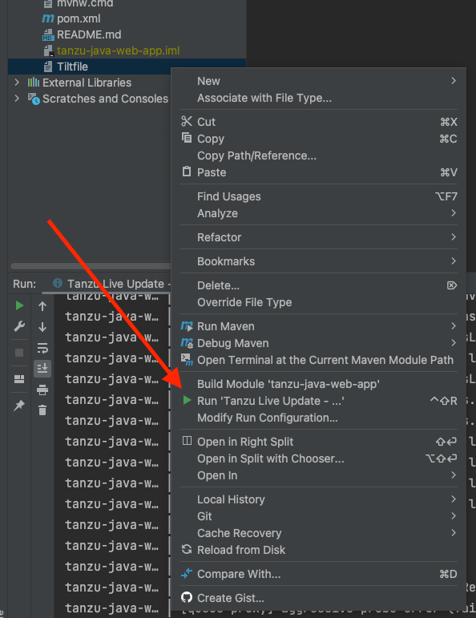
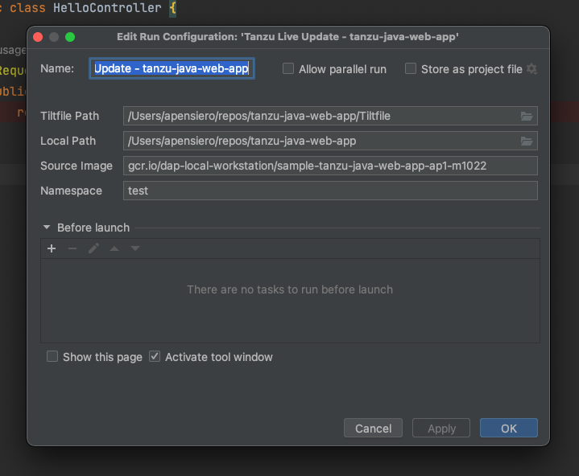

# Using Tanzu Developer Tools for IntelliJ

Ensure the project you want to use the extension with has the required files specified in
[Getting started](getting-started.md).

The Tanzu Developer Tools extension requires only one Tiltfile and one `workload.yaml` file per
project. `workload.yaml` must be a single-document YAML file, not a multi-document YAML file.

##  Debugging on the cluster

The extension enables you to debug your application on a Kubernetes cluster that has
Tanzu Application Platform.

Debugging requires a single-document `workload.yaml` file in your project. For how to create
`workload.yaml`, see [Set up Tanzu Developer Tools](getting-started.md#set-up-tanzu-dev-tools).

Debugging on the cluster and Live Update cannot be used simultaneously.
If you use Live Update for the current project, ensure that you stop the
Tanzu Live Update Run Configuration before attempting to debug on the cluster.

###  Start Debugging on the Cluster

To start debugging on the cluster:

1. Add a [breakpoint](https://www.jetbrains.com/help/idea/using-breakpoints.html) in your code.
1. Right-click the `workload.yaml` file in your project.
1. Select **Debug 'Tanzu Debug Workload...'** in the pop-up menu.

    

1. Ensure the configuration parameters are set:
    - **Source Image:** This is the registry location for publishing local source code.
    For example, `registry.io/yourapp-source`.
    It must include both a registry and a project name.
    - **Local Path:** This is the path on the local file system to a directory of source code to build.
    - **Namespace:** This is the namespace that workloads are deployed into.

    

1. You can also manually create Tanzu Debug configurations by using the **Edit Configurations**
IntelliJ UI.

###  Stop Debugging on the Cluster

Click the stop button in the Debug overlay to stop debugging on the cluster.

##  Start Live Update

1. Stop any running sessions. Only one Live Update session can be active at a time.
1. Right-click your project’s Tiltfile and select **Run 'Tanzu Live Update - ...'**.

1. Ensure the configuration parameters are set:
    - **Source Image:** This is the registry location for publishing local source code.
    For example, `registry.io/yourapp-source`. It must include both a registry and a project name.
    - **Local Path:** This is the path on the local file system to a directory of source code to build.
    - **Namespace:** This is the namespace that workloads are deployed into.

    

> **Important:** You must compile your code before the changes are synchronized to the container.
> For example, `Build Project`: `⌘`+`F9`.

##  Stop Live Update

To stop Live Update, use the native controls to stop the currently running Tanzu Live Update Run
Configuration.

