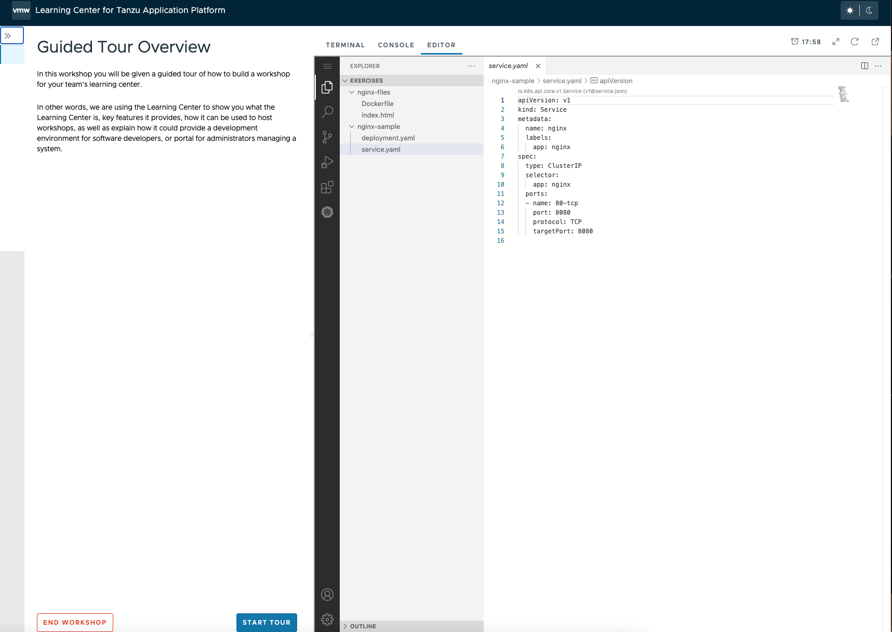
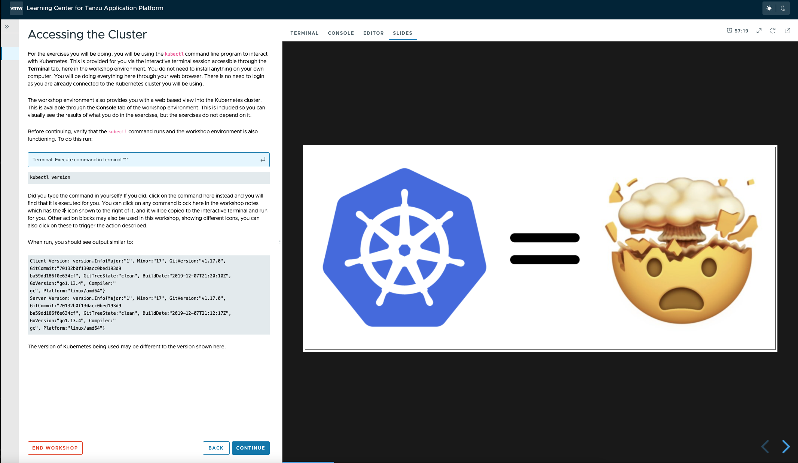
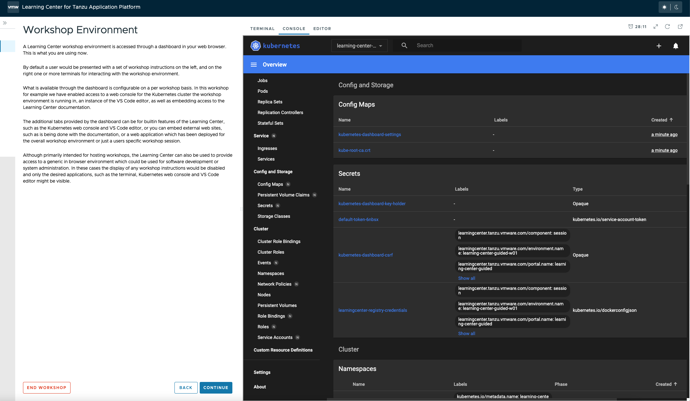
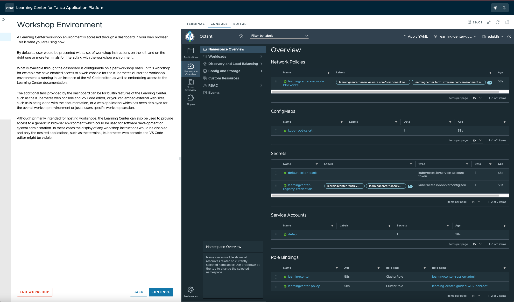

# Learning Center workshops

The Learning Center workshop dashboard comprises a set of workshop instructions on the left-hand side and a series of
tabbed views on the right-hand side. For workshops requiring commands to be run, one or more terminal shells are provided.
More detailed information about Workshops including creating your own: [Creating Learning Center Workshops](../workshop-content/about.md)

The terminals provide access to the editors `vi` and `nano`. To provide a UI based editor, you can
enable the embedded editor view and use the embedded IDE based on VS Code.

To complement the workshop instructions, or to be available for use by the instructor, you can include slides with a
workshop. For slides you can use HTML based slide presentation tools such as `reveal.js`, or you can embed a PDF file.

If the workshop involves working with Kubernetes, you can enable a web console for accessing the Kubernetes cluster.
The default web console uses the Kubernetes dashboard.

Alternatively, you can enable Octant as the web console.

