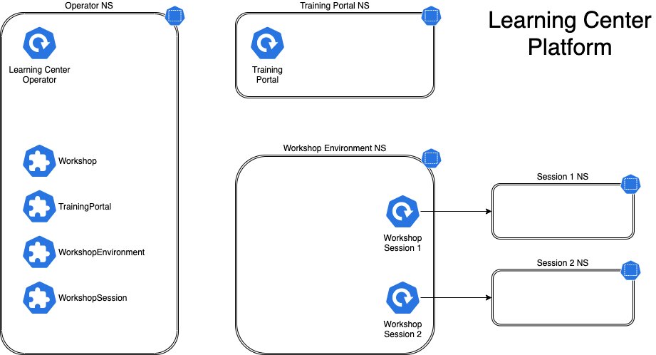

# Learning Center for Tanzu Application Platform

## Overview

Learning Center provides a platform for creating and self-hosting workshops. It allows content creators to create workshops from markdown files that are displayed to the learner in a terminal shell environment with an instructional wizard UI. The UI can embed slide content, an integrated development environment (IDE), a web console for accessing the Kubernetes cluster, and other custom web applications.

Although Learning Center requires
Kubernetes to run, and is used to teach users about Kubernetes, you can use it to host training for other
purposes as well. For example, you can use it to help train users in web-based applications, use of databases, or
programming languages, where the user has no interest or need for Kubernetes.

## Use cases

Use case scenarios that Learning Center supports include:

- Supervised workshops. For example, a workshop run at a conference, at a customer site, or online.
  The workshop has a set time period and you know the maximum number of users to expect. After the training is complete, the Kubernetes cluster created for the workshop is destroyed.

- Temporary learning portal. This is for when you must provide access to a small set of workshops for a short duration for hands on demos at a conference vendor booth. Users select which topic they want to learn about and do that workshop. The workshop instance is created on demand. When they have finished the workshop, that workshop instance is destroyed to free up resources. After the conference has finished, the Kubernetes cluster is destroyed.

- Permanent learning portal. Similar to the temporary learning portal, but runs on an extended basis as a public
  website where anyone can come and learn at any time.

- Personal training or demos. This is where anyone who wants to run a workshop on their own Kubernetes cluster to learn that
  topic, or where a product demo was packaged up as a workshop and they want to use it to demonstrate the product to a
  customer. You can destroy the workshop environment when complete, but there is no need for the cluster to be destroyed.

When running workshops, wherever possible a shared Kubernetes cluster reduces the amount of setup required. This works for developer-focused workshops, becauses it is usually not necessary to provide elevated access to the
Kubernetes cluster, and you can use role-based access controls (RBAC) to prevent users from interfering with each other.
You can also set quotas so users are restricted as to how much resources they can use.

When you run workshops that deal with cluster operations, for which users need cluster admin access,
create a separate cluster for each user. Learning Center doesn't deal with provisioning clusters, only with
deploying a workshop environment in a cluster after it exists.

## Use case requirements

In implementing to the preceding scenarios, the primary requirements related to creation of workshop content, and what you can do at runtime, are as follows:

- You must store everything for the workshop in a Git repository, with no dependency on using a special
  web application or service to create a workshop.

- Use GitHub as a means to distribute workshop content. Alternatively, you can distribute the workshop as a
  container image. The latter is necessary if special tools must be installed for use in a workshop.

- Provide instructions to the user to complete the workshop as Markdown or AsciiDoc files.

- You can annotate instructions as executable commands so that when clicked in the workshop dashboard, they execute for the user in the appropriate terminal to avoid mistakes when commands are entered manually.

- You can annotate text as copyable so when clicked in the workshop dashboard, it is copied into the
  browser paste buffer ready for pasting into the terminal or other web application.

- Provide each user access to one or more namespaces in the Kubernetes cluster unique to their session. For Kubernetes based workshops, this is where applications are deployed as part of the workshop.

- You can create additional Kubernetes resources specific to a workshop session in advance of the session. This enables the deployment of applications for each user session.

- You can deploy additional Kubernetes resources common to all workshop sessions when the workshop environment
  is first created. This enables deployment of applications shared by all users.

- Apply resource quotas on each workshop session to control how much resources users can consume.

- Apply role-based access control (RBAC) on each workshop session to control what users can do.

- Provide access to an editor (IDE) in the workshop dashboard in the web browser for users to edit
  files during the workshop.

- Provide access to a web-based console for accessing the Kubernetes cluster. Use of the Kubernetes dashboard
  or Octant is supported.

- Ability to integrate additional web-based applications into the workshop dashboard specific to the topic of the workshop.

- Ability for the workshop dashboard to display slides used by an instructor in support of the workshop.

## Platform architectural overview

The Learning Center relies on a Kubernetes Operator to perform the bulk of the work. The actions of the operator are
controlled by using a set of custom resources specific to the Learning Center.

There are multiple ways of using the custom resources to deploy workshops. The primary way is to create a training
portal, which in turn then triggers the setup of one or more workshop environments, one for each distinct workshop.
When users access the training portal and select the workshop they want to do, the training portal allocates to that
user a workshop session (creating one if necessary) against the appropriate workshop environment, and the user is
redirected to that workshop session instance.

You can associate each workshop session with one or more Kubernetes namespaces specifically for use during that session.
Role based access control (RBAC) applied to the unique Kubernetes service account for that session, ensures that the
user can only access the namespaces and other resources that they are allowed to for that workshop.

In this scenario, the custom resource types that come into play are:

- `Workshop` - Provides the definition of a workshop. Preloaded by an admin into the cluster, it defines
  where the workshop content is hosted, or the location of a container image which bundles the workshop content and any
  additional tools required for the workshop. The definition also lists additional resources that must be created
  which are to be shared between all workshop sessions, or for each session, with details of resources quotas and
  access roles required by the workshop.

- `TrainingPortal` - Created by an admin in the cluster to trigger the deployment of a training portal. The
  training portal can provide access to one or more distinct workshops defined by a `Workshop` resource. The training
  portal provides a web based interface for registering for workshops and accessing them. It also provides a REST API
  for requesting access to workshops, allowing custom front ends to be created which integrate with separate identity
  providers and which provide an alternate means for browsing and accessing workshops.

- `WorkshopEnvironment` - Used by the training portal to trigger the creation of a workshop environment for a
  workshop. This causes the operator to set up a namespace for the workshop into which shared resources are deployed,
  and where the workshop sessions are run.

- `WorkshopSession` - Used by the training portal to trigger the creation of a workshop session against a specific
  workshop environment. This causes the operator to set up any namespaces specific to the workshop session and pre-create
  additional resources required for a workshop session. Workshop sessions can either be created up front in reserve, to be handed out when requested, or created on demand.

## Next steps

Learn more about:

- [Workshops](workshop-content/about.md)
- [Getting started with Learning Center](getting-started/about.md)
- [Installing Learning Center](../learning-center/install-learning-center.md)
- [Local install guides](local-install-guides/about.md)
- [Air-gapped environment requirements](../learning-center/airgapped-environment.md)