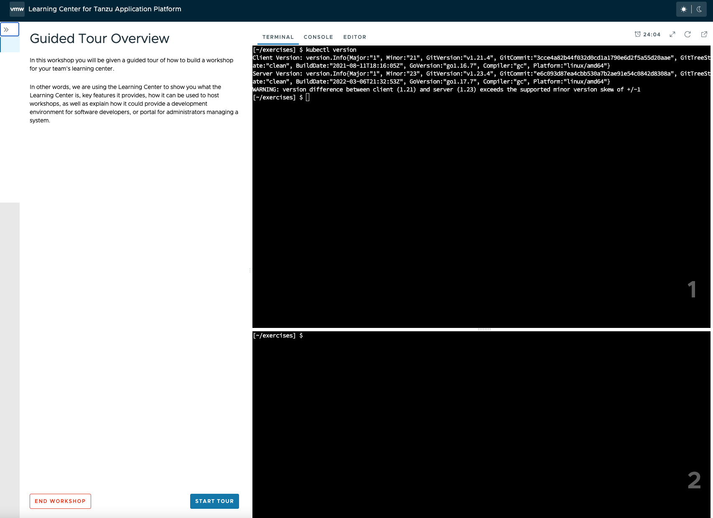

# TrainingPortal

## <a id="work-with-workshops"></a>Working with multiple workshops

The quickest way to deploy a set of workshops to use in a training session is to deploy a `TrainingPortal`.
This deploys a set of workshops with one instance of each workshop for each attendee.
A web-based portal is provided for registering attendees and allocating them to workshops.

The `TrainingPortal` custom resource provides a high-level mechanism for creating a set of workshop environments and
populating it with workshop instances. When the Learning Center operator processes this custom resource, it creates other custom resources to trigger the creation of the workshop environment and the workshop instances.
If you want more control, you can use these latter custom resources directly instead.

## <a id="loading-ws-definition"></a>Loading the workshop definition

A custom resource of type `Workshop` describes each workshop. Before you can create a workshop environment, you must load the definition of the workshop.

Here is an example `Workshop` custom resource:

```yaml
apiVersion: learningcenter.tanzu.vmware.com/v1beta1
kind: Workshop
metadata:
  name: lab-k8s-fundamentals
spec:
  title: Kubernetes Fundamentals
  description: Workshop on getting started with Kubernetes
  url: {YOUR-GIT-REPO-URL}/lab-k8s-fundamentals
  vendor: learningcenter.io
  authors:
  - Graham Dumpleton
  difficulty: intermediate
  duration: 1h
  tags:
  - kubernetes
  content:
    image: projects.registry.vmware.com/learningcenter/lab-k8s-fundamentals:latest
  session:
    namespaces:
      budget: medium
    applications:
      terminal:
        enabled: true
        layout: split
      console:
        enabled: true
      editor:
        enabled: true
```

To load the definition of the workshop, run:

```console
kubectl apply -f {YOUR-GIT-REPO-URL}/lab-k8s-fundamentals/master/resources/workshop.yaml
```

The custom resource created is cluster-scoped. The command must be run as a cluster admin or other appropriate
user with permission to create the resource.

If successfully loaded, the command outputs:

```console
workshop.learningcenter.tanzu.vmware.com/lab-k8s-fundamentals created
```

To list the workshop definitions that have been loaded and that can be deployed, run:

```console
kubectl get workshops
```

For this workshop, this outputs:

```console
NAME                  IMAGE                                            FILES  URL
lab-k8s-fundamentals  {YOUR-REGISTRY-URL}/lab-k8s-fundamentals:master         {YOUR-GIT-REPO-URL}/lab-k8s-fundamentals
```

The added fields in this case give:

- The name of the custom workshop container image deployed for the
workshop.
- A URL for more information about the workshop.

The definition of a workshop is loaded as a step of its own, rather than referring to a remotely hosted definition. This allows a cluster admin to audit the workshop definition to ensure it isn't doing something the cluster admin doesn't want to
allow. After the cluster admin approves the workshop definition, it can be used to create instances of the workshop.

## <a id="create-ws-training-portal"></a>Creating the workshop training portal

To deploy a workshop for one or more users, use the `TrainingPortal` custom resource. This custom resource specifies
a set of workshops to be deployed and the number of people taking the workshops.

The `TrainingPortal` custom resource we use in this example is:

```yaml
apiVersion: learningcenter.tanzu.vmware.com/v1beta1
kind: TrainingPortal
metadata:
  name: lab-k8s-fundamentals
spec:
  workshops:
  - name: lab-k8s-fundamentals
    capacity: 3
    reserved: 1
    expires: 1h
    orphaned: 5m
```

To create the custom resource, run:

```console
kubectl apply -f {YOUR-GIT-REPO-URL}/lab-k8s-fundamentals/master/resources/training-portal.yaml
```

The custom resource created is cluster-scoped. The command must be run as a cluster admin or other appropriate
user with permission to create the resource.

This results in the output:

```console
trainingportal.learningcenter.tanzu.vmware.com/lab-k8s-fundamentals created
```

There is actually much more going on than this. To see all the resources created, run:

```console
kubectl get learningcenter-training -o name
```

You should see:

```console
workshop.learningcenter.tanzu.vmware.com/lab-k8s-fundamentals
trainingportal.learningcenter.tanzu.vmware.com/lab-k8s-fundamentals
workshopenvironment.learningcenter.tanzu.vmware.comlab-k8s-fundamentals-w01
workshopsession.learningcenter.tanzu.vmware.com/lab-k8s-fundamentals-w01-s001
```

In addition to the original `Workshop` custom resource providing the definition of the workshop, and the `TrainingPortal` custom resource you just created, you've also created the `WorkshopEnvironment` and `WorkshopSession` custom resources.

The `WorkshopEnvironment` custom resource sets up the environment for a workshop, including deploying any application
services that must exist and are shared by all workshop instances.

The `WorkshopSession` custom resource results in the creation of a single workshop instance.

To see a list of the workshop instances created and their details, run:

```console
kubectl get workshopsessions
```

This yields output similar to:

```console
NAME                            URL                                         USERNAME   PASSWORD
lab-k8s-fundamentals-w01-s001   http://lab-k8s-fundamentals-w01-s001.test
```

Only one workshop instance is created. Though the maximum capacity is set to three, the reserved number of
instances (hot spares) is defined as one. Additional workshops instances are only created as workshop sessions
are allocated to users. One reserved instance is always maintained until capacity is reached.

If you need a different number of workshop instances, set the `portal.capacity` field of the `TrainingPortal` custom
resource YAML input file before creating the resource. Changing the values after the resource is created has
no effect.

In this case, only one workshop is listed to be hosted by the training portal. You can deploy more than one
workshop at the same time by adding the names of other workshops to `workshops`.

The first time you deploy the workshop, it can take a few moments to pull down the workshop image and start.

To access the workshops, attendees of a training session need to visit the web-based portal for the training session.
Find the URL for the web portal by running:

```console
kubectl get trainingportals
```

This should yield output similar to:

```console
NAME                  URL                                   ADMINUSERNAME  ADMINPASSWORD
lab-k8s-fundamentals  https://lab-k8s-fundamentals-ui.test  learningcenter         mGI2C1TkHEBoFgKiZetxMnwAldRU80aN
```

Attendees should only be given the URL. The password listed is only for use by the instructor of the training
session if required.

## <a id="access-ws-via-web-portal"></a>Accessing workshops via the web portal

Attendees can access workshops through the web portal by following two steps:

1. The attendee visits the web-based portal for the training session and is presented with a login page. However, before logging in, the attendee must register for an account. The attendee clicks the link to the registration page and fills it in.

    

    Registration is required so if the attendee's web browser exits or the attendee needs to switch web browsers, the attendee can log in again and access the same workshop instance.

2. Upon registering, the attendee is presented with a list of workshops available for the training session.

    

    - An orange dot beside a workshop means that no instance for that workshop has been allocated
    to the user as yet, but that some are available.
    - A red dot indicates there are no more workshop instances
    available.
    - A green dot indicates a workshop instance has
    already been reserved by the attendee.

    The attendee clicks the "Start workshop" button. This allocates a workshop instance if one hasn't yet been reserved and redirects
    the attendee to that workshop instance.

    

## <a id="delete-ws-training-portal"></a>Deleting the workshop training portal

The workshop training portal is intended for running workshops with a fixed time period where all workshop instances
are deleted when complete.

To delete all workshop instances and the web-based portal, run:

```console
kubectl delete trainingportal/lab-k8s-fundamentals
```
