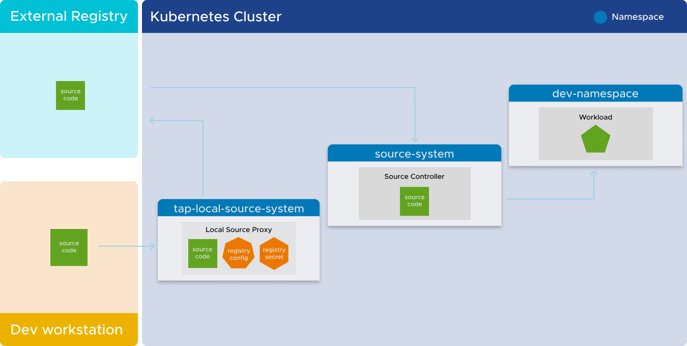

# Overview of Local Source Proxy

Local Source Proxy (LSP) offers developers a secure and user-friendly approach to seamlessly upload
their local source code to a Tanzu Application Platform cluster. This enables developers to navigate
their code smoothly through a predefined production pathway using supply chains.

With Local Source Proxy, developers can:

- Interact with external registries without needing to know registry specifics, such as endpoints,
  credentials, and certificates. This eliminates the burden of platform and app operators having to
  distribute registry credentials to developer workstations.

- Deploy their workloads from a local source through any mechanism, including IDE extensions,
  without providing the source image location. Developers can seamlessly deploy their applications
  without managing registry credentials on their local machines or keeping track of where their
  local source is uploaded.

Consequently, the `--source-image` flag in the Apps CLI becomes optional, and there is no longer a
need for Docker registry credentials on the developer’s local machine. Local Source Proxy
abstracts these details, making deployment more streamlined and user-friendly for developers.

By removing the necessity for specific registry information and credentials, Local Source Proxy
simplifies the developer experience. This enables developers to focus on developing their applications
instead of managing registry-related complexities.