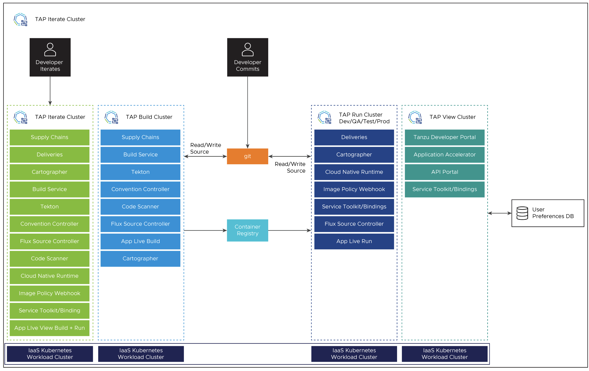

# Overview of multicluster Tanzu Application Platform

You can install Tanzu Application Platform (commonly known as TAP) in various topologies to reflect your existing landscape.
VMware has tested and recommends a multicluster topology for production use.
Because flexibility and choice are core to Tanzu Application Platform's design,
none of the implementation recommendations are set in stone.

The multicluster topology uses the [profile capabilities](../about-package-profiles.hbs.md#profiles-and-packages)
supported by Tanzu Application Platform. Each cluster adopts one of following multicluster-aligned profiles:

- **Iterate:** Intended for inner-loop iterative application development.

- **Build:** Transforms source revisions to workload revisions; specifically, hosting workloads and supply chains.

- **Run:** Transforms workload revisions to running pods; specifically, hosting deliveries and deliverables.

- **View:** For applications related to centralized developer experiences; specifically,
  Tanzu Developer Portal and metadata store.

The following diagram illustrates this topology.

## Next steps

To get started with installing a multicluster topology, see [Install multicluster Tanzu Application Platform profiles](installing-multicluster.md).
