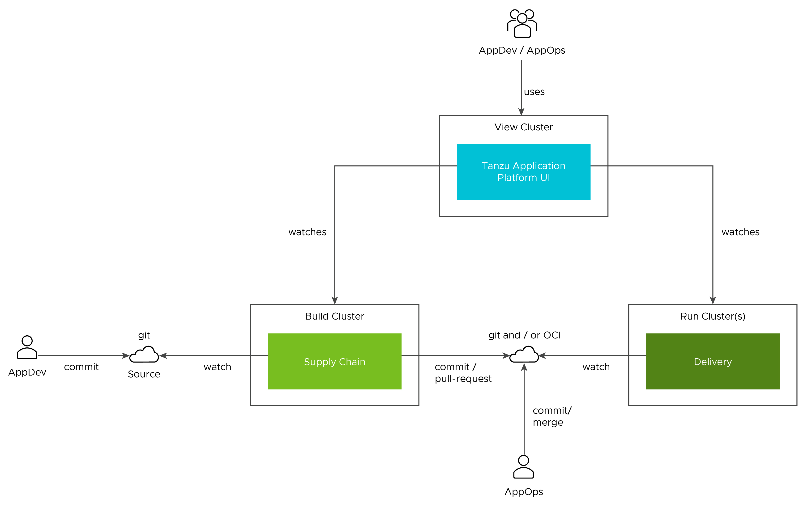

# Overview of multicluster Tanzu Application Platform

Tanzu Application Platform can be installed in various topologies to reflect a customer's existing landscape. VMware has tested and recommends the multicluster topology for production usage. Flexibility and choice are core to Tanzu Application Platform's design, so none of the implementation recommendations are set in stone.

The multicluster topology uses the [profile capabilities](../overview.md#profiles-and-packages) supported by Tanzu Application Platform. Each cluster assumes one of the three multicluster-aligned profiles:

- **Build:** Transforms source revisions to workload revisions; specifically, hosting workloads and supply chains.
 
- **Run:** Transforms workload revisions to running pods; specifically, hosting deliveries and deliverables.

- **View:** For applications related to centralized developer experiences; specifically, Tanzu Application Platform GUI and metadata store.

The following diagram illustrates this topology.

## Next steps

To get started with installing a multicluster topology, see [Install multicluster Tanzu Application Platform profiles](installing-multicluster.md).
