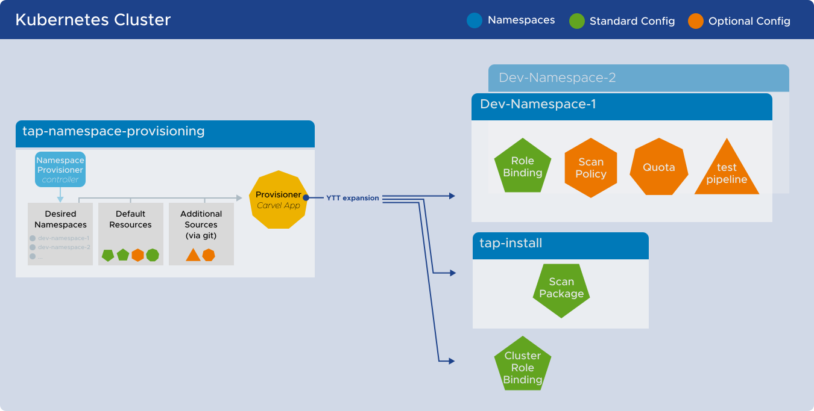
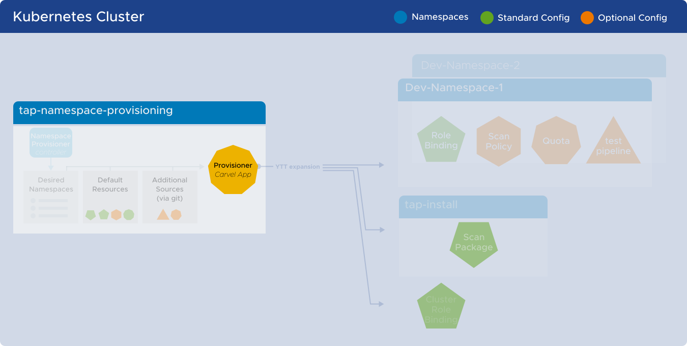
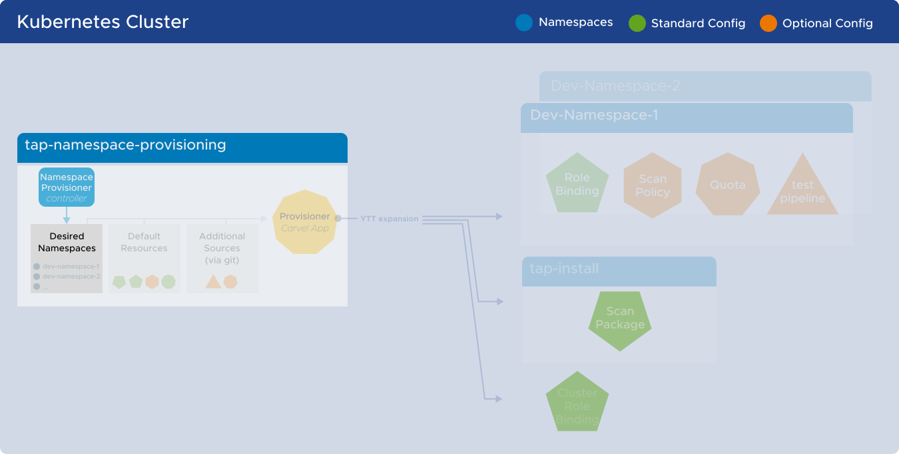

# Namespace Provisioner

Namespace Provisioner provides a secure, automated way for platform operators to provision
namespaces with the resources and proper namespace-level privileges required for their workloads
to function as intended. It enables you to add additional customized namespace-scoped resources to
meet your organization's requirements.

Namespace Provisioner enables operators that are new to Kubernetes to automate the provisioning of
multiple developer namespaces in a shared cluster. For organizations that have already adopted
Kubernetes, Namespace Provisioner is also compatible with existing Kubernetes tooling.

## <a id="nsp-component-overview"></a>Component Overview

The following diagram shows the components that are installed as part of the Namespace Provisioner
package and how they work together to automate resource creation in developer namespaces:



### <a id="nsp-component-carvel-app"></a>Provisioner Carvel Application



Namespace Provisioner consists of a [Carvel](https://carvel.dev/kapp-controller/docs/latest/app-overview/)
application named provisioner that is installed in the
`tap-namespace-provisioning` namespace. The provisioner application uses ytt to templatize a
set of resources into installations in multiple namespaces. The provisioner application references a
ConfigMap and a Secret which are explained in more detail below.

### <a id="desired-ns-configmap"></a>Desired Namespaces ConfigMap



The `desired-namespaces` ConfigMap in the `tap-namespace-provisioning` namespace provides
a declarative way to indicate which namespaces should be populated with resources. The ConfigMap
consists of a list of namespace objects, with a required `name` parameter, and optional additional
parameters which are used as `data.values` for customizing defined resources.
Manage the ConfigMap directly with [GitOps](tutorials.hbs.md#using-gitops), or the
[Namespace Provisioner Controller](tutorials.hbs.md#controller-ns-provisioning).

#### Example

```yaml
---
apiVersion: v1
kind: ConfigMap
metadata:
  name: desired-namespaces
  namespace: tap-namespace-provisioning
  annotations:
    kapp.k14s.io/create-strategy: fallback-on-update
    namespace-provisioner.apps.tanzu.vmware.com/no-overwrite: "" #! This annotation tells the provisioner app to not override this configMap as this is your desired state.
data:
  namespaces.yaml: |
    #@data/values
    ---
    namespaces:
    - name: dev-ns1
      # additional parameters about dev-ns1 in the object...
    - name: dev-ns2
      # additional parameters about dev-ns2 in the object...
```

### <a id="nsp-controller"></a>Namespace Provisioner Controller

If you prefer to have the `desired-namespaces` ConfigMap automatically managed by a controller
on the cluster, use the Namespace Provisioner controller.  It is installed as part of Namespace
Provisioner. It watches namespaces in the cluster and updates the
`desired-namespaces` ConfigMap in the `tap-namespace-provisioning` namespace with a list of
namespaces that match the namespace_selector label selector in `tap-values.yaml`. The default label
selector is configurable in `tap-values.yaml`.

### <a id="resources-secret"></a>Default Resources Secret

The `default-resources` Secret is templated by `tap-values.yaml` to contain the appropriate
resources for the given profile, set of supply chains installed, and other similar values. For the full
list of resources that are created for different profiles, see [Default resources mapping](reference.hbs.md#default-resources-mapping).

### <a id="expansion-template"></a>Expansion Template ConfigMap

The expansion-template ConfigMap contains the ytt logic to expand the resources defined in the
following locations into each of the  namespaces listed in the [desired-namespaces ConfigMap](about.hbs.md#desired-ns-configmap):

- Default-resources Secret
- [additional_sources](install.hbs.md#customized-installation) in the `namespace-provisioner` config in the `tap-values.yaml` file
