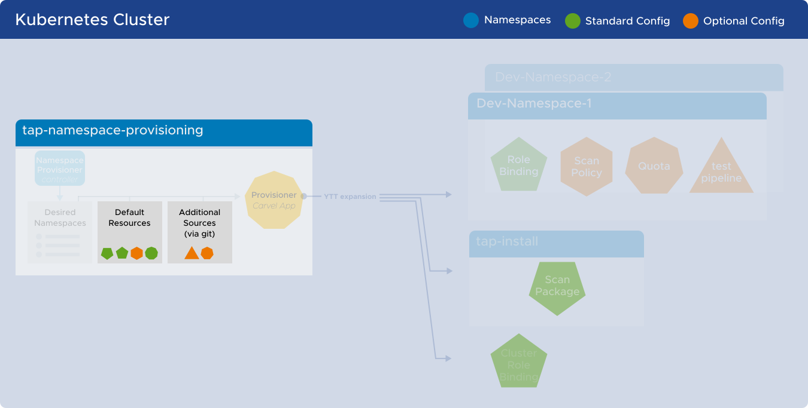

# Namespace Provisioner How-to Guide
This page provides guidance for more advanced use-cases associated with Namespace Provisioner.

The available guides are as follows:
* [Data values templating](#data-values-templating)
* [GitOps customizations](#gitops-customizations):
   1. [Extending the default resources that get provisioned](#extending-default-resources)
   2. [Customizing OOTB default resources](#customizing-default-resources)
   3. [Control reconcile behavior of namespace provisioner for certain resources](#control-reconcile-behavior)
   4. [Control the desired-namespace ConfigMap via GitOps](#control-desired-namespaces)

## <a id="data-values-templating"></a>Data values templating guide
Customize your custom resources with data values from TAP values and data from `desired-namespaces` ConfigMap.

Namespace provisioner inherits all of the configuration in the [`desired-namespaces`](about.hbs.md#nsp-component-desired-namespaces-configmap) as well as the tap values under the key `tap_values` making it available for Platform Operators to use as ytt `data.values` when [extending the resources via GitOps](#extending-ootb-resources).

Let's assume that the `desired-namespaces` ConfigMap has a namespace `dev-ns1` with an additional parameter `language: java`.

The `data.values` config that is available to Platform Operators for templating their custom resource looks as follows:

```yaml
# data.values map that can be used for templating custom resources
tap_values:
  ...
  supply_chain: testing_scanning
  profile: full
  ootb_delivery_basic:
    service_account: default
  ootb_supply_chain_basic:
    service_account: default
  ootb_supply_chain_testing_scanning:
    scanning:
      image:
        policy: image-scan-policy
      source:
        policy: scan-policy
    service_account: default
  ootb_supply_chain_testing:
    service_account: default

# Everything below this comes from desired-namespaces ConfigMap
name: dev-ns1  
# additional parameters about dev-ns1 from desired-namespaces ConfigMap
language: java
```

You can use this config while creating custom resources to [extend the OOTB default-resources](#extending-default-resources). 

For those interested, here's a [sample of a templated tekton pipeline.](https://github.com/vmware-tanzu/application-accelerator-samples/namespace-provisioner-gitops-examples/custom-resources/tekton-pipelines/python-test.yaml) 
</br></br>

---

</br>

## <a id="gitops-customizations"></a>GitOps Customizations



### <a id="extending-default-resources"></a>Extending the default provisioned resources

Platform Operators may need to do additional namespace customization beyond TAP requirements (such as quota allocation or creation of other namespaced resources) that are not taken care of by the [`default-resources`](about.hbs.md#nsp-component-default-resources) Secret that's created out of the box. 

Platform Operators can add [additional git sources](install.hbs.md#customized-install) in tap-values configuration for the namespace provisioner. 

This allows Platform Operators to extend the out of the box setup with additional resources which enables them to achieve the bespoke customizations needed to meet the unique requirements of thier organization.

In the example `namespace_provisioner` ([snippet from tap-values yaml below](#example-additional-resources)) we add 4 additional sources as follows:</br></br>

* The first additional source points to an example of a [workload service account yaml file](https://github.com/vmware-tanzu/application-accelerator-samples/namespace-provisioner-gitops-examples/custom-resources/workload-sa/workload-sa-with-secrets.yaml) with no ytt templating or overlay.
   * After importing this source, Namespace provisioner will create the following resources in all namespaces mentioned in “desired-namespaces” ConfigMap.</br></br>
* The second additional source points to examples of [ytt templated testing and scanpolicy](https://github.com/vmware-tanzu/application-accelerator-samples/namespace-provisioner-gitops-examples/custom-resources/testing-scanning-supplychain).
   * After importing this source, Namespace provisioner will create a **scan-policy** as well as a **developer-defined-tekton-pipeline-java** in all namespaces in the [`desired-namespaces`](about.hbs.md#nsp-component-desired-namespaces-configmap) ConfigMap with the default setup in [Install OOTB Supply Chain with Testing and Scanning](../getting-started/add-test-and-security.hbs.md#install-OOTB-test-scan) documentation.</br></br>
* The third additional source points to an example of a [ytt templated scanpolicy yaml file](https://github.com/vmware-tanzu/application-accelerator-samples/namespace-provisioner-gitops-examples/custom-resources/scanpolicies/scanpolicies.yaml).
   * After importing this source, Namespace provisioner will create a **snyk-scan-policy** in all namespaces in the [`desired-namespaces`](about.hbs.md#nsp-component-desired-namespaces-configmap) ConfigMap that has an additional parameter **scanpolicy: snyk**.</br></br>
* The fourth additional source points to [examples of ytt templated tekton pipelines](https://github.com/vmware-tanzu/application-accelerator-samples/namespace-provisioner-gitops-examples/custom-resources/tekton-pipelines).
   * After importing this source, Namespace Provisioner will create a **developer-defined-tekton-pipeline-python** and **developer-defined-tekton-pipeline-angular** for namespaces in  the [`desired-namespaces`](about.hbs.md#nsp-component-desired-namespaces-configmap) ConfigMap that has an additional parameter **language: python** and **language: angular** respectively.</br></br>


<a id="example-additional-resources"></a>Example TAP values snippet configuration for namespace_provisioner with additional_sources:
```yaml
namespace_provisioner:
  additional_sources:
  # Add a custom workload service account and a bunch of git secrets
  - git:
      ref: origin/main
      subPath: namespace-provisioner-gitops-examples/custom-resources/workload-sa
      url: https://github.com/vmware-tanzu/application-accelerator-samples.git
    path: _ytt_lib/workload-sa
  # Add templated java scan policy and tekton pipeline
  - git:
      ref: origin/main
      subPath: namespace-provisioner-gitops-examples/custom-resources/testing-scanning-supplychain
      url: https://github.com/vmware-tanzu/application-accelerator-samples.git
    path: _ytt_lib/testingscanning
  # Add templated snyk scan policy
  - git:
      ref: origin/main
      subPath: namespace-provisioner-gitops-examples/custom-resources/scanpolicies
      url: https://github.com/vmware-tanzu/application-accelerator-samples.git
    path: _ytt_lib/scanpolicies
  # Add templated tekton pipelines for angular, colang and python based on data.values
  - git:
      ref: origin/main
      subPath: namespace-provisioner-gitops-examples/custom-resources/tekton-pipelines
      url: https://github.com/vmware-tanzu/application-accelerator-samples.git
    path: _ytt_lib/tektonpipelines
```
</br>

---

</br>

### <a id="customizing-default-resources"></a>Customizing the default resources that get provisioned

The Out-Of-The-box [`default-resources`](reference.hbs.md#tap-profile---default-resources-mapping) can be customized by using GitOps with some specific characteristics:

- The GitOps customization should be done by using the [ytt overlay](https://carvel.dev/ytt/docs/latest/lang-ref-ytt-overlay/) feature and should be set in the tap-values under [additional_sources](install.hbs.md#customized-installation)
- The additional git resource should be mounted in the **path** `_ytt_lib/customize`, otherwise the customization will not be considered
- The GitOps repo folder should have a file with an extension [`lib.yaml`](https://carvel.dev/ytt/docs/latest/lang-ref-ytt-library/#instanceexport) to be recognized as a ytt library with members to be exported
- The library file in the GitOps repo folder should have a function called `customize` with the overlays to be applied to the resources, it can contain one or more overlays

The sample file [`sa-secrets.lib.yaml`](https://github.com/vmware-tanzu/application-accelerator-samples/blob/main/namespace-provisioner-gitops-examplesdefault-resources-overrides/overlays//sa-secrets.lib.yaml) shows how Platform/App Operators can completely override the `secrets` and `imagePullSecrets` sections of the default ServiceAccount to add custom created secrets by using other additional resources. 

Sample tap-values change to pull this ytt customization overlay:

```yaml
namespace_provisioner: 
  additional_sources:
  # Patches the OOTB default service account to add different secrets
  - git:
      ref: origin/main
      subPath: namespace-provisioner-gitops-examples/default-resources-overrides/overlays
      url: https://github.com/vmware-tanzu/application-accelerator-samples.git
    path: _ytt_lib/customize
  # Adds the secrets referenced in the overlay
  - git:
      ref: origin/main
      subPath: namespace-provisioner-gitops-examples/custom-resources/workload-sa
      url: https://github.com/vmware-tanzu/application-accelerator-samples.git
    path: _ytt_lib/workload-sa
```

Sample customization (`.lib.yaml`) file for overriding regoFile of the default ScanPolicy - [Link to the Sample file](https://github.com/vmware-tanzu/application-accelerator-samples/blob/main/namespace-provisioner-gitops-examples/default-resources-overrides/overlays/scanpolicy-rego.lib.yaml)

```yaml
#@ load("@ytt:overlay", "overlay")
#@ def customize():

#@overlay/match by=overlay.subset({"apiVersion": "v1", "kind": "ServiceAccount","metadata":{"name":"default"}}), expects="0+"
---
secrets:
  - name: gitlab-workload-token
  - name: github-workload-token
  - name: registries-credentials
imagePullSecrets:
  - name: gitlab-workload-token
  - name: github-workload-token
  - name: registries-credentials
#@  end
```

</br>

---

</br>

### <a id="control-reconcile-behavior"></a>Controlling the Namespace Provisioner reconcile behavior for specific resources

There are certain OOTB [`default-resources`](reference.hbs.md#tap-profile---default-resources-mapping) like the Tekton Pipeline and Scan Policy that comes annotated with a special annotation **`namespace-provisioner.apps.tanzu.vmware.com/no-overwrite`**. 

Any changes to the resources that have the `...no-overwrite` annotation are not overwritten by the **`provisioner`** kapp App controlling the resource provision. If Platform/App Operators want to restore the default state of those resources, they can simply delete them and the [provisioner](about.hbs.md#provisioner-carvel-app) kapp App will re-create them in their initial default state.

The kapp App controlling the resource provisioning has an sync interval of 10 minutes. To manually force the reconciliation of the resources (for example: Deleting a resource so that it can be created into its default initial state), you can use the [Carvel kctrl](https://carvel.dev/blog/kctrl-release-blog/) CLI to “kick” the “provisioner” app reconciliation. 

You can initiate the "kick" by running the following command:

```bash
kctrl app kick --app provisioner -n tap-namespace-provisioning -y
```

</br>

---

</br>

### <a id="control-desired-namespaces"></a>Control the `desired-namespaces` ConfigMap via GitOps

Prerequisites:
- Namespace Provisioner package is installed and successfully reconciled.
- [**`controller`** tap value key](install.hbs.md#customized-installation) is set to “false” (Default is “true”).
- The registry-credentials secret referred by the Tanzu Build Service is added to tap-install and exported to all namespaces. If you don’t want to export this secret to all namespaces for any reason, you will have to go through an additional step to create this secret in the namespace.

Users can choose to maintain the [`desired-namespaces`](about.hbs.md#nsp-component-desired-namespaces-configmap) ConfigMap in their git repository and opt not to use the namespace-provisioner controller. Users can use their choice of GitOps tools to override the [`desired-namespaces`](about.hbs.md#nsp-component-desired-namespaces-configmap) ConfigMap in the tap-namespace-provisioning namespace. 

>**NOTE:** you need to set the “controller” tap value key to “false” (Default is “true”) for namespace provisioner in tap-values.yaml file. The [`controller`](install.hbs.md#customized-installation) value in tap-values decides whether the Out-of-the-box controller is installed and used for maintaining the list of desired-namespaces or not.</br>
If the controller is installed as part of the package, when it reconciles, it will remove all namespaces that are not properly labeled with the [`namespace_selector`](install.hbs.md#customized-install) specified in the tap values (Default label selector is **`apps.tanzu.vmware.com/tap-ns=""`**). 

Use the following snippet as reference for the desired-namespaces ConfigMap that you can put on your git repository.
Desired-namespaces.yaml ([Link to sample repo file](https://github.com/vmware-tanzu/application-accelerator-samples/blob/main/namespace-provisioner-gitops-examples/desired-namespaces/gitops-managed-desired-namespaces.yaml))

```yaml
---
apiVersion: v1
kind: ConfigMap
metadata:
  name: desired-namespaces
  namespace: tap-namespace-provisioning
  annotations:
    kapp.k14s.io/create-strategy: fallback-on-update
    namespace-provisioner.apps.tanzu.vmware.com/no-overwrite: "" #! This annotation tells the provisioner app to not override this configMap as this is your desired state.
data:
  namespaces.yaml: |
    #@data/values
    ---
    namespaces:
    - name: python-backend-app
      language: python
      scanpolicy: snyk
    - name: angular-fe-app
      language: angular

```

We will use kubectl to override this ConfigMap manually, but in a customer environment, this ConfigMap can be overridden with the customer’s tool of choice for GitOps. The method for overriding the [`desired-namespaces`](about.hbs.md#nsp-component-desired-namespaces-configmap) ConfigMap is out of scope for this package. 

```bash
kubectl apply -f https://raw.githubusercontent.com/vmware-tanzu/application-accelerator-samples/main/namespace-provisioner-gitops-examples/desired-namespaces/gitops-managed-desired-namespaces.yaml
```

When this change is applied, the provisioner app will start the reconcile process and provision the resources on the given namespaces.

>**WARNING:** If there is a namespace in your GitOps repo `desired-namespaces` list that does not exist on the cluster, the `provisioner` app will fail to reconcile and will not be able to create resources. Additionally, the creation of the namespaces themselves is out of the scope for the namespace provisioner package.

</br>

---

### Links to additional Namespace Provisioner documentation:
* [Overview](about.hbs.md)
* [Tutorial - Provisioning Namespaces](tutorials.hbs.md) 
* [Installation](install.hbs.md)
* [Troubleshooting](troubleshooting.hbs.md)
* [Reference Materials](reference.hbs.md)