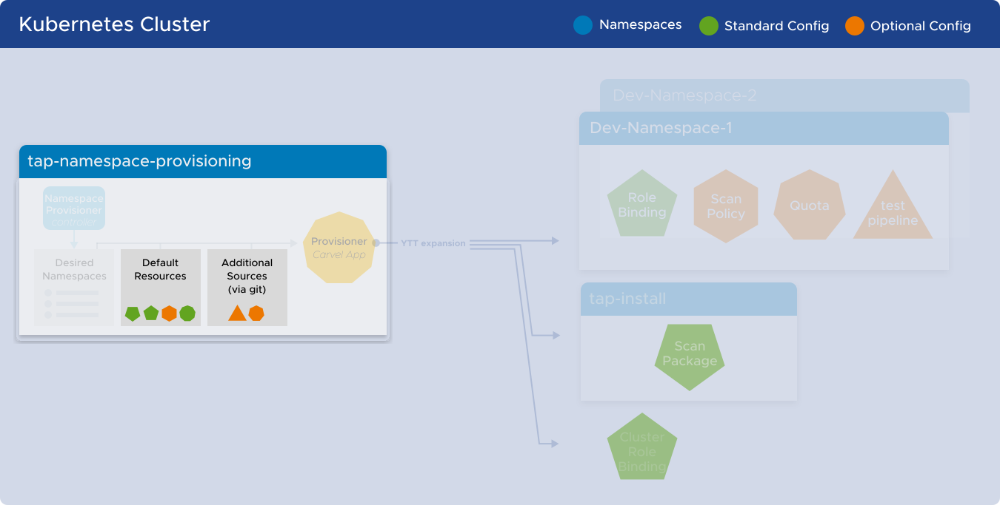

# Customize Namespace Provisioner

This topic describes advanced use cases associated with Namespace Provisioner.

## <a id="data-values-templating"></a>Data values templating guide

Customize your custom resources with data values from:

1. The `tap-values.yaml` file
2. The `desired-namespaces` ConfigMap.

Namespace Provisioner inherits all of the configuration in **both** the [desired-namespaces ConfigMap](about.hbs.md#desired-ns-configmap) and the tap config under the key `tap_values` making it available to
use as ytt `data.values` when [extending the resources via GitOps](#ex-default-resources).

For example, if the [desired-namespaces ConfigMap](about.hbs.md#desired-ns-configmap) has a
namespace `dev-ns1` with an additional `language: java` parameter, the `data.values` config that is
available for templating custom resources is as follows:

```yaml
# data.values map that can be used for templating custom resources
tap_values:
  ...
  supply_chain: testing_scanning
  profile: full
  ootb_delivery_basic:
    service_account: default
  ootb_supply_chain_basic:
    service_account: default
  ootb_supply_chain_testing_scanning:
    scanning:
      image:
        policy: image-scan-policy
      source:
        policy: scan-policy
    service_account: default
  ootb_supply_chain_testing:
    service_account: default

# Everything below this comes from desired-namespaces ConfigMap
name: dev-ns1
# additional parameters about dev-ns1 from desired-namespaces ConfigMap
language: java
```

You can use this config while creating custom resources to extend the default provisioned resources.

Here's a [sample of a templated Tekton pipeline.](https://github.com/vmware-tanzu/application-accelerator-samples/blob/tap-1.4-np/namespace-provisioner-gitops-examples/custom-resources/tekton-pipelines/python-test.yaml)

## <a id="gitops-customizations"></a>GitOps Customizations



### <a id="ex-default-resources"></a>Extending the default provisioned resources

To customize and extend the default configuration for the Namespace Provisioner
that is templated in the  [default-resources](about.hbs.md#nsp-component-default-resources) Secret,
add [additional sources](install.hbs.md#customized-install) in the `tap-values.yaml` configuration
file. For example, to adjust quota allocation or to create other namespace resources. For details of
the list of resources that are templated in the `default-resources` Secret, see [Default Resource Mapping](reference.hbs.md#default-resources-mapping).

This following are examples of additional sources:

- This additional source points to an example of a [workload service account yaml file](https://github.com/vmware-tanzu/application-accelerator-samples/blob/tap-1.4-np/namespace-provisioner-gitops-examples/custom-resources/workload-sa/workload-sa-with-secrets.yaml).
After importing this source, Namespace Provisioner creates the following resources in all
namespaces listed in the [desired-namespaces ConfigMap](about.hbs.md#desired-ns-configmap).
- <a id="add-test-scan"></a>This additional source points to examples of
[ytt templated testing and scanpolicy](https://github.com/vmware-tanzu/application-accelerator-samples/tree/tap-1.4-np/namespace-provisioner-gitops-examples/custom-resources/testing-scanning-supplychain).
After importing this source, Namespace Provisioner creates a **scan-policy** and a
**developer-defined-tekton-pipeline-java** in all namespaces in the
[desired-namespaces ConfigMap](about.hbs.md#desired-ns-configmap)  with the default setup in [Install OOTB Supply Chain with Testing and Scanning](../getting-started/add-test-and-security.hbs.md#install-OOTB-test-scan)
documentation.
- This additional source points to an example of a [ytt templated scanpolicy yaml file](https://github.com/vmware-tanzu/application-accelerator-samples/blob/tap-1.4-np/namespace-provisioner-gitops-examples/custom-resources/scanpolicies/snyk-scanpolicies.yaml).
After importing this source, Namespace Provisioner creates a **snyk-scan-policy** in all
namespaces in the [desired-namespaces](about.hbs.md#desired-ns-configmap) ConfigMap that
has an additional parameter **scanpolicy: snyk**.
- This additional source points to [examples of ytt templated tekton pipelines](https://github.com/vmware-tanzu/application-accelerator-samples/tree/tap-1.4-np/namespace-provisioner-gitops-examples/custom-resources/tekton-pipelines).
After importing this source, Namespace Provisioner creates a *developer-defined-tekton-pipeline-python**
and **developer-defined-tekton-pipeline-angular** for namespaces in the [desired-namespaces ConfigMap](about.hbs.md#desired-ns-configmap) that has an additional parameter **language: python** and **language: angular** respectively.

<a id="ex-additional-resources"></a>The following example provides a snippet from `tap-values.yaml`
with custom configuration for [additional_sources](install.hbs.md#customized-installation). Each of
the user-generated `namespace_provisioner.additional_sources[].path` values must be unique, and each
path must begin with "_ytt_lib/" to be identified as a ytt library.

```yaml
namespace_provisioner:
  additional_sources:
  # Add a custom workload service account and some secrets
  - git:
      ref: tap-1.4-np
      subPath: namespace-provisioner-gitops-examples/custom-resources/workload-sa
      url: https://github.com/vmware-tanzu/application-accelerator-samples.git
    path: _ytt_lib/workload-sa
  # Add templated Grype scan policy and java Tekton pipeline
  - git:
      ref: tap-1.4-np
      subPath: namespace-provisioner-gitops-examples/custom-resources/testing-scanning-supplychain
      url: https://github.com/vmware-tanzu/application-accelerator-samples.git
    path: _ytt_lib/testingscanning
  # Add templated snyk scan policy
  - git:
      ref: tap-1.4-np
      subPath: namespace-provisioner-gitops-examples/custom-resources/scanpolicies
      url: https://github.com/vmware-tanzu/application-accelerator-samples.git
    path: _ytt_lib/scanpolicies
  # Add templated tekton pipelines for angular, colang and python based on data.values
  - git:
      ref: tap-1.4-np
      subPath: namespace-provisioner-gitops-examples/custom-resources/tekton-pipelines
      url: https://github.com/vmware-tanzu/application-accelerator-samples.git
    path: _ytt_lib/tektonpipelines
```

### <a id="add-test-scan"></a> Add the resources required by the Out of the Box Testing and Scanning Supply Chain

Follow these instructions to install the Java scan policy and Tekton pipeline resources required by
the OOTB Testing and Scanning Supply Chain.

1. Add or update `tap-values.yaml` with the following `namespace_provisioner.additional_resources`
configuration</br>
(The ytt templated testing and scanpolicy files that are mounted are [here](https://github.com/vmware-tanzu/application-accelerator-samples/tree/tap-1.4-np/namespace-provisioner-gitops-examples/custom-resources/testing-scanning-supplychain)).</br></br>


   ```yaml
   namespace_provisioner:
     additional_sources:
     # Add templated java scan policy and tekton pipeline
     - git:
         ref: tap-1.4-np
         subPath: namespace-provisioner-gitops-examples/custom-resources/testing-scanning-supplychain
         url: https://github.com/vmware-tanzu/application-accelerator-samples.git
       path: _ytt_lib/testingscanning   # this user-generated path must always begin with "_ytt_lib/"
   ```

   </br>

1. Apply your updated `tap-values.yaml` to the target cluster

   ```terminal
   tanzu package installed update tap -f tap-values.yaml --namespace tap-install
   ```

   - After the tap-values changes are applied and the
`namespace_provisioner.additional_resources` are imported, Namespace Provisioner creates
the defined `scan-policy` and `developer-defined-tekton-pipeline-java` in all namespaces
defined in the [desired-namespaces ConfigMap](about.hbs.md#desired-ns-configmap).

### <a id="custom-default-resources"></a>Customizing the default resources that get provisioned

Customize the Out-Of-The-box [default-resources](reference.hbs.md#tap-profile---default-resources-mapping)
using GitOps with some specific characteristics:

- Use the [ytt overlay](https://carvel.dev/ytt/docs/latest/lang-ref-ytt-overlay/) feature for
  GitOps customization, set in the `tap-values.yaml` under [additional_sources](install.hbs.md#customized-installation).
- Mount additional Git resource in the path `_ytt_lib/customize`, otherwise
  the customization is not applied.
- The GitOps repository directory must have a file with an extension [lib.yaml](https://carvel.dev/ytt/docs/latest/lang-ref-ytt-library/#instanceexport) to be recognized as a ytt library with members to be exported.
- The library file in the GitOps repository directory must have a function called `customize` with the
overlays to be applied to the resources, it can contain one or more overlays.

The sample file [sa-secrets.lib.yaml](https://github.com/vmware-tanzu/application-accelerator-samples/blob/tap-1.4-np/namespace-provisioner-gitops-examples/default-resources-overrides/overlays/sa-secrets.lib.yaml)
shows how to completely override the `secrets` and `imagePullSecrets`
sections of the default ServiceAccount to add custom created secrets by using other additional resources.

Sample tap-values change to pull this ytt customization overlay:

```yaml
namespace_provisioner:
  additional_sources:
  # Patches the OOTB default service account to add different secrets
  - git:
      ref: tap-1.4-np
      subPath: namespace-provisioner-gitops-examples/default-resources-overrides/overlays
      url: https://github.com/vmware-tanzu/application-accelerator-samples.git
    path: _ytt_lib/customize   # this path must always be exactly "_ytt_lib/customize"
  # Adds the secrets referenced in the overlay
  - git:
      ref: tap-1.4-np
      subPath: namespace-provisioner-gitops-examples/custom-resources/workload-sa
      url: https://github.com/vmware-tanzu/application-accelerator-samples.git
    path: _ytt_lib/workload-sa   # this user-generated path must always begin with "_ytt_lib/"
```

Sample customization (`.lib.yaml`) file for overriding the `secrets` and `imagePullSecrets` of the
default ServiceAccount
- [Link to the Sample file](https://github.com/vmware-tanzu/application-accelerator-samples/blob/tap-1.4-np/namespace-provisioner-gitops-examples/default-resources-overrides/overlays/sa-secrets.lib.yaml)

```yaml
#@ load("@ytt:overlay", "overlay")
#@ def customize():

#@overlay/match by=overlay.subset({"apiVersion": "v1", "kind": "ServiceAccount","metadata":{"name":"default"}}), expects="0+"
---
secrets:
  - name: gitlab-workload-token
  - name: github-workload-token
  - name: registries-credentials
imagePullSecrets:
  - name: gitlab-workload-token
  - name: github-workload-token
  - name: registries-credentials
#@  end
```

### <a id="con-reconcile-behavior"></a>Control the Namespace Provisioner reconcile behavior for specific resources

There are certain OOTB [default-resources](reference.hbs.md#tap-profile---default-resources-mapping)
like the `ServiceAccount` that are annotated with a special annotation
`namespace-provisioner.apps.tanzu.vmware.com/no-overwrite`.

Any changes to the resources that have the `...no-overwrite` annotation are not overwritten by the
[provisioner application](about.hbs.md#provisioner-carvel-app) that controls resource provision.
To restore the default state of those resources, you can delete them and the
[provisioner application](about.hbs.md#nsp-component-carvel-app) re-creates them in their initial
default state.

The [provisioner application](about.hbs.md#nsp-component-carvel-app) has a synchronization interval
of 10 minutes. To manually force the reconciliation of the resources, for example, to delete a
resource so that it can be re-created into its default initial state, use the
[Carvel kctrl](https://carvel.dev/blog/kctrl-release-blog/) CLI
to “kick” the [provisioner application](about.hbs.md#nsp-component-carvel-app) reconciliation.

Run the following command to initiate the "kick":

```console
kctrl app kick --app provisioner -n tap-namespace-provisioning -y
```

### <a id="con-desired-namespaces"></a>Control the `desired-namespaces` ConfigMap with GitOps

You can maintain the [desired-namespaces](about.hbs.md#desired-ns-configmap) ConfigMap in your Git
repository instead of using the [controller](about.hbs.md#nsp-controller). You can use the GitOps
tool of your choice to override the [desired-namespaces ConfigMap](about.hbs.md#desired-ns-configmap)
in the `tap-namespace-provisioning` namespace.

#### Prerequisites

Ensure that the following prerequisites are met:

- The Namespace Provisioner package is installed.
- [controller](install.hbs.md#customized-installation) must be set to “false”. If the
  [controller](about.hbs.md#nsp-controller) is set to "true", it overwrites
  the declarative desired state configured in your GitOps repository.
- The registry-credentials secret referred by the Tanzu Build Service is added to `tap-install.yaml`
  and exported to all namespaces. If you don’t want to export this secret to all namespaces for any reason,
  you must complete an additional step to create this secret in the namespace.

Use the following snippet as a reference for the [desired-namespaces ConfigMap](about.hbs.md#desired-ns-configmap)
that you can put on your Git repository.
Desired-namespaces.yaml ([Link to sample repo file](https://github.com/vmware-tanzu/application-accelerator-samples/blob/tap-1.4-np/namespace-provisioner-gitops-examples/desired-namespaces/gitops-managed-desired-namespaces.yaml))

```yaml
---
apiVersion: v1
kind: ConfigMap
metadata:
  name: desired-namespaces
  namespace: tap-namespace-provisioning
  annotations:
    kapp.k14s.io/create-strategy: fallback-on-update
    namespace-provisioner.apps.tanzu.vmware.com/no-overwrite: "" #! This annotation tells the provisioner app to not override this configMap as this is your desired state.
data:
  namespaces.yaml: |
    #@data/values
    ---
    namespaces:
    - name: python-backend-app
      language: python
      scanpolicy: snyk
    - name: angular-fe-app
      language: angular
    - name: golang-opts
      language: golang

```

The recommended approach is to maintain a list of namespace objects in your GitOps repository and
use the GitOps tool of your choice to create namespaces in the cluster and the provisioner
application populates it with the appropriate resources.

The following command uses Kubectl to override this [desired-namespaces](about.hbs.md#desired-ns-configmap)
ConfigMap manually. The ConfigMap can be overridden with your  tool of choice.

```console
kubectl apply -f https://raw.githubusercontent.com/vmware-tanzu/application-accelerator-samples/tap-1.4-np/namespace-provisioner-gitops-examples/desired-namespaces/gitops-managed-desired-namespaces.yaml
```

When this change is applied, the [provisioner application](about.hbs.md#nsp-component-carvel-app)
starts the reconcile process and provisions the resources on the given namespaces.

>**WARNING:** If there is a namespace in your GitOps repository [desired-namespaces ConfigMap](about.hbs.md#desired-ns-configmap)
list that does not exist on the cluster, the `provisioner` application fails to reconcile and cannot
create resources. Creating namespaces is out of scope for the Namespace Provisioner package.
