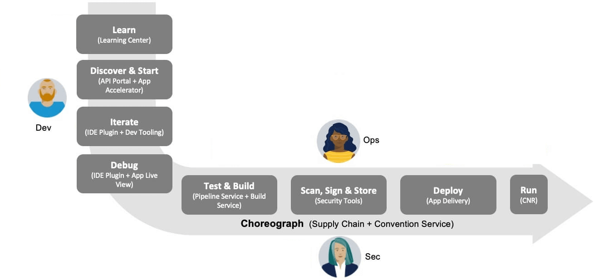
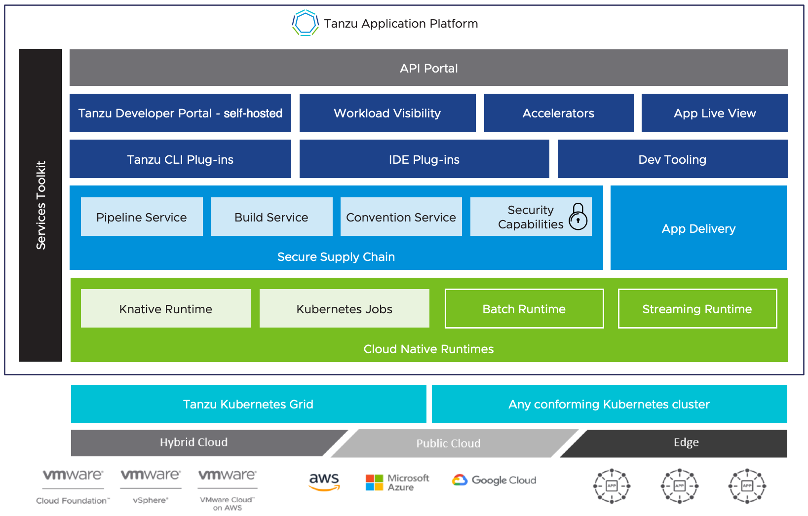

# Tanzu Application Platform v1.1

##  Overview of Tanzu Application Platform

VMware Tanzu Application Platform is an application development platform that provides a rich set
of developer tools. It offers developers a paved path to production to build and deploy software quickly and
securely on any compliant public cloud or on-premises Kubernetes cluster.

Tanzu Application Platform delivers a superior developer experience for enterprises building and
deploying cloud-native applications on Kubernetes.
It enables application teams to get to production faster by automating source-to-production
pipelines. It clearly defines the roles of developers and operators so they can work collaboratively
and integrate their efforts.

Tanzu Application Platform includes elements that enable developers to quickly begin building
and testing applications regardless of their familiarity with Kubernetes.

Operations teams can create application scaffolding templates with built-in security and compliance
guardrails, making those considerations mostly invisible to developers. Starting with the templates,
developers turn source code into a container and get a URL to test their app in minutes.

After the container is built, it updates every time there’s a new code commit
or dependency patch. And connecting to other applications and data, regardless of how they’re built
or what kind of infrastructure they run on, has never been easier, thanks to an internal API
management portal.

Customers can simplify workflows in both the inner loop and outer loop of Kubernetes-based app
development with Tanzu Application Platform while creating supply chains.

- **Inner Loop**:
    - The inner loop describes a developer’s development cycle of iterating on code.
    - Inner loop activities include coding, testing, and debugging before making a commit.
    - On cloud-native or Kubernetes platforms, developers in the inner loop often build container images and connect their apps to all necessary services and APIs to deploy them to a development environment.

- **Outer Loop**:
    - The outer loop describes how operators deploy apps to production and maintain them over time.
    - On a cloud-native platform, outer loop activities include building container images, adding container security, and configuring continuous integration and continuous delivery (CI/CD)  pipelines.
    - Outer loop activities are challenging in a Kubernetes-based development environment due to app delivery platforms being constructed from various third-party and open source components with numerous configuration options.

- **Supply Chains and choreography**:
    - Tanzu Application Platform uses the choreography pattern inherited from the context of microservices[^1] and applies it to continuous integration and continuous deployment (CI/CD) to create a path to production.[^2]

[^1]: https://stackoverflow.com/questions/4127241/orchestration-vs-choreography
[^2]: https://tanzu.vmware.com/developer/guides/supply-chain-choreography/

Supply Chains provide a way of codifying all of the steps of your path to production, or what is
more commonly known as CI/CD. A supply chain differs from CI/CD in that you can add any and every
step that is necessary for an application to reach production or a lower environment.

To address the developer experience gap, the path to production allows users to create a
unified access point for all of the tools required for their applications to reach a customer-facing
environment.

Instead of having separate tools that are loosely coupled to each other for testing and building,
security, deploying, and running apps, a path to production defines all four tools in a single,
unified layer of abstraction. Where tools typically can't integrate with
one another and additional scripting or webhooks are necessary, a unified automation tool codifies
all the interactions between each of the tools.

Tanzu Application Platform provides a default set of components that automates pushing an app to
staging and production on Kubernetes. This removes the pain points for both inner and outer loops.
It also allows operators to customize the platform by replacing Tanzu Application Platform components
with other products.

The following packages are part of the Tanzu Application Platform:

- **[API portal for VMware Tanzu](https://docs.pivotal.io/api-portal)**

  API portal for VMware Tanzu enables API consumers to find APIs they can use in their own
  applications.

  Consumers can view detailed API documentation and try out an API to see if it meets their needs.
  API portal assembles its dashboard and detailed API documentation views by ingesting OpenAPI
  documentation from the source URLs. An API portal operator can add any number of OpenAPI source
  URLs to be displayed in a single instance.

- **[Application Accelerator for VMware Tanzu](https://docs.vmware.com/en/Application-Accelerator-for-VMware-Tanzu/index.html)**

  The Application Accelerator component helps app developers and app operators through the creation
  and generation of application accelerators.

  Accelerators are templates that codify best practices and ensure important configurations and
  structures are in place from the start. Developers can bootstrap their applications and get
  started with feature development right away.

  Application operators can create custom accelerators that reflect their desired architectures and
  configurations and enable fleets of developers to use them, decreasing operator concerns about
  whether developers are implementing their desired best practices.

- **[Application Live View for VMware Tanzu](https://docs.vmware.com/en/Application-Live-View-for-VMware-Tanzu/index.html)**

  Application Live View is a lightweight insight and troubleshooting tool that helps application
  developers and application operators look inside running applications.

  It is based on the concept of Spring Boot Actuators.
  Fundamentally, the application provides information from inside the running processes by using
  endpoints (in our case, HTTP endpoints). Application Live View uses those endpoints to get the
  data from the application and to interact with it.

- **[Cloud Native Runtimes for VMware Tanzu](https://docs.vmware.com/en/Cloud-Native-Runtimes-for-VMware-Tanzu/index.html)**

  Cloud Native Runtimes for Tanzu is a serverless application runtime for Kubernetes that is based
  on Knative and runs on a single Kubernetes cluster. For information about Knative, see the
  [Knative documentation](https://knative.dev/docs/). Cloud Native Runtimes capabilities are included
  in VMware Tanzu Advanced Edition and VMware Tanzu Application Platform.

- **[Convention Service for VMware Tanzu](convention-service/about.md)**

  The convention service provides a means for people in operational roles to express their hard-won
  knowledge and opinions about how apps should run on Kubernetes as a convention. The convention
  service applies these opinions to fleets of developer workloads as they are deployed to the
  platform, saving operator and developer time.

- **[Default roles for Tanzu Application Platform](authn-authz/overview.md)**

  This package includes five default roles for users including app-editor, app-viewer, app-operator, and service accounts including workload, and deliverable. These roles are available to help operators limit the permissions that a user or service account requires on a cluster that runs Tanzu Application Platform. They are built by using aggregated cluster roles in Kubernetes role-based access control (RBAC).

  Default roles only apply to a user interacting with the cluster using kubectl and Tanzu CLI. Tanzu Application Platform GUI support for default roles is planned for a future release.

- **[Developer Conventions](convention-service/about.md)**

  Developer conventions configure workloads to prepare them for inner loop development.

  It’s meant to be a “deploy and forget” component for developers: after it is installed on the
  cluster with the Tanzu Package CLI, developers do not need to directly interact with it.
  Developers instead interact with the Tanzu Developer Tools for VS Code IDE Extension or
  Tanzu CLI Apps plug-in, which rely on the Developer Conventions to modify the workload to enable
  inner loop capabilities.

- **[Flux Source Controller](https://fluxcd.io/docs/components/source/)**

  The main role of the source management component is to provide a common interface for artifact acquisition.

- **[Grype](https://github.com/anchore/grype)**

  Grype is a vulnerability scanner for container images and file systems.

- **[Services Toolkit](https://docs.vmware.com/en/Services-Toolkit-for-VMware-Tanzu-Application-Platform/index.html)**

  Services Toolkit comprises a number of Kubernetes-native components which support the management,
  life cycle, discoverability, and connectivity of Service Resources (databases, message queues,
  DNS records, etc) on Kubernetes.

- **[Supply Chain Choreographer for VMware Tanzu](scc/about.md)**

  Supply Chain Choreographer is based on open-source [Cartographer](https://cartographer.sh/docs/).
  It enables app operators to create pre-approved paths to production by integrating Kubernetes
  resources with the elements of their existing toolchains, such as Jenkins.

  Each pre-approved supply chain creates a paved road to production. It orchestrates supply chain
  resources - test, build, scan, and deploy - enabling developers to focus on delivering
  value to their users while also providing app operators with the peace of mind that all code in
  production has passed through all the steps of an approved workflow.

- **[Supply Chain Security tools for Tanzu - Scan](scst-scan/overview.md)**

  With Supply Chain Security Tools for VMware Tanzu - Scan, Tanzu customers can build and deploy
  secure trusted software that complies with their corporate security requirements.

  To enable this, Supply Chain Security Tools - Scan provides scanning and gatekeeping capabilities
  that Application and DevSecOps teams can incorporate earlier in their path to production.
  This is an established industry best practice for reducing security risk and ensuring more
  efficient remediation.

- **[Supply Chain Security Tools - Sign](scst-sign/overview.md)**

  Supply Chain Security Tools - Sign provides an admission controller that allows a cluster operator
  to specify a policy that allows or denies images from running based on signature verification
  against public keys. It works with
  [cosign signature format](https://github.com/sigstore/cosign#quick-start) and allows for fine-tuned
  configuration based on image source patterns.

- **[Supply Chain Security Tools - Store](scst-store/overview.md)**

  Supply Chain Security Tools - Store saves software bills of materials (SBoMs) to a database and
  enables you to query for image, source, package, and vulnerability relationships.
  It integrates with Supply Chain Security Tools - Scan to automatically store the resulting source
  and image vulnerability reports.

- **[Tanzu Application Platform GUI](tap-gui/about.md)**

  Tanzu Application Platform GUI lets your developers view your organization's running applications
  and services. It provides a central location for viewing dependencies, relationships, technical
  documentation, and even service status.
  Tanzu Application Platform GUI is built from the Cloud Native Computing Foundation's project
  Backstage.

- **[Tanzu Build Service](tanzu-build-service/tbs-about.md)**

  Tanzu Build Service uses the open-source Cloud Native Buildpacks project to turn application
  source code into container images.

  Build Service executes reproducible builds that align with modern container standards, and keeps
  images up to date. It does so by leveraging Kubernetes infrastructure with kpack, a Cloud Native
  Buildpacks Platform, to orchestrate the image life cycle.

  The kpack CLI tool, kp, can aid in managing kpack resources. Build Service helps you
  develop and automate containerized software workflows securely and at scale.

- **[Tanzu Developer Tools for Visual Studio Code](vscode-extension/about.md)**

  Tanzu Developer Tools for Visual Studio Code is the official VMware Tanzu IDE extension for VS Code
  to help you develop code using the Tanzu Application Platform.
  The VSCode extension enables live updates of your application while it runs on the cluster and
  lets you debug your application directly on the cluster.

- **[Tanzu Learning Center](learning-center/about.md)**

  Learning Center provides a platform for creating and self-hosting workshops. With Learning Center, content
  creators can create workshops from markdown files that learners can view in a terminal
  shell environment with an instructional wizard UI. The UI can embed slide content, an integrated
  development environment (IDE), a web console for accessing the Kubernetes cluster, and other custom
  web applications.

  Although Learning Center requires Kubernetes to run, and it teaches users about Kubernetes,
  you can use it to host training for other purposes as well. For example, you can use it to train
  users on web-based applications, use of databases, or programming languages.

- **[Tekton](tekton/tekton-about.md)**

  Tekton is a powerful and flexible open-source framework for creating CI/CD systems, enabling
  developers to build, test, and deploy across cloud providers and on-premise systems.

##  Installation profiles in Tanzu Application Platform v1.1

Tanzu Application Platform can be deployed through predefined profiles or individual packages. The profiles are designed to allow the Tanzu Application Platform to scale across an organization's multicluster, multicloud, or hybrid cloud infrastructure. These profiles are not meant to cover all customer’s use cases, but rather serve as a starting point to allow for further customization.

The following profiles are available in Tanzu Application Platform:

- **Full:**
  This profile contains all of the Tanzu Application Platform packages.

- **Iterate:**
  This profile is intended for iterative application development.

- **Build:**
  This profile is intended for the transformation of source revisions to workload revisions. Specifically, hosting Workloads and SupplyChains.

- **Run:**
  This profile is intended for the transformation of workload revisions to running Pods. Specifically, hosting Deliveries and Deliverables.

- **View:**
  This profile is intended for instances of applications related to centralized developer experiences. Specifically, Tanzu Application Platform GUI and Metadata Store.

##  About Tanzu Application Platform package profiles

Tanzu Application Platform can be installed through predefined profiles or through individual
packages. This section explains how to install a profile.

Tanzu Application Platform contains the following five profiles:

- Full (`full`)
- Iterate (`iterate`)
- Build (`build`)
- Run (`run`)
- View (`view`)

The following table lists the packages contained in each profile:

<table>
  <tr>
   <td><strong>Capability Name</strong>
   </td>
   <td><strong>Full</strong>
   </td>
   <td><strong>Iterate</strong>
   </td>
   <td><strong>Build</strong>
   </td>
   <td><strong>Run</strong>
   </td>
   <td><strong>View</strong>
   </td>
  </tr>
  <tr>
   <td>API Portal
   </td>
   <td>&check;
   </td>
   <td>
   </td>
   <td>
   </td>
   <td>
   </td>
   <td>&check;
   </td>
  </tr>
  <tr>
   <td>Application Accelerator
   </td>
   <td>&check;
   </td>
   <td>
   </td>
   <td>
   </td>
   <td>
   </td>
   <td>&check;
   </td>
  </tr>
  <tr>
   <td>Application Live View (Build)
   </td>
   <td>&check;
   </td>
   <td>&check;
   </td>
   <td>&check;
   </td>
   <td>
   </td>
   <td>
   </td>
  </tr>
  <tr>
   <td>Application Live View (Run)
   </td>
   <td>&check;
   </td>
   <td>&check;
   </td>
   <td>
   </td>
   <td>&check;
   </td>
   <td>
   </td>
  </tr>
  <tr>
  <td>Application Live View GUI Backend
   </td>
   <td>&check;
   </td>
   <td>
   </td>
   <td>
   </td>
   <td>
   </td>
   <td>&check;
   </td>
  </tr>
  <tr>
  <td>Cloud Native Runtimes
   </td>
   <td>&check;
   </td>
   <td>&check;
   </td>
   <td>
   </td>
   <td>&check;
   </td>
   <td>
   </td>
  </tr>
  <tr>
   <td>Convention Controller
    </td>
   <td>&check;
   </td>
   <td>&check;
   </td>
   <td>&check;
   </td>
   <td>
   </td>
   <td>
   </td>
  </tr>
  <tr>
   <td>Default Roles
   </td>
   <td>&check;
   </td>
   <td>&check;
   </td>
   <td>&check;
   </td>
   <td>&check;
   </td>
   <td>&check;
   </td>
  </tr>
  <tr>
   <td>Developer Conventions
   </td>
   <td>&check;
   </td>
   <td>&check;
   </td>
   <td>
   </td>
   <td>
   </td>
   <td>
   </td>
  </tr>
  <tr>
   <td>Flux Source Controller
  </td>
   <td>&check;
   </td>
   <td>&check;
   </td>
   <td>&check;
   </td>
   <td>&check;
   </td>
   <td>&check;
   </td>
  </tr>
  <tr>
   <td>Grype
   </td>
   <td>&check;
   </td>
   <td>
   </td>
   <td>&check;
   </td>
   <td>
   </td>
   <td>
   </td>
  </tr>
  <tr>
   <td>Image Policy Webhook
  </td>
   <td>&check;
   </td>
   <td>&check;
   </td>
   <td>
   </td>
   <td>&check;
   </td>
   <td>
   </td>
  </tr>
  <tr>
   <td>Learning Center
  </td>
   <td>&check;
   </td>
   <td>
   </td>
   <td>
   </td>
   <td>
   </td>
   <td>&check;
   </td>
  </tr>
  <tr>
   <td>Out of the Box Delivery - Basic
   </td>
   <td>&check;
   </td>
   <td>&check;
   </td>
   <td>
   </td>
   <td>&check;
   </td>
   <td>
   </td>
  </tr>
  <tr>
   <td>Out of the Box Supply Chain - Basic
   </td>
   <td>&check;
   </td>
   <td>&check;
   </td>
   <td>&check;
   </td>
   <td>
   </td>
   <td>
   </td>
  </tr>
  <tr>
   <td>Out of the Box Supply Chain - Testing
   </td>
   <td>&check;
   </td>
   <td>&check;
   </td>
   <td>&check;
   </td>
   <td>
   </td>
   <td>
   </td>
  </tr>
  <tr>
   <td>Out of the Box Supply Chain - Testing and Scanning
   </td>
   <td>&check;
   </td>
   <td>
   </td>
   <td>&check;
   </td>
   <td>
   </td>
   <td>
   </td>
  </tr>
  <tr>
   <td>Out of the Box Templates
   </td>
   <td>&check;
   </td>
   <td>&check;
   </td>
   <td>&check;
   </td>
   <td>&check;
   </td>
   <td>
   </td>
  </tr>
  <tr>
   <td>Service Bindings
   </td>
   <td>&check;
   </td>
   <td>&check;
   </td>
   <td>
   </td>
   <td>&check;
   </td>
   <td>
   </td>
  </tr>
  <tr>
   <td>Services Toolkit
   </td>
   <td>&check;
   </td>
   <td>&check;
   </td>
   <td>
   </td>
   <td>&check;
   </td>
   <td>
   </td>
  </tr>
  <tr>
   <td>Source Controller
   </td>
   <td>&check;
   </td>
   <td>&check;
   </td>
   <td>&check;
   </td>
   <td>&check;
   </td>
   <td>&check;
   </td>
  </tr>
  <tr>
   <td>Spring Boot Convention
  </td>
   <td>&check;
   </td>
   <td>&check;
   </td>
   <td>&check;
   </td>
   <td>
   </td>
   <td>
   </td>
  </tr>
  <tr>
   <td>Supply Chain Choreographer
   </td>
   <td>&check;
   </td>
   <td>&check;
   </td>
   <td>&check;
   </td>
   <td>&check;
   </td>
   <td>
   </td>
  </tr>
  <tr>
   <td>Supply Chain Security Tools - Scan</td>
  </td>
   <td>&check;
   </td>
   <td>
   </td>
   <td>&check;
   </td>
   <td>
   </td>
   <td>
   </td>
  </tr>
  <tr>
   <td>Supply Chain Security Tools - Store</td>
   </td>
   <td>&check;
   </td>
   <td>
   </td>
   <td>
   </td>
   <td>
   </td>
   <td>&check;
   </td>
  </tr>
  <tr>
   <td>Tanzu Build Service
   </td>
   <td>&check;
   </td>
   <td>&check;
   </td>
   <td>&check;
   </td>
   <td>
   </td>
   <td>
   </td>
  </tr>
  <tr>
   <td>Tanzu Application Platform GUI
   </td>
   <td>&check;
   </td>
   <td>
   </td>
   <td>
   </td>
   <td>
   </td>
   <td>&check;
   </td>
  </tr>
  <tr>
   <td>Tekton Pipelines
   </td>
   <td>&check;
   </td>
   <td>&check;
   </td>
   <td>&check;
   </td>
   <td>
   </td>
   <td>
   </td>
  </tr>
  <tr>
   <td>Telemetry
   </td>
   <td>&check;
   </td>
   <td>&check;
   </td>
   <td>&check;
   </td>
   <td>&check;
   </td>
   <td>&check;
   </td>
  </tr>
  <tr>
</table>

\* Only one supply chain should be installed at any given time.
For information on switching from one supply chain to another, see [Getting Started with Tanzu Application Platform](getting-started.md).

##  About installing the Tanzu Application Platform v1.1

To install the Tanzu Application Platform profiles, see [Installing Tanzu Application Platform](install-intro.md).

##  Notice of telemetry collection for Tanzu Application Platform

[//]: # (This following text came from legal. Do not edit it.)

Tanzu Application Platform participates in the VMware Customer Experience Improvement Program (CEIP).
As part of CEIP, VMware collects technical information about your organization’s use of VMware
products and services in association with your organization’s VMware license keys.
For information about CEIP, see the [Trust & Assurance Center](http://www.vmware.com/trustvmware/ceip.html).
You may join or leave CEIP at any time.
The CEIP Standard Participation Level provides VMware with information to improve its products and
services, identify and fix problems, and advise you on how to best deploy and use VMware products.
For example, this information can enable a proactive product deployment discussion with your VMware
account team or VMware support team to help resolve your issues.
This information cannot directly identify any individual.

[//]: # (The text above came from legal. Do not edit it.)

You must acknowledge that you have read the VMware CEIP policy before you can proceed with the
installation.
For more information, see [Install your Tanzu Application Platform profile](install.md#install-profile).
To opt out of telemetry participation after installation, see
[Opting out of telemetry collection](opting-out-telemetry.md).
