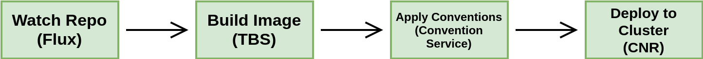
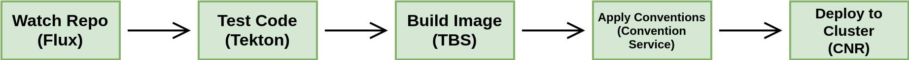

# Default Supply Chains

Default supply chains are provided out of the box with Tanzu Application Platform. The two default supply chains that are included are:

- Source to URL
- Source & Test to URL

## Source to URL

Source to URL is the most basic supply chain allowing you to:

- Watch a git repository
- Build the code into an image
- Apply some conventions to the K8s YAML
- Deploy the application to the same cluster



### Example usage

#### Credentials for pushing app images to a registry

As the supply chain builds a container image based of the source code and
pushes it to a registry, we need to provide to the systems the credentials for
doing so.

Using the `imagepullsecret` command from the [tanzu cli] we're able to
provision a base secret that contains such credentials and then export the
contents of that secret to the namespaces where it should be consumed.


```bash
# define details about the registry that we want to create a secret
# with the credentials to be exposed to cluster components and the
# supplychain.
#
#
REGISTRY=10.188.0.3:5000
REGISTRY_USERNAME=admin
REGISTRY_PASSWORD=admin


# create a Secret object using the `dockerconfigjson` format using the
# credentials provided, then a SecretExport (`secretgen-controller`
# resource) so that it gets exported to all namespaces where a
# placeholder secret can be found.
#
#
tanzu imagepullsecret add registry-credentials \
  --export-to-all-namespaces \
  --registry $REGISTRY \
  --username $REGISTRY_USERNAME \
  --password $REGISTRY_PASSWORD
```
```console
- Adding image pull secret 'registry-credentials'...
 Added image pull secret 'registry-credentials' into namespace 'default'
```

_ps.: note that the REGISTRY here _must_ be the same as the one set in the
values file above._

## Source & Test to URL

The source & test to URL supply chain builds on the ability of the source to url supply chain and adds the ability to perform testing using Tekton.



### Example usage

#### Tanzu Build Service cluster objects

In order for Tanzu Build Service to build container images based on the
appplication source code, we need for first configure a few cluster-wide
objects.

```bash
ytt --ignore-unknown-comments \
  -f ./examples/values.yaml \
  -f ./examples/cluster \
	--data-value registry=$REGISTRY |
  kapp deploy --yes -a kpack-cluster-setup -f-
```
```console
Target cluster 'https://127.0.0.1:41255' (nodes: cartographer-control-plane)

Changes

Namespace  Name                          Kind             Op       Wait to  
(cluster)  builder                       ClusterBuilder   create   reconcile
^          go-store                      ClusterStore     create   reconcile
^          stack                         ClusterStack     create   reconcile
default    private-registry-credentials  Secret           create   reconcile
^          service-account               ServiceAccount   create   reconcile

Op:      5 create, 0 delete, 0 update, 0 noop
Wait to: 5 reconcile, 0 delete, 0 noop

8:28:37PM: ---- applying 5 changes [0/5 done] ----
...
8:28:38PM: ---- applying complete [5/5 done] ----
8:28:38PM: ---- waiting complete [5/5 done] ----

Succeeded
```

we can make sure that everything went well by looking at the status of the
clusterbuilder that we just submitted:

```bash
kubectl describe clusterbuilder builder
```
```console
...
  Conditions:
    Last Transition Time:     2021-09-28T21:22:02Z
    Status:                   True
    Type:                     Ready
  Latest Image:               10.188.0.3:5000/go-builder@sha256:481a496fa4e1785537811808349863f009fd96704a6234007c069f19b5a8aecc
```


#### Developer Workload

Finaly, having set up the cluster, what's left is for the developer to submit a
Workload whose selector matches the supplychain:

```bash
kubectl get clustersupplychains.carto.run source-test-to-url \
  -o jsonpath='{.spec.selector}'
```
```console
{"apps.tanzu.vmware.com/workload-type": "web"}
```

For instance:

```yaml
apiVersion: carto.run/v1alpha1
kind: Workload
metadata:
  name: dev
  labels:
    apps.tanzu.vmware.com/workload-type: web
    app.kubernetes.io/part-of: hello-world
spec:
  params:
    - name: tekton-pipeline-name
      value: developer-defined-tekton-pipeline
  source:
    git:
      url: https://github.com/kontinue/hello-world
      ref:
        branch: main
```

and a Tekton pipeline object:

```yaml
apiVersion: tekton.dev/v1beta1
kind: Pipeline
metadata:
  name: developer-defined-tekton-pipeline
spec:
  params:
    - name: source-url
    - name: source-revision
  tasks:
    - name: test
      params:
        - name: source-url
          value: $(params.source-url)
        - name: source-revision
          value: $(params.source-revision)
      taskSpec:
        params:
          - name: source-url
          - name: source-revision
        steps:
          - name: test
            image: golang
            script: |-
              cd `mktemp -d`

              wget -qO- $(params.source-url) | tar xvz
              go test -v ./...
```