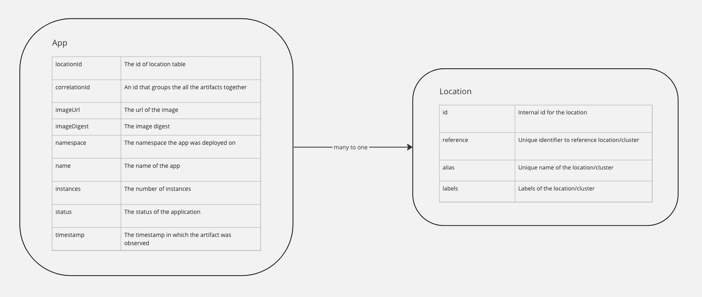

# AMR Data Model

This topic describes the different data models used in the AMR to store artifact information.

##  Overview

Here is a diagram that shows the data models currently used in AMR to store artifact information and the relation between them.

## AMR Data Models

Currently in the AMR there are two types of data models, `App` and `Location`.

### Application

The `App` data model represents the information of an application (i.e. replicaset) at a point in time. 
This information is sent to the AMR by `cloud events`, so each entry represents the status of the app when an event occurred.
Typically, that would include entries corresponding to events such as when an app is being created, scaling up, running, scaling down, deleted.
This is useful for users to see the history of their apps. 

Each `app` data entry stores information on the associated `location` it was deployed in, details on the status, what is deployed etc. Check the diagram above for a list of all fields the data model stores.
An `app` entry can only be associated to one `location`, and no duplicates are allowed in the same location.

### Location

The `Location` data model stores data about locations that `apps` are deployed on (i.e. clusters). 
There is a unique `reference` and `alias` to each location, as well as any amount of labels that the user wishes to add. 
Configuring these fields for a location can be done through the tap values yaml file, see [here](link).

There can be multiple `app` entries pointing to the same `location` entry.