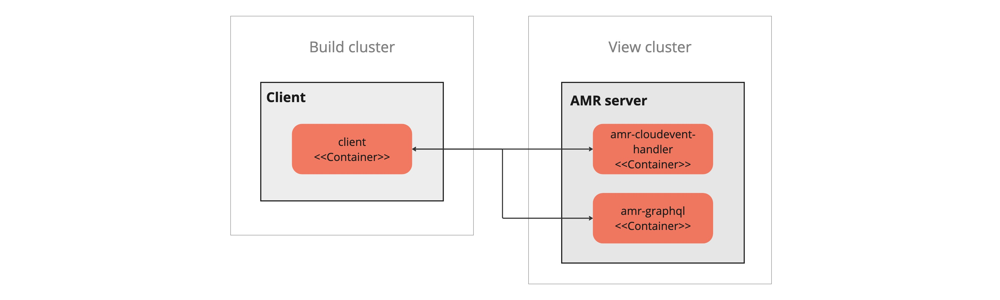
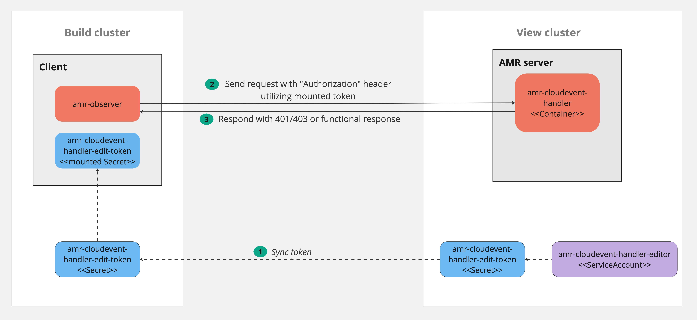

# Authentication and authorization

1. [High-level design](#high-level-design)
1. GraphQL default service account
1. Cloudevent handler default service account
1. GraphQL user-defined service account
1. Cloudevent user-defined service account
1. Configuring AMR Observer with the Cloudevent handler service account access token
1. Using `curl` to query GraphQL

## High-level design

The Artifact Metadata Repository (AMR) deploys two k8s services which expose http endpoints: 1) Cloudevent-handler and 2) GraphQL. They're both in the same cluster. In a multi-cluster TAP deployment, they're in the View cluster and the clients can be from any cluster. We'll show the client in the Build cluster in our examples.

The client sends requests to either service depending on their current task. The cloudevent-handler ingests events from the client and stores it in a database (write). The GraphQL server answers queries from the client and returns data from the database (read). Other than those points, the two can be treated the same for the purpose of this design. They will both use the same authentication and authorization solution and we'll simplify the explanation by showing just the cloudevent-handler.

### Kubernetes RBAC

The server will implement support for auth using **k8s RBAC**. This includes requiring the client to send a token from a k8s service account token bound to a k8s role.

1. The administrator creates a service account, role/clusterrole, and role binding in the cluster where the cloudevent-handler is deployed (View cluster). The role declares what permissions the client has: 
   * For the AMR **Observer** the supported permissions are `update`, resource `*`, group `cloudevents.amr.apps.tanzu.vmware.com`. No resourceNames are supported. That translates to “write for all resources” for the CloudEvents API.
   * For **GraphQL** service the supported permissions are `get`, resource `*` and group `graphql.amr.apps.tanzu.vmware.com`. No resourceNames are supported. That translates to “read all” from the GraphQL API.
1. The administrator copies the service account token and puts it in the client cluster where the client container can read it. For example, the client can get the token mounted as a k8s secret.
1. The client sends a request to AMR, and puts the service account token in the http header `Authorization: Bearer <token>`.
1. The cloudevent-handler will read the token and conduct a **TokenReview**.
1. The cloudevent-handler will then do a **SubjectAccessReview** using the userinfo returned from TokenReview and the resource information as described in #1.
1. The SubjectAccessReview will, according to the normal k8s RBAC system, look for any Role/ClusterRole associations via Bindings to find a match between the assigned roles to the specific service account and the requested resource information. 

