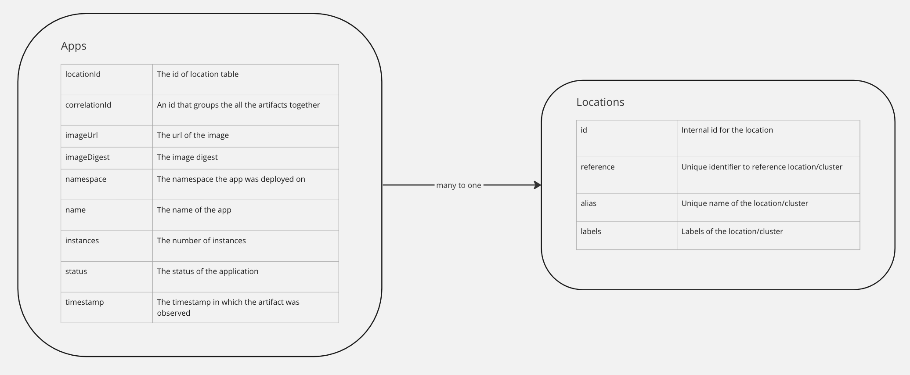

# Artifact Metadata Repository (AMR) Data Model and Concepts

This topic describes data models used in the Artifact Metadata Repository (AMR).

##  Overview

The diagram below shows the data models used in the AMR to store artifact information and the relation between them.

##  AMR Data Models

There are two types of data models in the AMR: `Apps` and `Locations`.

###  Apps

The `Apps` data model represents the information of an application (i.e. replicaset) at a point in time.
This information is sent to the AMR by [cloud events](cloudevents.hbs.md), so each entry represents the status of the app when an event occurred.
These entries correspond to events such as when an app is created, scaled up, running, scaled down or deleted.
This is useful for users to see the history of their apps.

Each `Apps` data entry stores information on the associated location it was deployed in, details on the status, what is deployed, etc. Check the diagram above for a list of all fields the data model stores.
An `Apps` entry can only be associated to one `Locations` entry. 
There can be multiple `Apps` entries pointing to the same `Locations` entry. 
All `Apps` entries within a given location are guaranteed to be unique, meaning that no two `Apps` entries in the same location can have identical values for all their fields.

###  Locations

The `Locations` data model stores data about the locations that `Apps` are deployed on (i.e. clusters).

- `reference`: unique reference to the location. It is automatically set to be the `kube-system` namespace UID by the AMR. This is not configurable by the user.
- `alias`: unique alias for the location. 
  By default, it is initialized with the value of the `reference`, but users have the option to configure it to a different value. See [AMR Configuration](configuration.hbs.md).
- `labels`: labels of the location. They can be added bu users through tap values yaml file, see [AMR Configuration](configuration.hbs.md).