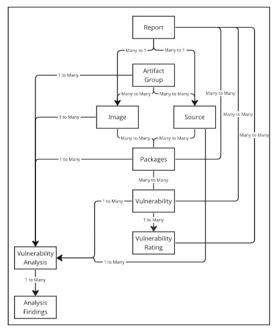
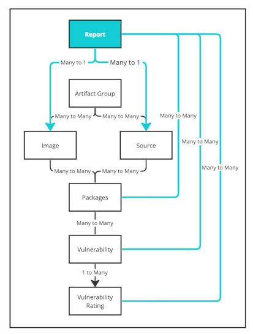

# Data models and concepts for Supply Chain Security Tools - Store

This topic describes the different data models and concepts the Supply Chain Security Tools (SCST) - Store uses for consuming and providing information.

##  Overview

This diagram shows an overview of the SCST - Store data models and their relations.

##  Software Bill of Material per build

Originally, the SCST - Store aggregated the data of all vulnerability scans
submitted to it. This allowed users to see information from all scan results
against an image or source. However, users couldn't retrieve information against
an image or source from a specific vulnerability scan. For example, a user can't
know from which vulnerability scan a specific CVE might have surfaced from. This
is why VMware introduced Software Bill of Material per build for SCST - Store.

Items in blue are the new information saved with each vulnerability scan.

With each vulnerability scan submitted, the SCST - Store creates an internal
report, which keeps track of the following from the vulnerability scan:

- The specific image or source
- Which packages were listed
- Which vulnerabilities were listed
- Which ratings were listed

Users can then search for all reports against an image or source with [query for a list of reports](api.hbs.md#span-idv1-search-reportsspan-query-for-a-list-of-reports-with-specified-image-digest-source-sha-or-original-location-v1searchreports).

After a report is located, the information for that report is retrieved by using [query for a specific report](api.hbs.md#span-idv1-get-reportspan-get-a-specific-report-by-its-unique-identifier-v1getreport).
