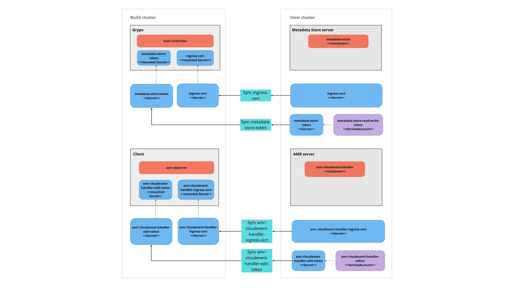

# Multicluster setup for Supply Chain Security Tools - Store

This topic describes how you can deploy Supply Chain Security Tools (SCST) -
Store in a multicluster setup includes installing multiple profiles such as,
View, Build, Run, and Iterate.

## Overview

SCST - Store is deployed with the View profile. After
installing the View profile, but before installing the Build profile, you must
add configuration for SCST - Store to the Kubernetes cluster where you intend to install the Build profile.
This topic explains how to add configuration which allows components in the Build
cluster to communicate with SCST - Store in the View cluster.

> **Note** If you already deployed the Build profile, you can follow
> this procedure. However, in the [Install Build
> profile](#install-build-profile) step, instead of deploying the Build profile
> again, update your deployment using `tanzu package installed update`.



## Prerequisites

You must install the View profile. See [Install View profile](../multicluster/installing-multicluster.hbs.md#install-view).

## Procedure summary

1. Copy SCST - Store CA certificates from the View cluster.
   1. Copy Metadata Store CA certificate from the View cluster.
   2. Copy AMR CloudEvent Handler CA certificate from the View cluster.
2. Copy SCST - Store tokens from the View cluster.
   1. Copy Metadata Store authentication token from the View cluster.
   2. Copy AMR CloudEvent Handler edit token from the View cluster.
3. Apply the SCST - Store CA certificates and SCST - Store tokens to Build cluster.
   1. Apply the Metadata Store CA certificate and an authentication token to a new Kubernetes cluster
   2. Apply the CloudEvent Handler CA certificate and edit token to Build cluster
4. Install the Build profile.

## Copy SCST - Store CA certificate from View cluster

### Copy Metadata Store CA certificate from the View cluster
With your kubectl targeted at the View cluster, you can view Metadata Store's TLS
CA certificate. Run these commands to copy the CA certificate into a file
`store_ca.yaml`.

```bash
MDS_CA_CERT=$(kubectl get secret -n metadata-store ingress-cert -o json | jq -r ".data.\"ca.crt\"")
cat <<EOF > store_ca.yaml
---
apiVersion: v1
kind: Secret
type: Opaque
metadata:
  name: store-ca-cert
  namespace: metadata-store-secrets
data:
  ca.crt: $MDS_CA_CERT
EOF
```

### Copy AMR CloudEvent Handler CA certificate from the View cluster
With your kubectl targeted at the View cluster, you can view AMR CloudEvent Handler's TLS
CA certificate. Run these commands to copy the CA certificate into a file
`ceh_ca.yaml`.

```bash
CEH_CA_CERT=$(kubectl get secret -n amr-observer-system amr-cloudevent-handler-ingress-cert -o json | jq -r ".data.\"ca.crt\"")
cat <<EOF > ceh_ca.yaml
---
apiVersion: v1
kind: Secret
type: Opaque
metadata:
  name: truststore
  namespace: amr-observer-system
data:
  ca.crt: $CEH_CA_CERT
EOF
```

## Copy SCST - Store authentication tokens from the View cluster
### Copy Metadata Store authentication token from the View cluster

Copy the Metadata Store authentication token into an environment variable. You use
this environment variable in the next step.

```bash
MDS_AUTH_TOKEN=$(kubectl get secrets metadata-store-read-write-client -n metadata-store -o jsonpath="{.data.token}" | base64 -d)
```
## Copy AMR CloudEvent Handler edit token from the View cluster

Copy the AMR CloudEvent Handler token into an environment variable. You use
this environment variable in the next step.

```bash
CEH_EDIT_TOKEN=$(kubectl get secrets amr-cloudevent-handler-edit-token -n metadata-store -o jsonpath="{.data.token}" | base64 -d)
```

## Apply the SCST - Store CA certificates and SCST - Store tokens to Build cluster

Once we have certificate and tokens copied, we apply the Metadata Store CA certificates, Metadata Store authentication token and CloudEvent Handler edit token to the Kubernetes cluster where you intend to install the Build profile.

### Apply the Metadata Store CA certificate and an authentication token to a new Kubernetes cluster

Before you deploy the Build profile, you must apply the Metadata Store CA certificate and
Metadata Store authentication token from the earlier steps. Then the Build profile deployment
will have access to these values.

To apply the Metadata Store CA certificate and an authentication token:

1. With your kubectl targeted at the Build cluster, create a namespace for the Metadata Store CA
certificate and an authentication token.

    ```bash
    kubectl create ns metadata-store-secrets
    ```

1. Apply the Metadata Store CA certificate `store_ca.yaml` secret YAML you generated earlier.

    ```bash
    kubectl apply -f store_ca.yaml
    ```

1. Create a secret to store the access token. This uses the Metadata Store `MDS_AUTH_TOKEN` environment variable.

    ```bash
    kubectl create secret generic store-auth-token \
      --from-literal=auth_token=$MDS_AUTH_TOKEN -n metadata-store-secrets
    ```

The cluster now has a Metadata Store CA certificate named  `store-ca-cert` and a Metadata Store authentication
token named `store-auth-token` in the namespace `metadata-store-secrets`.

### Apply the CloudEvent Handler CA certificate and edit token to Build cluster

Steps to apply the CloudEvent Handler CA certificate and edit token:

1. If you already installed build cluster you can skip this step. 
   With your kubectl targeted at the Build cluster, create a namespace for the Cloud Event Handler CA
certificate and edit token.

    ```bash
    kubectl create ns amr-observer-system
    ```

1. Apply the CloudEvent Handler CA certificate `ceh_ca.yaml` secret YAML you generated earlier.

    ```bash
    kubectl apply -f ceh_ca.yaml
    ```

1. Create a secret to store the CloudEvent Handler edit token. This uses the `CEH_EDIT_TOKEN` environment variable.

    ```bash
    kubectl create secret generic amr-observer-edit-token \
      --from-literal=auth_token=$CEH_EDIT_TOKEN -n amr-observer-system
    ```

The cluster now has a CloudEvent Handler CA certificate named  `truststore` and edit
token named `amr-observer-edit-token` in the namespaces `metadata-store-secrets` and `amr-observer-system`.


## <a id='install-build-profile'></a>Install Build profile

If you came to this topic from the [Install multicluster Tanzu Application
Platform profiles](../multicluster/installing-multicluster.hbs.md) topic after
installing the View profile, return to that topic to [install the Build
profile](../multicluster/installing-multicluster.hbs.md#install-build).

The Build profile `values.yaml` contains configuration that references the
secrets in the `metadata-store-secrets` namespace you created in this guide. The
names of these secrets are hard coded in the example `values.yaml`.

### More information about how Build profile uses the configuration

The secrets you created are used in the Build profile `values.yaml` to configure
the Grype scanner which talks to SCST - Store. After performing a vulnerabilities
scan, the Grype scanner sends the results to SCST - Store. Here's a snippet of
what the configuration might look like.

```yaml
...
grype:
  targetImagePullSecret: "TARGET-REGISTRY-CREDENTIALS-SECRET"
  metadataStore:
    url: METADATA-STORE-URL-ON-VIEW-CLUSTER # Url with http / https
    caSecret:
        name: store-ca-cert
        importFromNamespace: metadata-store-secrets # Must match with `ingress-cert.data."ca.crt"` of store on view cluster
    authSecret:
        name: store-auth-token # Must match with valid store token of metadata-store on view cluster
        importFromNamespace: metadata-store-secrets
...
```

Where:

- `METADATA-STORE-URL-ON-VIEW-CLUSTER` is the ingress URL of SCST - Store
  deployed to the View cluster. For example,
  `https://metadata-store.example.com`. See [Ingress support](ingress.hbs.md).
- `TARGET-REGISTRY-CREDENTIALS-SECRET` is the name of the secret that contains
  the credentials to pull an image from the registry for scanning.

CloudEvent Handler CA CERT `truststore` and `amr-observer-edit-token` are used by AMR Observer so that AMR Observer can establish a connection with `AMR CloudEvent Handler`
to write events.

## Configure developer namespaces

After you finish the entire Tanzu Application Platform installation process, you
are ready to configure developer namespaces. To prepare developer namespaces,
you must export the Metadata Store secrets you created earlier to those namespaces.

### <a id="export-multicluster"></a> Exporting SCST - Store secrets to a developer namespace in a Tanzu Application Platform multicluster deployment

Export secrets to a developer namespace by creating `SecretExport` resources on
the developer namespace. Run the following command to create the `SecretExport`
resources. You must have created and populated the `metadata-store-secrets`
namespace.

```bash
cat <<EOF | kubectl apply -f -
---
apiVersion: secretgen.carvel.dev/v1alpha1
kind: SecretExport
metadata:
  name: store-ca-cert
  namespace: metadata-store-secrets
spec:
  toNamespaces: [DEV-NAMESPACES]
---
apiVersion: secretgen.carvel.dev/v1alpha1
kind: SecretExport
metadata:
  name: store-auth-token
  namespace: metadata-store-secrets
spec:
  toNamespaces: [DEV-NAMESPACES]
EOF
```

Where `[DEV-NAMESPACES]` is an array of developer namespaces where the Metadata Store secrets are exported.

More detailed description of `metadata` configuration can be found at [Cluster Specific Store Configuration](cluster-specific-scanner-configurations.hbs.md)

## Additional resources

- [Ingress support](ingress.hbs.md)
- [Custom certificate configuration](custom-cert.hbs.md)
