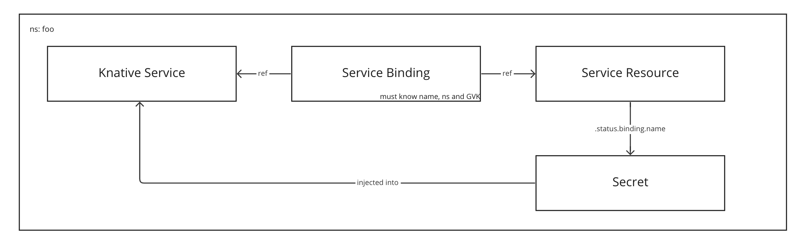
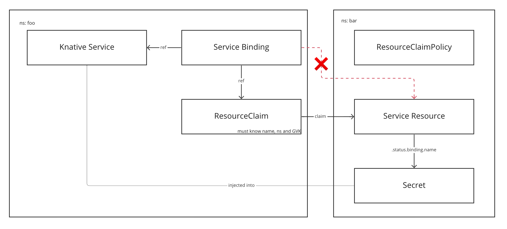
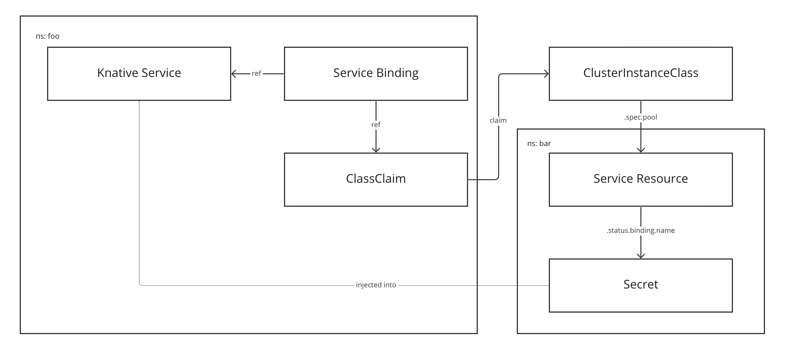
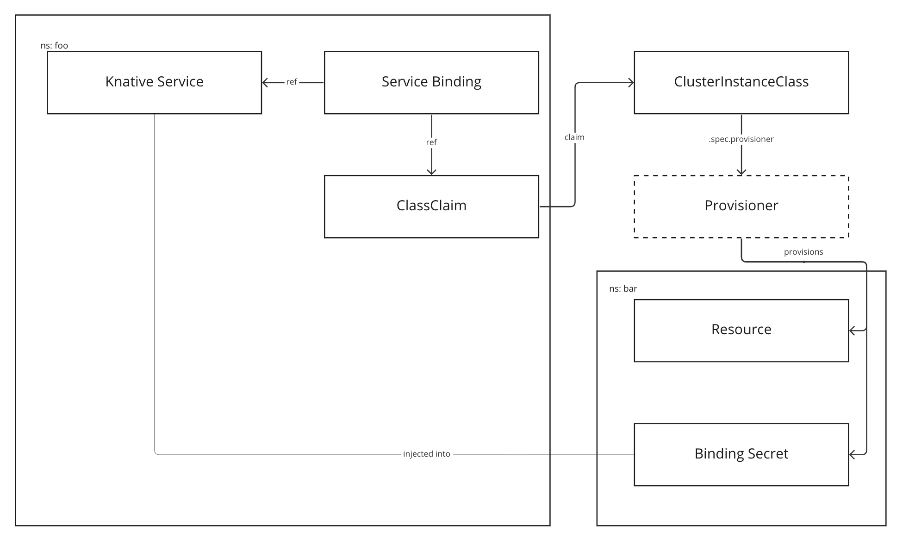
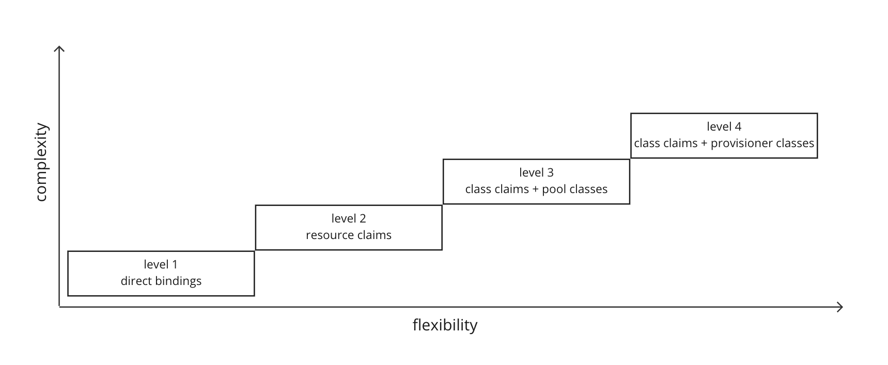

# Four Levels of Service Consumption in Tanzu Application Platform

Over time, as Tanzu Application Platform (referred to as "TAP" from hereon in) has evolved and matured, so has the way in which services can be offered and consumed on the platform. In this document we chart the progress of this evolution in terms of four levels of service consumption. Keep in mind as you read your way through each level that the introduction of a higher level does not automatically mean that all lower levels are suddenly made obsolete. In fact, in most cases the higher levels build upon the foundations laid by the lower levels, and merely represent a higher-level, slightly more opinionated abstraction.

## Level 1 - Direct Bindings

When TAP 1.0 was first released, it shipped with support for Service Bindings, which back the level 1 concept of direct bindings.

Let's imagine that you have deployed an application Workload to TAP. As a result you have a Knative service sitting in namespace `foo`. Let's also imagine that there's some other API resource sitting in namespace `foo` which represents a service, perhaps something like a database or a cache. We'll call this resource a Service Resource. Using a Service Binding you can bind that Service Resource with the Knative service. This has the effect of injecting the credentials for the Service Resource into the Knative service, such that ultimately the application Workload can then consume it.

This is a relatively straightforward concept to grasp. There are only a few resources at play and there's no unnecessary indirection. In fact, users of TAP are not even directly exposed to the Service Binding. The Service Binding is created automatically as part of the OOTB supply chains whenever an application Workload is configured to refer to a service.

However there are a number of limitations with this sort of setup. The first is that the Service Resource has to be bindable. That is to say that it must adhere to [Provisioned Service](https://github.com/servicebinding/spec#provisioned-service) as defined by the Service Binding Specification for Kubernetes. While there are _some_ resources out there that do adhere to this specification (primarily resources offered by VMware Tanzu's data services), the overhwelming majority of resources don't.

The second limitation is that all resources have to be in the same namespace, which is ok, but it is a bit limiting.

The third limitation is that the Service Binding has to know detailed and specific information about the Service Resource, including its name, namespace and API Group/Version and Kind. This is not a particularly nice or clear separation of concerns as it introduces tight coupling between app teams, who create the application Workloads, and ops teams, who create the Service Resources.

## Level 2 - Resource Claims

In order to address some of these limitations, to coincide with the release of TAP 1.0 services toolkit shipped with a capability known as Resource Claims.

Let's imagine the same setup as before, but this time we want the Service Resource to be in a separate namespace from the Knative service. Unfortunately this is not possible with direct bindings. If you look at the [schema](https://github.com/servicebinding/spec#resource-type-schema-1) for ServiceBinding you will note that there is no option to configure a `namespace` for the service. This is where Resource Claims enter the picture.

Resource Claims allow you to claim a bindable Service Resource that exists in another namespace, and to then bind the application Workload to the Resource Claim instead of to the Service Resource directly. Note that because we are now essentially jumping across namespace tenancy boundaries, this claiming across namespaces is only permitted if a corresponding Resource Claim Poolicy has been created.

The big advantage of level 2 over level 1 is that now the application Workload and the Service Resource do not have to exist in the same namespace. This helps to promote a better separation of concerns. It is now possible for apps teams and ops teams to manage the lifecycles of apps and services inderpendently, without stepping on each others' toes.

However it's still not an ideal solution, and some of the limitations from level 1 still exist here in level 2. The Service Resource still has to be bindable and apps teams still need to know the name, namespace and API GVK of the Service Resource. In addition, ops teams need to ensure that the Service Resources actually exist. These resources must be manually provisioned and permitted to be claimed through policy, as otherwise Resource Claims created by the apps teams will just sit around indefinitely in a pending state.

So, level 2 brings some improvements but there's still work to be done.

## Level 3 - Class Claims and Pool-based Classes

Level 3 heralds the introduction of Class Claims and pool-based Classes. Originally released with TAP 1.4, Class Claims and pool-based Classes help to alleviate the issue of apps teams having to know detailed information about Service Resources.

Building again on the setup from before, we still have an application Workload in a namespace `foo` and a Service Resource in a namespace `bar`. However this time, rather than relying on Resource Claim and Resource Claim Poolicy, we have introduced a Class Claim and a pool-based Class. The pool-based Class is able to pool Service Resources via label/field selectors from across all namespaces on the cluster. The idea then is that ops teams create the Service Resources, then create a Class to essentially gather them all together into one logical thing, which can then be discovered and claimed from by apps teams.

Apps teams can discover the available Classes using the `tanzu service class list` command. Now, rather than creating a Resource Claim, they instead create a higher-level abstraction - a Class Claim. The Class Claim simply refers to the name of a Class, and that's it. There's no longer a need to provide detailed information such as the GVK for the Service Resource behind the Class. Simply create a Class Claim referring to a Class and then bind your application Workload to the Class Claim.

Taking this into consideration it's clear that at level 3 it is much, much simpler for apps teams to consume services and that the separation of concerns is much neater. Still, a few limitations remain - Service Resources must still be bindable and ops teams still need to manually provision the Service Resources in order to fill the pool. Enter level 4 ...

## Level 4 - Class Claims and Provisioner-based Classes (aka "Dynamic Provisioning")

Level 4 is the current highest level of service consumption in TAP. Released in TAP 1.5, it brings with it the introduction of provisioner-based Classes, which, together with Class Claims, power TAP's dynamic provisioning capability.

We have the same setup as before, but this time round the Class defines a provisioner rather than a pool. We currently support one provisioner type - [Crossplane](https://www.crossplane.io/), but it's possible that support for new provisioners may be added in the future.

When a Class Claim which refers to a provisioner-based Class is created, the services toolkit controller will ask the provisioner to provision whatever resources may be necessary to create a service instance which can then be bound to application Workloads. In the example here, the provisioner creates a namespace, a Service Resource and a Secret which conforms to the binding specification. Then, that Secret is wired all the way back through to the application Workload.

Two big advantages are realized at level 4. Firstly, ops teams no longer need to manually provision Service Resources. They are now created on-demand as and when needed. This not only helps to remove unnecessary burden from ops teams, but also helps to provider better utilization of resources as Service Resources no longer need to sit around in a pool waiting to be claimed. The second huge advantage is that Service Resources no longer need to be bindable. The provisioner can act almost like an adapter to bring pretty much any service you can think of into TAP. The only requirement is that the provisioner create a binding-conformant Secret holding credentials for the provisioned Service Resources, but this is something that can be configured once during the dynamic provisioning setup.

While level 4 is very powerful and seemingly solves all of the problems we've discussed thus far, it's not entirely without its drawbacks. The main one being that all this flexibility comes at the cost of added complexity. There are many, many more moving parts involved at level 4 when compared to say level 1. However it may be a price worth paying in order to benefit from all that's on offer.

## Summary

By now you have seen how each new level builds and improves upon the last, however it is important to note that all levels can be considered valid use cases in their own right. As users of TAP, you can choose which level you'd like to operate at. Finding the level that's right for you will likely depend on a number of factors, such as the size of the organisation you work for as well as the layout of apps teams and ops teams within the org.

If you work at a small startup in which there are no strict divides between apps teams and ops teams, then perhaps level 1 is perfectly suitable for your needs. If on the other hand you work for a huge organisation with distinct and dedicated apps and ops teams, then choosing one of the higher levels in which that separation is better catered to will likely make most sense. If you are not sure, it's probably best to start with level 4. Level 4 provides the ultimate services experience on TAP that we have been slowly building towards over the course of each new TAP release, and as such should hopefully be sure to meet all your services needs.
