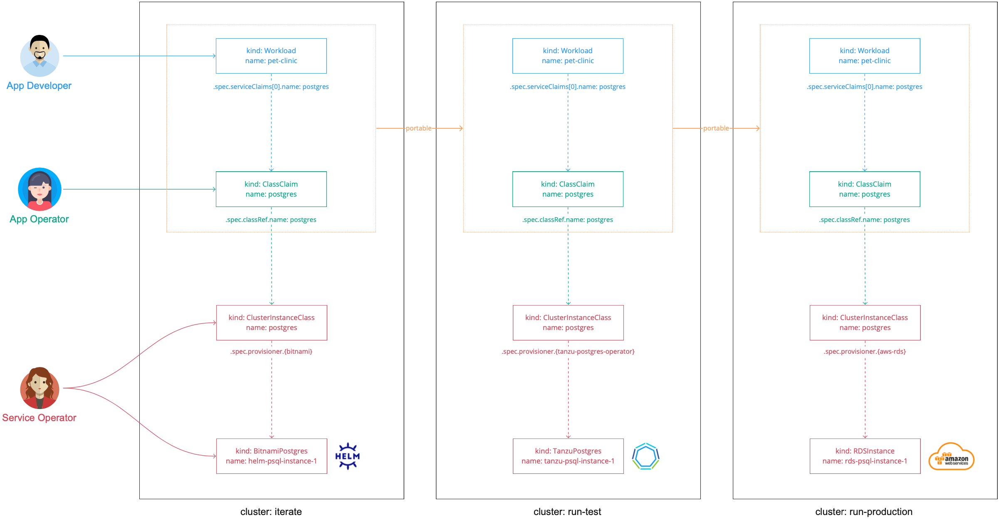

# Abstracting service implementations behind a class across clusters

In this Services Toolkit tutorial you learn how [service operators](../reference/terminology-and-user-roles.hbs.md#so)
can configure a class that allows for claims to resolve to different backing implementations of a service,
such as PostgreSQL, depending on which cluster the class is claimed in.

This sort of setup allows the configurations of workloads and class claims to remain unchanged as
they are promoted through environments, whilst also enabling service operators to change
the implementations of the backing services without further configuration.

## <a id="about"></a> About this tutorial

**Target user role**:       Service Operator<br />
**Complexity**:             Medium<br />
**Estimated time**:         60 minutes<br />
**Topics covered**:         Classes, Claims, Claim-by-Class, Multi-Cluster<br />
**Learning outcomes**:      Ability to abstract the implementation (for example, helm, tanzu data service, cloud) of a service (for example, RabbitMQ) across multiple clusters<br />

## <a id="prereqs"></a> Prerequisites

- Access to three separate Tanzu Application Platform clusters v1.5.0 or later.
  This tutorial refers to them as `iterate`, `run-test`, and `run-production`, but you can use
  different names if required.

## <a id="scenario"></a> Scenario

The tutorial is centered around the following hypothetical, but somewhat realistic, real-world scenario.

You work at BigCorp as a service operator.
BigCorp uses three separate Tanzu Application Platform clusters: `iterate`, `run-test`, and
`run-production`.
Application workloads begin on the `iterate` cluster, before being promoted to the `run-test`
cluster, and then finally to the `run-production` cluster.
The application development team have asked you for a PostgreSQL service they can use with their
workloads, which must be available on all three clusters.

You are aware that the service level objectives (SLOs) for each cluster are different and want to
tailor the implementation of the PostgreSQL service to each of the clusters accordingly.
The `iterate` cluster has low level SLOs, so you want to offer an unmanaged PostgreSQL service backed by
simple Helm chart.
The `run-test` cluster has more robust requirements, so want to offer a PostgreSQL service backed
by VMware Tanzu.
The `run-production` cluster is critically important, so you want to use a fully managed,
cloud-based PostgreSQL implementation there.

You want to ensure that the differing implementations are completely opaque to development teams.
They do not need to know about the inner workings of the services, and must be able to keep their
workloads and class claims the same as they are promoted across clusters.
You have heard great things about Tanzu Application Platform's claims and classes abstractions and want
to make use of them to help you complete your task.

## <a id="concepts"></a> Concepts

This section provides a high-level overview of the elements you will use during this tutorial and
how they all fit together.



In this diagram:

- There are three clusters: `iterate`, `run-test`, and `run-production`.
- In each cluster, the service operator creates a `ClusterInstanceClass` called postgres.
  - In the `iterate` cluster, this is a provisioner-based class that uses the pre-installed Bitnami
    services to provision Helm instances of PostgreSQL.
  - In the `run-test` cluster, this is a provisioner-based class that uses VMware Tanzu Postgres to
    provision instances of PostgreSQL.
  - In the `run-production` cluster, this is a provisioner-based class that uses Amazon RDS to provision
    instances running in Amazon AWS RDS.
- The app operator creates a `ClassClaim`. This is applied with a consuming workload.
  - When it is applied in `iterate` it resolves to a Helm chart instance.
  - When it is promoted to `run-test` it resolves to a VMware Tanzu Postgres instance.
  - When it is promoted to `run-production` it resolves to an Amazon AWS RDS instance.
- The definition of the `ClassClaim` remains identical across the clusters, which is easier for
  the application development team.

> **Important** The backing service implementations and environment layouts used in this scenario
> are arbitrary. They are not recommendations or requirements.

Although this tutorial uses provisioner-based classes on all three clusters,
you can also use a combination of provisioner-based and pool-based classes across the clusters.
You might want to do this in cases where, for example, you want to allow for
dynamic provisioning of service instances in the `iterate` cluster, but want to be more considered about
the approach in the `run-production` cluster where you might want to ensure that workloads only ever
connect to one specific service instance.
You can achieve this by using a provisioner-based class on the `iterate` cluster
and an identically named pool-based class on the `run-production` cluster that is configured to
only ever select from a pool that consists of one service instance.

## <a id="procedure"></a> Procedure

The following steps explain how to set up a class that allows for claims to resolve to
differing implementations of PostgreSQL depending on the cluster it is in.

### <a id="set-up-run-test"></a> Step 1: Set up the run-test cluster

Configure the `run-test` cluster for dynamic provisioning of VMware Tanzu Postgres
service instances. To do that, see
[Configure dynamic provisioning of VMware Tanzu Postgres service instances](../how-to-guides/dynamic-provisioning-tanzu-postgresql.hbs.md)
and complete the steps in the following sections only:

1. [Install the Tanzu VMware Postgres Operator](../how-to-guides/dynamic-provisioning-tanzu-postgresql.hbs.md#install-postgres-operator)
1. [Set up the namespace](../how-to-guides/dynamic-provisioning-tanzu-postgresql.hbs.md#set-up-namespace)
1. [Create a CompositeResourceDefinition](../how-to-guides/dynamic-provisioning-tanzu-postgresql.hbs.md#compositeresourcedef)
1. [Create a Composition](../how-to-guides/dynamic-provisioning-tanzu-postgresql.hbs.md#create-composition)
1. [Configure RBAC](../how-to-guides/dynamic-provisioning-tanzu-postgresql.hbs.md#configure-rbac)

You do not have to do any other sections in that topic.

### <a id="set-up-run-prod"></a> Step 2: Set up the run-production cluster

Configure the `run-production` cluster for dynamic provisioning of AWS RDS PostgreSQL
service instances.
To do that, see
[Configure Dynamic Provisioning of AWS RDS Service Instances](../how-to-guides/dynamic-provisioning-rds.hbs.md)
and complete the steps in the following sections only:

1. [Install the AWS Provider for Crossplane](../how-to-guides/dynamic-provisioning-rds.hbs.md#install-aws-provider)
1. [Create a CompositeResourceDefinition](../how-to-guides/dynamic-provisioning-rds.hbs.md#compositeresourcedef)
1. [Create a Composition](../how-to-guides/dynamic-provisioning-rds.hbs.md#create-composition)
1. [Configure RBAC](../how-to-guides/dynamic-provisioning-rds.hbs.md#configure-rbac)

You do not have to do any other sections in that topic.

### <a id="create-class"></a> Step 3: Create the class

The `ClusterInstanceClass` acts as the abstraction fronting the differing service implementations
across the different clusters.
You must create a class with the same name on all three of the clusters,
but the configuration of the class varies slightly on each.
The `ClassClaim` refers to classes by name. The fact that the class name remains consistent
is what allows for the `ClassClaim`, which the application development teams create, to remain unchanged
as they are promoted across the clusters.

Create a file named `postgres.class.iterate-cluster.yaml` and copy in the following contents.

```yaml
# postgres.class.iterate-cluster.yasml

---
apiVersion: services.apps.tanzu.vmware.com/v1alpha1
kind: ClusterInstanceClass
metadata:
  name: bigcorp-postgresql
spec:
  description:
    short: PostgreSQL by BigCorp
  provisioner:
    crossplane:
      compositeResourceDefinition: xpostgresqlinstances.bitnami.database.tanzu.vmware.com
```

This class refers to the `xpostgresqlinstances.bitnami.database.tanzu.vmware.com`
CompositeResourceDefinition.
This is installed as part of the [Bitnami Services](../../bitnami-services/about.hbs.md) package and
powers the pre-installed PostgreSQL service.

You are reusing the underlying CompositeResourceDefinition here from a different class using the
class name you want.

Use kubectl to apply the file to the `iterate` cluster.

```console
kubectl apply -f postgres.class.iterate-cluster.yaml
```

Create a file named `postgres.class.run-test-cluster.yaml` and copy in the following contents.

```yaml
# postgres.class.run-test-cluster.yaml

---
apiVersion: services.apps.tanzu.vmware.com/v1alpha1
kind: ClusterInstanceClass
metadata:
  name: bigcorp-postgresql
spec:
  description:
    short: PostgreSQL by BigCorp
  provisioner:
    crossplane:
      compositeResourceDefinition: xpostgresqlinstances.database.tanzu.example.org
```

This class is almost identical to the previous one, however this one refers instead to the
`xpostgresqlinstances.database.tanzu.example.org` CompositeResourceDefinition.

Use kubectl to apply the file to the `run-test` cluster.

```console
kubectl apply -f postgres.class.run-test-cluster.yaml
```

Create a file named `postgres.class.run-production-cluster.yaml` and copy in the following contents.

```yaml
# postgres.class.run-production-cluster.yaml

---
apiVersion: services.apps.tanzu.vmware.com/v1alpha1
kind: ClusterInstanceClass
metadata:
  name: bigcorp-postgresql
spec:
  description:
    short: PostgreSQL by BigCorp
  provisioner:
    crossplane:
      compositeResourceDefinition: xpostgresqlinstances.database.rds.example.org
```

Again, this class is almost identical to the previous two, but this time refers to the
`xpostgresqlinstances.database.rds.example.org` CompositeResourceDefinition.

Use kubectl to apply the file to the `run-production` cluster.

```console
kubectl apply -f postgres.class.run-production-cluster.yaml
```

### <a id="create-workload-classclaim"></a> Step 4: Create and promote the workload and class claim

After configuring the clusters and classes, switch roles from service operator to application operator
and developer to create the workload and class claim YAML and promote it through the three clusters.

Create a file named `app-with-postgres.yaml` and copy in the following contents.

```yaml
# app-with-postgres.yaml

---
apiVersion: services.apps.tanzu.vmware.com/v1alpha1
kind: ClassClaim
metadata:
  name: postgres
  namespace: default
spec:
  classRef:
    name: bigcorp-postgresql

---
apiVersion: carto.run/v1alpha1
kind: Workload
metadata:
  name: pet-clinic
  namespace: default
  labels:
    apps.tanzu.vmware.com/workload-type: web
    app.kubernetes.io/part-of: pet-clinic
spec:
  params:
  - name: annotations
    value:
      autoscaling.knative.dev/minScale: "1"
  env:
  - name: SPRING_PROFILES_ACTIVE
    value: postgres
  serviceClaims:
  - name: db
    ref:
      apiVersion: services.apps.tanzu.vmware.com/v1alpha1
      kind: ClassClaim
      name: postgres
  source:
    git:
      url: https://github.com/sample-accelerators/spring-petclinic
      ref:
        branch: main
        tag: tap-1.2
```

Then use kubectl to apply the file to the `iterate` cluster.

```console
kubectl apply -f app-with-postgres.yaml
```

Wait for the workload to become ready and then inspect the cluster to see that the workload is bound
to a Helm-based PostgreSQL service instance.
Target the `iterate` cluster then run `helm list -A` to confirm.

Next, apply the exact same `app-with-postgres.yaml` to the `run-test` cluster.
When it is ready, confirm that the workload is bound to a Tanzu-based PostgreSQL service instance.
Target the `run-test` cluster then run `kubectl get postgres -n tanzu-psql-service-instances` to confirm.

Finally, apply the exact same `app-with-postgres.yaml` to the `run-production` cluster.
When it is ready, confirm that the workload is bound to a RDS-based PostgreSQL service instance.
Target the `run-production` cluster then run `kubectl get RDSInstance -A` to confirm.
