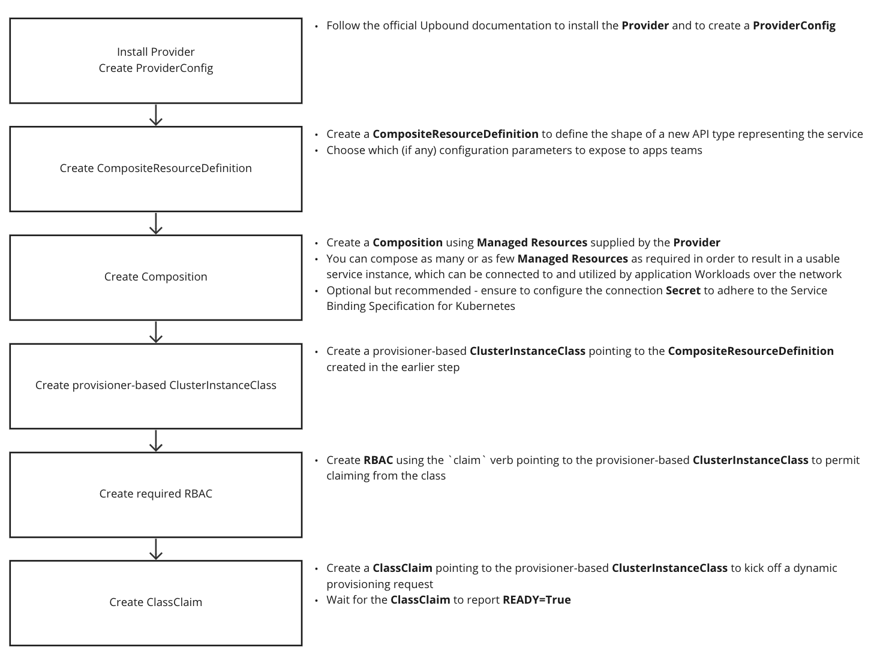

# Integrating Cloud Services (AWS, Azure, GCP, etc.) into Tanzu Application Platform

**Target user role**:       Service Operator<br />
**Complexity**:             Advanced<br />
**Estimated time**:         30 minutes<br />
**Topics covered**:         Dynamic Provisioning, Cloud-based Services, AWS, Azure, GCP, Crossplane<br />
**Learning outcomes**:      An understanding of the steps involved in integrating cloud-based services into Tanzu Application Platform<br />

## About

There are a countless and ever-growing number of cloud-based services available on the market for consumers today. The three big clouds - AWS, Azure and GCP all provide support for a wide range of fully-managed, performant and on-demand services ranging from databases, to message queues, to storage solutions and beyond. In this tutorial you will learn what it takes to integrate any one of these services into Tanzu Application Platform (referred to as "TAP" from hereon in), so that it can be can offered to and consumed by apps teams in a simple and effective way.

This tutorial is written at a slightly higher level that the other [tutorials](../tutorials.hbs.md) in this documentation. This is because it is simply not feasible to write detailed, step-by-step documentation for integrating each and every cloud-based service into TAP. There are far too many of them, each bringing with them a different set of considerations and concerns. Instead, this tutorial guides you through the general approach to integrating cloud-based services into TAP. While specific configurations will of course change between services, the overall process remains the same through a consistent set of steps. It is these steps that this tutorial focusses on. The aim is to give you just enough understanding so that you are able to go off and to integrate whatever cloud-based service you like into TAP.

If you are interested in a more specific and low-level walkthrough, then please refer to [Configure Dynamic Provisioning of AWS RDS Service Instances](../how-to-guides/configure-dynamic-provisioning-rds.hbs.md), which does walk through each step in detail for AWS RDS integration. It may be useful to read through that guide even if you are hoping to integrate with one of the other cloud providers.

## In a nutshell

The diagram below depicts at a high-level what is required to integrate a cloud-based service into TAP.



The rest of this tutorial talks through each step, providing hints, tips and references to example configurations where appropriate.

## Step 1: Installing a Provider

The first step is to install a suitable Crossplane `Provider` for your cloud of choice. Upbound provides support for the 3 main clouds via [provider-aws](https://marketplace.upbound.io/providers/upbound/provider-aws/latest), [provider-azure](https://marketplace.upbound.io/providers/upbound/provider-azure/latest) and [provider-gcp](https://marketplace.upbound.io/providers/upbound/provider-gcp/latest).

Choose whichever Provider you want, then follow Upbound's official documentation to install the `Provider` and to create a corresponding `ProviderConfig`. 

    > **Note** The official documentation for the Providers include a step to "Install Universal Crossplane",
    > which you can safely skip over as Crossplane is already installed as part of TAP.
    > The documentation also assumes Crossplane to be installed in the `upbound-system` namespace,
    > however when working with Crossplane on TAP it is installed to the `crossplane-system` namespace by default.
    > Bear this in mind when it comes to creating the `Secret` and the `ProviderConfig` with credentials for the `Provider`.

    > **Note** Be aware of the fact that these cloud-based Providers often install many hundreds of additional CRDs into
    > the cluster, which can have a negative impact on cluster performance.
    > Refer to [Known Limitations](../reference/known-limitations.hbs.md#stk-known-limitation-too-many-crds) for further information.

## Step 2: Create CompositeResourceDefinition

The next step is to create a `CompositeResourceDefinition`, which defines the shape of a new API type which will be used to create the cloud-based resource(s).

For help creating the `CompositeResourceDefinition`, refer to [Defining Composite Resources](https://docs.crossplane.io/latest/concepts/composition/#defining-composite-resources) in the Upbound documentation, or refer to [Step 2: Create CompositeResourceDefinition](../how-to-guides/configure-dynamic-provisioning-rds.hbs.md#stk-dynamic-provisioning-rds-step-2) in the how-to guide [Configure Dynamic Provisioning of AWS RDS Service Instances](../how-to-guides/configure-dynamic-provisioning-rds.hbs.md) in the services toolkit documentation.

## Step 3: Create Composition

This step is likely to be the most difficult and time-consuming. The `Composition` is essentially where you define configuration for the resource(s) that will ultimately make up the service instances that will be claimed by apps teams. You will need to configure whatever resources are necessary to result in usable service instances which can be connected to and utilized over the network.

The best way to get started with `Compositions` is to first read through [Configuring Composition](https://docs.crossplane.io/v1.11/concepts/composition/#configuring-composition)  in the Upbound documentation. Then refer to example `Compositions` to get a better feel for what they look like. See [here](https://docs.vmware.com/en/Services-Toolkit-for-VMware-Tanzu-Application-Platform/0.9/svc-tlk/usecases-consuming_aws_rds_with_crossplane.html#define-composite-resource-types-5) for an example `Composition` for AWS RDS. See [here](https://docs.vmware.com/en/Services-Toolkit-for-VMware-Tanzu-Application-Platform/0.9/svc-tlk/usecases-consuming_azure_database_with_crossplane.html#define-composite-resource-types-7) for an example `Composition` for Azure Flexible Server and see [here](https://docs.vmware.com/en/Services-Toolkit-for-VMware-Tanzu-Application-Platform/0.9/svc-tlk/usecases-consuming_gcp_sql_with_crossplane.html#define-composite-resource-types-5) for an example `Composition` for GCP Cloud SQL.

## Step 4: Create provisioner-based ClusterInstanceClass

This step is fairly straightforward. You simply need to create a provisioner-based `ClusterInstanceClass` which is configured to refer to the `CompositeResourceDefinition` created in step 2. For example:

```yaml
---
apiVersion: services.apps.tanzu.vmware.com/v1alpha1
kind: ClusterInstanceClass
metadata:
  name: cloud-service-foo
spec:
  description:
    short: FooDB by cloud provider Foo!
  provisioner:
    crossplane:
      compositeResourceDefinition: <NAME OF THE COMPOSITE RESOURCE DEFINITION>
```

See [Step 4: Make the service discoverable to application teams](../how-to-guides/configure-dynamic-provisioning-rds.hbs.md#stk-dynamic-provisioning-rds-step-4) for a real-world example.

## Step 5: Create RBAC

This step is also fairly straightforward. You simply need to create an RBAC rule using the `claim` verb pointing to the `ClusterInstanceClass` created in the previous step. For example:

```yaml
apiVersion: rbac.authorization.k8s.io/v1
kind: ClusterRole
metadata:
  name: app-operator-claim-foo-db
  labels:
    apps.tanzu.vmware.com/aggregate-to-app-operator-cluster-access: "true"
rules:
- apiGroups:
  - "services.apps.tanzu.vmware.com"
  resources:
  - clusterinstanceclasses
  resourceNames:
  - cloud-service-foo
  verbs:
  - claim
```

See [Step 5: Authorize users with the app-operator role to claim from the class](../how-to-guides/configure-dynamic-provisioning-rds.hbs.md#stk-dynamic-provisioning-rds-step-5) for a real-world example.

## Step 6: Create ClassClaim

This is the step in which everything comes together and is your first chance to test everything out end-to-end. Simply create a `ClassClaim` which points to the `ClusterInstanceClass` created in the previous step. For example:

```yaml
---
apiVersion: services.apps.tanzu.vmware.com/v1alpha1
kind: ClassClaim
metadata:
  name: claim-1
spec:
  classRef:
    name: cloud-service-foo
  parameters:
    key: value
```

Check to see that the `ClassClaim` eventually transitions into a `READY=True` state. If it doesn't, then you will need to debug what has gone wrong, using `kubectl` to trace your way back from `ClassClaim` -> `ClusterInstanceClass` -> `CompositeResourceDefinition` -> `CompositeResource` -> Managed Resource(s) and resolving any errors encountered along the way.
