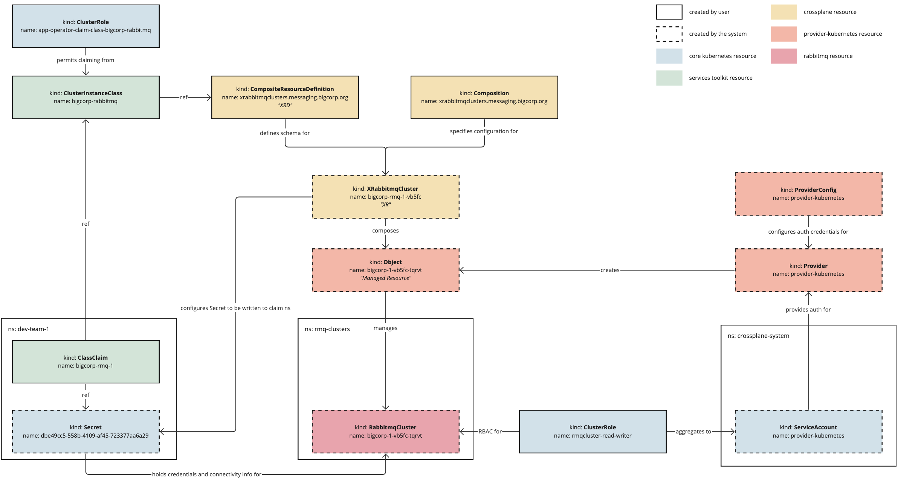

# Set up dynamic provisioning of service instances

In this Services Toolkit tutorial you learn how [service operators](../reference/terminology-and-user-roles.hbs.md#so)
can set up a new, self-serve, and customized service for Tanzu Application Platform (commonly known as TAP).
The example uses Tanzu RabbitMQ the service, but the steps and learnings can apply to almost any
other service.

## <a id="about"></a> About this tutorial

**Target user role**:       Service Operator<br />
**Complexity**:             Advanced<br />
**Estimated time**:         60 minutes<br />
**Topics covered**:         Dynamic Provisioning, Crossplane, Tanzu RabbitMQ Cluster Kubernetes
operator<br />
**Learning outcomes**:      Ability to offer new, on-demand, and customized services in your
Tanzu Application Platform clusters<br />

## <a id="prereqs"></a> Prerequisites

- Access to a Tanzu Application Platform cluster v1.5.0 or later.
- Basic familiarity with Crossplane, particularly the concepts of
  [Composition and CompositeResourceDefinitions](https://docs.crossplane.io/v1.11/concepts/composition/).

## <a id="scenario"></a> Scenario

The tutorial is centered around the following hypothetical, but somewhat realistic, real-world scenario.

You work at BigCorp and are tasked to provide an on-demand, self-serve RabbitMQ service for BigCorp's
development teams who are working with Tanzu Application Platform.
You have already reviewed the RabbitMQ offering that is available with Bitnami Services, but have discovered
that while it is an excellent service for testing and for quickly getting started,
it is not quite suitable for BigCorp's stringent and specific needs.

In particular, you must comply with BigCorp's auditing and logging policy, and want to enforce that
every RabbitMQ cluster in use on the platform adheres to that policy.
At the same time, you don't want to be a blocker for the application teams and want to offer
them self-serve access to RabbitMQ whenever they need it, without incurring any untoward delays.
You have heard great things about Tanzu Application Platform's dynamic provisioning capability, and
are now looking to make use of it to help you complete your task.

In this tutorial you will learn how to:

- Install the RabbitMQ Cluster Kubernetes operator
- Create a `CompositeResourceDefinition`
- Create a `Composition`
- Create a provisioner-based class
- Understand and create the necessary RBAC permissions
- Create a claim for the class to test it all out
- Understand how all the pieces fit together to power the dynamic provisioning capability in
  Tanzu Application Platform

## <a id="concepts"></a> Concepts

The following diagram provides an overview of the elements of dynamic provisioning and how they fit together.



The following is a high-level overview of how the system works:

1. The service operator creates a `CompositeResourceDefinition` and a `Composition`, which together
   define the configuration of the service instances that will be dynamically provisioned.
2. The service operator creates a class pointing to the `CompositeResourceDefinition`.
   This informs application development teams that the service is available.
3. The service operator applies necessary Role-Based Access Control (RBAC) to permit the system to
   create the necessary resources, and to authorize application development teams to create claims
   for the class.
4. The application developer creates a claim referring to the class, optionally passing through
   parameters to override any default configuration where permissible.
5. The system creates a `CompositeResource`, merging information provided in the claim with default
   configuration specified by the system and configuration defined in the `Composition`.
6. Crossplane reconciles the `CompositeResource` into a service instance and writes credentials for
   the instance into a `Secret`.
7. The `Secret` is written back to the application developer's namespace, so that application workloads
   can use it.

As you follow this tutorial, it will address the parts of this diagram in more detail.

## <a id="procedure"></a> Procedure

The following steps show how to configure dynamic provisioning for a service.

### <a id="install-operator"></a> Step 1: Install the operator

When adding any new service to Tanzu Application Platform, ensure that there are a suitable set of
APIs available in the cluster from which to construct the service instances.
Usually, this involves installing one or more Kubernetes Operators into the cluster.

Given the aim of this tutorial is to set up a new RabbitMQ service, install the RabbitMQ Cluster
Operator for Kubernetes.

> **Note** The steps in this tutorial use the open source version of the operator.
> For most real-world deployments, VMware recommends using the official, supported version provided
> by VMware.
> For more information, see [VMware RabbitMQ for Kubernetes](https://docs.vmware.com/en/VMware-RabbitMQ-for-Kubernetes/index.html).

Use `kapp` to install the operator by running:

```console
kapp -y deploy --app rmq-operator --file https://github.com/rabbitmq/cluster-operator/releases/latest/download/cluster-operator.yml
```

This causes a new API Group/Version of `rabbitmq.com/v1beta1` and Kind named `RabbitmqCluster` to
become available in the cluster.
You can now use this API to create RabbitMQ cluster instances as part of the dynamic provisioning setup.

### <a id="create-xrd"></a> Step 2: Creating a `CompositeResourceDefinition`

Tanzu Application Platform's dynamic provisioning capability relies on
[Crossplane](https://www.crossplane.io/).
You can find the specific integration point at `.spec.provisioner.crossplane.compositeResourceDefinition`
in Tanzu Application Platform's `ClusterInstanceClass` API.

As the name suggests, this field is looking for a `CompositeResourceDefinition`, which you create
in this step of the procedure.
The `CompositeResourceDefinition` (XRD) defines the shape of a new, custom API type that encompasses
the specific set of requirements laid out by the scenario in this tutorial.

Create a file named `xrabbitmqclusters.messaging.bigcorp.org.xrd.yaml` and copy in the following contents.

```yaml
# xrabbitmqclusters.messaging.bigcorp.org.xrd.yaml

---
apiVersion: apiextensions.crossplane.io/v1
kind: CompositeResourceDefinition
metadata:
  name: xrabbitmqclusters.messaging.bigcorp.org
spec:
  connectionSecretKeys:
  - host
  - password
  - port
  - provider
  - type
  - username
  group: messaging.bigcorp.org
  names:
    kind: XRabbitmqCluster
    plural: xrabbitmqclusters
  versions:
  - name: v1alpha1
    referenceable: true
    schema:
      openAPIV3Schema:
        properties:
          spec:
            description: The OpenAPIV3Schema of this Composite Resource Definition.
            properties:
              replicas:
                description: The desired number of replicas forming the cluster
                type: integer
              storageGB:
                description: The desired storage capacity of a single replica, in GB.
                type: integer
            type: object
        type: object
    served: true
```

Then use kubectl to apply the file to the Tanzu Application Platform cluster.

```console
kubectl apply -f xrabbitmqclusters.messaging.bigcorp.org.xrd.yaml
```

For a detailed explanation of `CompositeResourceDefinition` see, the
[Crossplane documentation](https://docs.crossplane.io/v1.10/concepts/composition/#defining-composite-resources).

The following is a condensed explanation of the most relevant pieces of the `CompositeResourceDefinition`
configuration, provided in this section, as it relates to dynamic provisioning in Tanzu Application Platform.

The example in this tutorial does **not** specify `.spec.claimNames` in the XRD.
Tanzu Application Platform's dynamic provisioning capability makes use of Crossplane's cluster-scoped
Composite Resources, rather than the namespace-scoped Claims ("Claims" here not to be confused with Tanzu Application Platform's own concept of claims).
As such, this configuration is not required, although it does not cause any adverse effects if you add it.

Next, see the `.spec.connectionKeys` field. This field detects the keys that will exist in the `Secret`
resulting from the dynamic provisioning request.
You likely want this `Secret` to conform with the [Service Binding Specification for Kubernetes](https://github.com/servicebinding/spec),
as this, in part, is what allows for automatic configuration of the service instance by
Tanzu Application Platform's application workloads.
This is assuming that the application is using a binding-aware library such as [Spring Cloud Bindings](https://github.com/spring-cloud/spring-cloud-bindings).
Specific key name requirements vary by service type, however all must provide the `type` key.

Finally, see the `.spec.properties` section in the schema for `v1alpha1`.
This is where you, as the service operator, can set which configuration options you want to expose
to application development teams.
In the example in this section, there are two configuration options: `replicas` and `storageGB`.
By adding these properties to the specification, you are handing over control of these specific
configuration options to the development teams.
For example, you might want to add `storageGB` if the development teams have more knowledge about
how much storage their apps require than you do. By adding `storageGB` you can allow them to decide
for themselves how much storage they require.

You can choose to add as many or as few configuration options here as you like.
You can also choose to set default values. In highly regulated environments, you might not want to
allow for any configuration by developers at all.

In the scenario at the beginning of this tutorial, it says that you must comply with the auditing
and logging policy.
You do not specify any configuration related to auditing or logging in the XRD in this step.
This is intentional as in this scenario there are strict auditing and logging requirements and cannot
permit developers to override those.
In the next step you learn how to ensure that those requirements get enforced on the resulting
RabbitMQ clusters.

To verify the status of the XRD you created, run:

```console
kubectl get xrds
```

If successful, the `xrabbitmqclusters.messaging.bigcorp.org` is listed with `ESTABLISHED=True`.

You might see some other XRDs listed as well. These are the `*.bitnami.*.tanzu.vmware.com` XRDs.
These are part of the `bitnami.services.tanzu.vmware.com` package with Tanzu Application Platform and
serve as the basis of the Bitnami Services.
You can ignore these other XRDs for now, but if you want to see how they are used in practice, see
[Claim services on Tanzu Application Platform](../../getting-started/consume-services.hbs.md) and
[Consume services on Tanzu Application Platform](../../getting-started/consume-services.hbs.md)
in the Tanzu Application Platform getting started guide.

As a result of creating the XRD, a new API Group/Version of `messaging.bigcorp.org/v1alpha1` and Kind
named `XRabbitmqCluster` become available in the cluster.
If you inspect this API further, notice that the `replicas` and `storageGB` properties configured in
the XRD are present in the specification of `XRabbitmqCluster`.

```console
kubectl explain --api-version=messaging.bigcorp.org/v1alpha1 xrabbitmqclusters.spec
```

You will also notice that Crossplane has injected some other fields into the specification as well,
but you can mostly ignore these for now.

### <a id="create-composition"></a> Step 3: Creating a Crossplane `Composition`

You do most of the configuration for dynamic provisioning during the creation of the `Composition`.

For a more detailed explanation about the `Composition`, see the
[Crossplane documentation](https://docs.crossplane.io/v1.10/concepts/composition/).

The following are the basics you must know to start to create a `Composition` for use in
Tanzu Application Platform.

Create a file named `xrabbitmqclusters.messaging.bigcorp.org.composition.yaml` and copy
in the following contents.

```yaml
# xrabbitmqclusters.messaging.bigcorp.org.composition.yaml

---
apiVersion: apiextensions.crossplane.io/v1
kind: Composition
metadata:
  name: xrabbitmqclusters.messaging.bigcorp.org
spec:
  compositeTypeRef:
    apiVersion: messaging.bigcorp.org/v1alpha1
    kind: XRabbitmqCluster
  resources:
  - base:
      apiVersion: kubernetes.crossplane.io/v1alpha1
      kind: Object
      spec:
        forProvider:
          manifest:
            apiVersion: rabbitmq.com/v1beta1
            kind: RabbitmqCluster
            metadata:
              namespace: rmq-clusters
            spec:
              terminationGracePeriodSeconds: 0
              replicas: 1
              persistence:
                storage: 1Gi
              resources:
                requests:
                  cpu: 200m
                  memory: 1Gi
                limits:
                  cpu: 300m
                  memory: 1Gi
              rabbitmq:
                envConfig: |
                  RABBITMQ_LOGS=""
                additionalConfig: |
                  log.console = true
                  log.console.level = debug
                  log.console.formatter = json
                  log.console.formatter.json.field_map = verbosity:v time msg domain file line pid level:-
                  log.console.formatter.json.verbosity_map = debug:7 info:6 notice:5 warning:4 error:3 critical:2 alert:1 emergency:0
                  log.console.formatter.time_format = epoch_usecs
        connectionDetails:
        - apiVersion: v1
          kind: Secret
          namespace: rmq-clusters
          fieldPath: data.provider
          toConnectionSecretKey: provider
        - apiVersion: v1
          kind: Secret
          namespace: rmq-clusters
          fieldPath: data.type
          toConnectionSecretKey: type
        - apiVersion: v1
          kind: Secret
          namespace: rmq-clusters
          fieldPath: data.host
          toConnectionSecretKey: host
        - apiVersion: v1
          kind: Secret
          namespace: rmq-clusters
          fieldPath: data.port
          toConnectionSecretKey: port
        - apiVersion: v1
          kind: Secret
          namespace: rmq-clusters
          fieldPath: data.username
          toConnectionSecretKey: username
        - apiVersion: v1
          kind: Secret
          namespace: rmq-clusters
          fieldPath: data.password
          toConnectionSecretKey: password
        writeConnectionSecretToRef:
          namespace: rmq-clusters
    connectionDetails:
    - fromConnectionSecretKey: provider
    - fromConnectionSecretKey: type
    - fromConnectionSecretKey: host
    - fromConnectionSecretKey: port
    - fromConnectionSecretKey: username
    - fromConnectionSecretKey: password
    patches:
      - fromFieldPath: metadata.name
        toFieldPath: spec.forProvider.manifest.metadata.name
        type: FromCompositeFieldPath
      - fromFieldPath: spec.replicas
        toFieldPath: spec.forProvider.manifest.spec.replicas
        type: FromCompositeFieldPath
      - fromFieldPath: spec.storageGB
        toFieldPath: spec.forProvider.manifest.spec.persistence.storage
        transforms:
        - string:
            fmt: '%dGi'
            type: Format
          type: string
        type: FromCompositeFieldPath
      - fromFieldPath: metadata.name
        toFieldPath: spec.writeConnectionSecretToRef.name
        transforms:
        - string:
            fmt: '%s-rmq'
            type: Format
          type: string
        type: FromCompositeFieldPath
      - fromFieldPath: metadata.name
        toFieldPath: spec.connectionDetails[0].name
        transforms:
        - string:
            fmt: '%s-default-user'
            type: Format
          type: string
        type: FromCompositeFieldPath
      - fromFieldPath: metadata.name
        toFieldPath: spec.connectionDetails[1].name
        transforms:
        - string:
            fmt: '%s-default-user'
            type: Format
          type: string
        type: FromCompositeFieldPath
      - fromFieldPath: metadata.name
        toFieldPath: spec.connectionDetails[2].name
        transforms:
        - string:
            fmt: '%s-default-user'
            type: Format
          type: string
        type: FromCompositeFieldPath
      - fromFieldPath: metadata.name
        toFieldPath: spec.connectionDetails[3].name
        transforms:
        - string:
            fmt: '%s-default-user'
            type: Format
          type: string
        type: FromCompositeFieldPath
      - fromFieldPath: metadata.name
        toFieldPath: spec.connectionDetails[4].name
        transforms:
        - string:
            fmt: '%s-default-user'
            type: Format
          type: string
        type: FromCompositeFieldPath
      - fromFieldPath: metadata.name
        toFieldPath: spec.connectionDetails[5].name
        transforms:
        - string:
            fmt: '%s-default-user'
            type: Format
          type: string
        type: FromCompositeFieldPath
    readinessChecks:
      - type: MatchString
        fieldPath: status.atProvider.manifest.status.conditions[1].status # ClusterAvailable
        matchString: "True"
```

Use kubectl to apply the file to the Tanzu Application Platform cluster.

```console
kubectl apply -f xrabbitmqclusters.messaging.bigcorp.org.composition.yaml
```

#### About `.spec.compositeTypeRef`

The `.spec.compositeTypeRef` is configured to refer to `XRabbitmqCluster` on the
`messaging.bigcorp.org/v1alpha1` API group and version.

```yaml
...
spec:
  compositeTypeRef:
    apiVersion: messaging.bigcorp.org/v1alpha1
    kind: XRabbitmqCluster
...
```

This is the API that was created when you applied the XRD in
[Step 2: Creating a `CompositeResourceDefinition`](#create-xrd).
By configuring `.spec.compositeTypeRef` to refer to this API, you are instructing Crossplane
to use the configuration contained within this `Composition` to compose subsequent managed resources
whenever it observes that a new `XRabbitmqCluster` resource is created in the cluster.
Tanzu Application Platform's dynamic provisioning system creates the `XRabbitmqCluster` resources automatically.
To visualize how these pieces fit together, see the diagram in the [Concepts](#concepts) section.

#### About `.spec.resources`

The `.spec.resources` section is where you specify the managed resources to be created.
Managed resources are tied to Crossplane's `Providers`, with each `Provider` defining a set of managed
resources which can then be used in compositions.
Tanzu Application Platform includes two `Providers` with the Crossplane package:
[provider-helm](https://github.com/crossplane-contrib/provider-helm) and
[provider-kubernetes](https://github.com/crossplane-contrib/provider-kubernetes).
This makes a `Release` managed resource available, which is used to manage Helm
releases, and makes an `Object` managed resource available, which used to manage arbitrary
Kubernetes resources.
You can install and use any other `Provider`.
To find the latest providers, see the [Upbound Marketplace](https://marketplace.upbound.io/providers).
The more providers you install, the more managed resources you can choose from in your compositions.

##### The `Object` managed resource

The overarching goal is to compose whatever resources are necessary to create functioning, usable
service instances and to surface the credentials and connectivity information required to connect to
those instances in a known and repeatable way.
This tutorial uses the `RabbitmqCluster` resource, which presents one single API to use to create
fully functioning RabbitMQ clusters, credentials for which get stored in `Secrets` in the cluster.

However, `RabbitmqCluster` is not a Crossplane managed resource so you cannot refer to this resource
directly under `.spec.resources`.
To work around this, use `provider-kubernetes` and its corresponding `Object` managed resource.
`Object` enables you to wrap any arbitrary Kubernetes resource, such as `RabbitmqCluster`, into a
Crossplane managed resource and to then use them like any other managed resource inside `Compositions`.

```yaml
...
spec:
  resources:
  - base:
      apiVersion: kubernetes.crossplane.io/v1alpha1
      kind: Object
      spec:
        forProvider:
          manifest:
            apiVersion: rabbitmq.com/v1beta1
            kind: RabbitmqCluster
            metadata:
              namespace: rmq-clusters
            spec:
              terminationGracePeriodSeconds: 0
              replicas: 1
              persistence:
                storage: 1Gi
              resources:
                requests:
                  cpu: 200m
                  memory: 1Gi
                limits:
                  cpu: 300m
                  memory: 1Gi
              rabbitmq:
                envConfig: |
                  RABBITMQ_LOGS=""
                additionalConfig: |
                  log.console = true
                  log.console.level = debug
                  log.console.formatter = json
                  log.console.formatter.json.field_map = verbosity:v time msg domain file line pid level:-
                  log.console.formatter.json.verbosity_map = debug:7 info:6 notice:5 warning:4 error:3 critical:2 alert:1 emergency:0
                  log.console.formatter.time_format = epoch_usecs
...
```

The `Object` managed resource is where you configure `RabbitmqCluster` resources.
This is the place in which you can now fine-tune the configuration of  the RabbitMQ Clusters to
your needs.

Recall from the hypothetical scenario that you are particularly concerned about your company's
logging policy.
The configuration in the `Object` translates that hypothetical policy into default configuration on
the `RabbitmqCluster` resource by specifying `.spec.rabbitmq.additionalConfig` for the resource.
This was taken from [one of the examples](https://github.com/rabbitmq/cluster-operator/blob/main/docs/examples/json-log/rabbitmq.yaml)
in the RabbitMQ Cluster Operator GitHub repository.
You can configure the resource however you want and to whatever requirements necessary.

##### The `patches` section

The `Object` also sets default values for the number of replicas and the amount of persistent storage
for new `RabbitmqClusters` to one replica and 1&nbsp;Gi.
However, you want to allow these two values to be configurable by the application development teams
as specified in [Step 2: Creating a `CompositeResourceDefinition`](#create-xrd).
You can configure this using patches.

```yaml
...
patches:
  - fromFieldPath: metadata.name
    toFieldPath: spec.forProvider.manifest.metadata.name
    type: FromCompositeFieldPath
...
```

The first thing to note is that all the patches are of type `FromCompositeFieldPath`,
which allows you to take values
defined on the composite resource (`XRabbitmqCluster` in this case) and to pass them through to the
underlying managed resource (an `Object` wrapping `RabbitmqCluster` in this case).
The first patch sets the name of the `RabbitmqCluster` to the same name as the name of the composite
resource `XRabbitmqCluster`, which were created using `generateName`,
thereby ensuring a unique name for each dynamically provisioned `RabbitmqCluster` instance.

```yaml
...
patches:
...
  - fromFieldPath: spec.replicas
    toFieldPath: spec.forProvider.manifest.spec.replicas
    type: FromCompositeFieldPath
  - fromFieldPath: spec.storageGB
    toFieldPath: spec.forProvider.manifest.spec.persistence.storage
    transforms:
    - string:
        fmt: '%dGi'
        type: Format
      type: string
    type: FromCompositeFieldPath
...
```

The second and third patches pass through configuration for the number of replicas
and amount of persistent storage, which overrides the default values already configured.

The remaining patches all do the same thing, which is to patch in the name of the `Secret`
for the fields in the `connectionDetails` section.

```yaml
...
- fromFieldPath: metadata.name
  toFieldPath: spec.connectionDetails[0].name
  transforms:
  - string:
      fmt: '%s-default-user'
      type: Format
    type: string
  type: FromCompositeFieldPath
...
```

When creating a `RabbitmqCluster` resource using the RabbitMQ Cluster Kubernetes operator,
the operator creates a `Secret` containing credentials and connectivity information used to connect
to the cluster.
That `Secret` is named `x-default-user`, where `x` is the name of the `RabbitmqCluster` resource.
Because the name of the `RabbitmqCluster` cannot be known upfront, you must use
patches to ensure that the `connectionDetails` section refers to the correctly-named `Secret`.

The `connectionDetails` sections are where you configure which keys and values to expose in the
resulting `Secret`.
You must specify the same set of keys as defined in the original XRD.

##### The `readinessChecks` section

Configuring readiness checks helps to keep consumers of dynamic provisioning, that is,
the application teams, informed about when the resulting service instances are ready for application
workloads to use.

```yaml
...
readinessChecks:
  - type: MatchString
    fieldPath: status.atProvider.manifest.status.conditions[1].status # ClusterAvailable
    matchString: "True"
```

Where possible it is simplest to use the `Ready` condition to verify readiness.
However, the `RabbitmqCluster` API doesn't expose a simple `Ready` condition, so you must configure the
ready check on `ClusterAvailable` instead.

#### Check the namespace

One final important decision is the name of the namespace in which to create the dynamically
provisioned `RabbitmqCluster` resources. This tutorial uses the `rmq-clusters` namespace.

```yaml
...
spec:
  resources:
  - base:
      apiVersion: kubernetes.crossplane.io/v1alpha1
      kind: Object
      spec:
        forProvider:
          manifest:
            apiVersion: rabbitmq.com/v1beta1
            kind: RabbitmqCluster
            metadata:
              namespace: rmq-clusters
...
```

To make sure that the `rmq-clusters` namespace exists.

```console
kubectl create namespace rmq-clusters
```

This configuration says that all dynamically provisioned `RabbitmqCluster` resources must be placed
in the same `rmq-clusters` namespace.
If you want to place each new cluster into a separate namespace, you must create an additional
`Object` managed resource to wrap the creation of a `Namespace` and to apply patches to the
resources accordingly.
For this tutorial you only require one namespace.

### <a id="create-class"></a> Step 4: Creating a provisioner-based class

The creation of the XRD and the Composition brings to an end the Crossplane-centric part of this tutorial.
What remains is to integrate all that you configured into Tanzu Application Platform's classes and
claims model so that application teams can more easily make use of it.
The first step here is to create a provisioner-based class and to point it at the XRD you created.

Create a file named `bigcorp-rabbitmq.class.yaml` and copy in the following contents.

```yaml
# bigcorp-rabbitmq.class.yaml

---
apiVersion: services.apps.tanzu.vmware.com/v1alpha1
kind: ClusterInstanceClass
metadata:
  name: bigcorp-rabbitmq
spec:
  description:
    short: On-demand RabbitMQ clusters precision engineered to meet the needs of BigCorp!
  provisioner:
    crossplane:
      compositeResourceDefinition: xrabbitmqclusters.messaging.bigcorp.org
```

Then use kubectl to apply the file to the Tanzu Application Platform cluster.

```console
kubectl apply -f bigcorp-rabbitmq.class.yaml
```

This is referred to as a provisioner-based class due to the configuration of `.spec.provisioner`.
For more information, see [ClusterInstanceClass](../reference/api/clusterinstanceclass-and-classclaim.hbs.md).

By creating this class you are informing application teams that the service is available.
Application teams can discover it by using the `tanzu service class list` command.
They can also use `tanzu service class get bigcorp-rabbitmq`, which provides detailed information
about the class, including details of the `replicas` and `storageGB` parameters that you configured earlier.

### <a id="create-rbac"></a> Step 5: Configure supporting RBAC

There are two parts of RBAC to consider when you set up a new service for dynamic provisioning in
Tanzu Application Platform.
The first relates to granting permissions to the providers used in the compositions.
The `Composition` created earlier uses `Object` managed resources ultimately to create
`RabbitmqCluster` resources.
Therefore, you must grant `provider-kubernetes` permission to create `RabbitmqCluster` resources.
You can do this by using an aggregating `ClusterRole` as follows.

Create a file named `provider-kubernetes-rmqcluster-read-writer.rbac.yaml` and copy in the
following contents.

```yaml
# provider-kubernetes-rmqcluster-read-writer.rbac.yaml

---
apiVersion: rbac.authorization.k8s.io/v1
kind: ClusterRole
metadata:
  name: rmqcluster-read-writer
  labels:
    services.tanzu.vmware.com/aggregate-to-provider-kubernetes: "true"
rules:
- apiGroups:
  - rabbitmq.com
  resources:
  - rabbitmqclusters
  verbs:
  - "*"
```

Then use kubectl to apply the file to the Tanzu Application Platform cluster.

```console
kubectl apply -f provider-kubernetes-rmqcluster-read-writer.rbac.yaml
```

While not necessary here, a corresponding label `services.tanzu.vmware.com/aggregate-to-provider-helm: "true"`
exists for aggregating RBAC permissions to `provider-helm` as well.

The second element of RBAC detects who is authorized to use the new service.
This is an important piece of configuration.
You are configuring an on-demand service and making it available to application teams.
Without any other supporting policy in place, application teams can create as many `RabbitmqClusters`
as they like. This is of course the whole point of an on-demand service, but you must be conscious of
resource use, and might want to control who can create new service instances on-demand.

You can grant authorization by using standard Kubernetes RBAC resources.
Dynamic provisioning uses a custom RBAC verb, `claim`, which you can apply to classes to
permit claiming from classes.

Create a file named `app-operator-claim-class-bigcorp-rabbitmq.rbac.yaml` and copy in the following contents.

```yaml
# app-operator-claim-class-bigcorp-rabbitmq.rbac.yaml

---
apiVersion: rbac.authorization.k8s.io/v1
kind: ClusterRole
metadata:
  name: app-operator-claim-class-bigcorp-rabbitmq
  labels:
    apps.tanzu.vmware.com/aggregate-to-app-operator-cluster-access: "true"
rules:
- apiGroups:
  - services.apps.tanzu.vmware.com
  resources:
  - clusterinstanceclasses
  resourceNames:
  - bigcorp-rabbitmq
  verbs:
  - claim
```

Then use kubectl to apply the file to the Tanzu Application Platform cluster.

```console
kubectl apply -f app-operator-claim-class-bigcorp-rabbitmq.rbac.yaml
```

This `ClusterRole` grants anyone holding the `app-operator` Tanzu Application Platform user role the
ability to claim from the `bigcorp-rabbitmq` class.

### <a id="verify"></a> Step 6: Verify your configuration

To test your configuration, create a claim for the class and thereby trigger the dynamic provisioning
of a new RabbitMQ cluster.
This step is typically performed by the application operator, rather than the service operator, but
it is important that you to confirm that everything is configured correctly.

Create a file named `bigcorp-rmq-1.claim.yaml` and copy in the following contents.

```yaml
# bigcorp-rmq-1.claim.yaml

---
apiVersion: services.apps.tanzu.vmware.com/v1alpha1
kind: ClassClaim
metadata:
  name: bigcorp-rmq-1
spec:
  classRef:
    name: bigcorp-rabbitmq
  parameters:
    storageGB: 2
    replicas: 3
```

Then use kubectl to apply the file to the Tanzu Application Platform cluster.

```console
kubectl apply -f bigcorp-rmq-1.claim.yaml
```

After the RabbitMQ service is provisioned, the claim status reports `Ready=True`.

```console
kubectl get classclaim bigcorp-rmq-1
```
