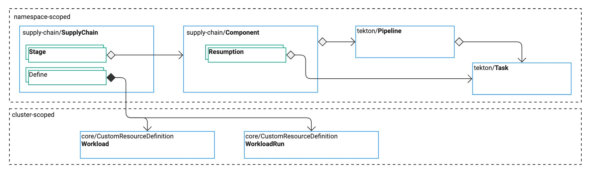

# Explanations for Platform Engineers

This section describes the core architectural concepts of Tanzu Supply Chain.
It focuses on authoring a platform for application development.

{{> 'partials/supply-chain/beta-banner' }}

The Tanzu Supply Chain enables platform engineers to author a seamless experience for
development work; an experience that does not require an understanding of Kubernetes.

## System overview

Each SupplyChain resource combines multiple Components in `stages`.
SupplyChains define a process for converting configuration Workloads into final artifacts.
They are very similar to pipelines in other CI/CD systems, with some key differences:

- The SupplyChain defines a Workload CRD, which becomes the interface that end users (typically developers) consume to have work done.
- End-users are typically unaware of the inner-workings of the SupplyChain and Components.
- Components are designed to encapsulate the work of generating a final or intermediate artifact, and importantly, the work of discovering new work to be done.

The flow of operations is as follows:

1. Apply a valid SupplyChain, Components, and accompanying Tekton Tasks and Pipelines.
2. Tanzu Supply Chain generates a Workload custom resource definition as defined by the SupplyChain.
3. A developer discovers the Workload Kinds available to them using the Tanzu CLI.
4. The developer generates a workload and fills in the required configuration.
5. After applying the Workload, Tanzu Supply Chain starts the first WorkloadRun, capturing progress and artifacts as it progresses.
6. Tanzu Supply Chain monitors Components that have Resumptions to discover if new runs need to be generated.
   1. New configuration in the Workload triggers new runs.
   2. New source code, base images, or other triggers from Resumptions trigger new runs.
7. The developer observes the progress of runs using the Tanzu CLI

## GitOps management of SupplyChains

SupplyChains, especially the authoring resources SupplyChain, Component, and Tekton Pipeline/Task are delivered to clusters via a Git repository and GitOps source promotion style.

For details, see [GitOps Managed SupplyChains](./../how-to/deploying-supply-chains/gitops-managed.hbs.md).

## Discover the primitives of a Tanzu Supply Chain

- SupplyChains define the Workload Kind, and the components to use.
- Workloads provide an end-user (developer) API
- WorkloadRuns provide a record of each progression through a supply chain.
- Components provide an abstraction for a piece of work, and reasons to trigger new runs.
- Resumptions provide a process for defining the triggering of new runs

<!--
[SupplyChain]: ./supply-chains.hbs.md
[SupplyChains]: ./supply-chains.hbs.md
[Workload]: ./workloads.hbs.md
[Workloads]: ./workloads.hbs.md
[WorkloadRuns]: ./workload-runs.hbs.md
[WorkloadRun]: ./workload-runs.hbs.md
[Components]: ./components.hbs.md
[Resumptions]: ./resumptions.hbs.md
-->