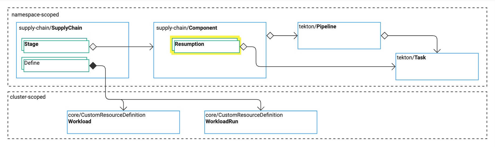

# Resumptions explained

{{> 'partials/supply-chain/beta-banner' }}

[Detailed Specification in the API Section](../../reference/api/component.hbs.md)

Resumptions are an important part of the Tanzu Supply Chain [Component] resource.

The rest of [Component] deals with either the configuration to pass to resumptions and pipelines, or the pipeline to 'run' when the [Component] is reached in the [SupplyChain] `stages`.
Resumptions are focused on **reasons to run again**.

Resumptions are executed on a timer, specified in the component's `resumptions` array. 
When they trigger, they execute a Tekton TaskRun to discover new values. These are very common for discovering
changes to source repositories, image repositories, and new versions of binaries.

When a run is executing and it reaches a stage with a resumption, a `resumptionKey` is generated based on the value of the parameters being passed to the resumption.
If a resumption has already been executed with the same parameters, then the result of that resumption is used.
This allows hundreds/thousands of workloads to reuse the same common inputs from resumptions without needing to run another resumption.

Resumptions wait for the period of time specified in `resumptions[].trigger.runAfter`, after the last _completion_ of a resumption TaskRun, before executing it again.

When any of a resumption's results change, all the [WorkloadRuns] with the same `resumptionKey` will be cloned, truncated back to the stage of the resumption, and will progress from there.

This is how resumptions trigger a new [WorkloadRun].

[SupplyChain]: ./supply-chains.hbs.md
[SupplyChains]: ./supply-chains.hbs.md
[Component]: ./components.hbs.md
[Components]: ./components.hbs.md
[Workload]: ./workloads.hbs.md
[Workloads]: ./workloads.hbs.md
[WorkloadRuns]: ./workload-runs.hbs.md
[WorkloadRun]: ./workload-runs.hbs.md
[Resumptions]: ./resumptions.hbs.md
[Resumption]: ./resumptions.hbs.md
