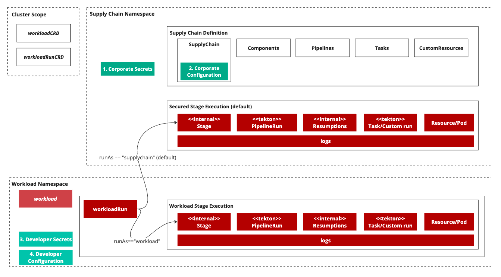

# Security Model

This topic tells you about the security model for Tanzu Supply Chain.

{{> 'partials/supply-chain/beta-banner' }}

In Tanzu Application Platform v1.8.0, Tanzu Supply Chain (beta) requires that resources associated
with Workloads be created in the same namespace as a Supply Chain. This is inflexible, and
creates security concerns over platform configuration and secrets.

Tanzu Application Platform v1.9.0 introduces a security model for executing stages of a Supply Chain
where Workloads exist in a separate namespaces to the Supply Chain.

Runs for associated Workloads are created in the same namespace as the Workload.

Stages, Resumptions, TaskRuns, and PipelineRuns are created by default in the Supply Chain
namespace. This gives the components in these stages visibility over platform secrets in the Supply
Chain namespace.

If you want a stage of a pipeline to execute in the Workload
namespace, use the `securityContext.runAs` setting. For example, to allow a source component to
retrieve source from a developer controlled
repository using secrets provided by the developer in the Workload namespace.
For more information, see [securityContext](../../reference/api/supplychain.hbs.md#security-context)
in the SupplyChain API topic.
