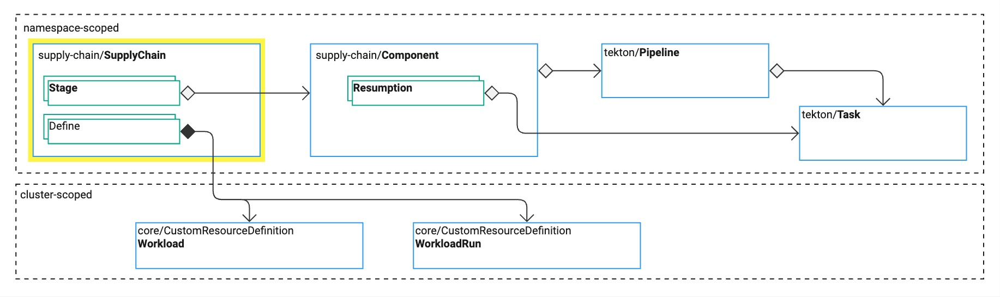

# Overview of SupplyChains

This topic tells you about the `SupplyChain` resource in Tanzu Supply Chain.
The `SupplyChain` resource unifies the Tanzu Supply Chain operation.
For reference information, see [SupplyChain](../../reference/api/supplychain.hbs.md).

{{> 'partials/supply-chain/beta-banner' }}

##  SupplyChain describes a process with stages

A supply chain, in the context of physical manufacturing is the process that delivers an end product
to customers, starting with the raw materials.

In software, it's a very similar concept, delivering an operational end product to customers,
starting with source code (raw materials).

The Tanzu Supply Chain product relies on this metaphor to describe your golden path to production.
It provides a primitive called `SupplyChain`, which is a Kubernetes custom resource that you use to
define all, or portions of, your software supply chain.

This section describes typical uses of the `SupplyChain` primitive for Tanzu Supply Chain.

###  SupplyChain describes a build process

A `SupplyChain` can describe the process of converting source into a runnable or deployable package.

Typical stages in this process are:

- Build:
  - Compile binary from source
  - Create OCI Image from binary
- Configure:
  - Create deployment artifacts, such as Kubernetes Pod definitions
- Package:
  - Create packaging artifacts, such as a Carvel Package or a Helm Chart

<!--
[//]: # (### Describe your build-promotion process)

[//]: # ()
[//]: # (<!-- Ask <Nick Webb> for a section here -->
<!--

[//]: # ()
[//]: # (### Describe a release process)

[//]: # ()
[//]: # (<!-- tbd -->

##  SupplyChain defines a configuration resource

A `SupplyChain` brings together the API for a user to apply to the cluster by:

- Defining a group and kind for a resource, called `Workload`. For reference information, see
  [spec.defines](../../reference/api/supplychain.hbs.md#specdefines).
- Specifying components used in the stages of the `SupplyChain`. For reference information, see
  [spec.stages[]](../../reference/api/supplychain.hbs.md#specstages).

By selecting components, the supply chain aggregates each the configuration for each component as a
single API specification for the `Workload`.

> **Note** `Workload` might be renamed in a later Tanzu Application Platform release.
>
> VMware plans to add support for overriding configuration within a `SupplyChain` to allow
> platform engineers to configure the values that developers don't need to know.

###  Supply Chains enforce immutability

The version of your SupplyChain that is embedded in the name must follow these rules.

A patch update is required to update the supply chain without an API change.
The controller ensures this rule cannot be broken when comparing supply chains on the cluster.

For example, you can apply to a cluster:

- A SupplyChain with the name `serverappv1s.example.com-1.0.0` with kind `ServerAppV1s`
- A SupplyChain with the name `serverappv1s.example.com-1.0.1` with kind `ServerAppV1s`

If the generated API for the kind is unchanged, then the later version is accepted.
If there is a change, the supply chain that was applied first succeeds, and the others reflect the error
in their status.
This ensures that you can't accidentally break the kind API that is running.

These rules ensure that potentially thousands of `Workloads` and `Runs` on the cluster do not break.

Recommended version guidelines:

- If the API and general behavior is unchanged by a change to the `spec.stages`:
  - Use a patch update such as `1.2.5` to `1.2.6`
  - Keep the same kind, such as `ServerAppV1`
- If the API is unchanged, but something significantly different occurs because of changes to the `spec.stages`, consider:
  - An update to the minor or major version, such as `1.2.5` to `1.3.0`
  - An update to the kind, such as `ServerAppV2`
  - A change of kind, such as `ServerAppWithApprovalV1`
- If the API changes, consider:
  - An update to the minor or major version, such as `1.2.5` to `1.3.0`
  - An update to the kind, such as `ServerAppV2`

This ensures clear communication to your users. New kind versions typically indicate that the user
must migrate their resources to the new API.

##  Integrity validation

A SupplyChain is not valid if:

- A required field is missing.
- The `Components` referenced are not in the same namespace.
- The `Components` referenced contain inputs that are not satisfied by their position in the `spec.stages`.
- The name does not match the `spec.defines` section.
- The `SupplyChain` breaks the versioning rules.

For more information, see [status.conditions[]](../../reference/api/supplychain.hbs.md#statusconditions).

<!--
Components: ./components.hbs.md
[Workload]: ./workloads.hbs.md -->
