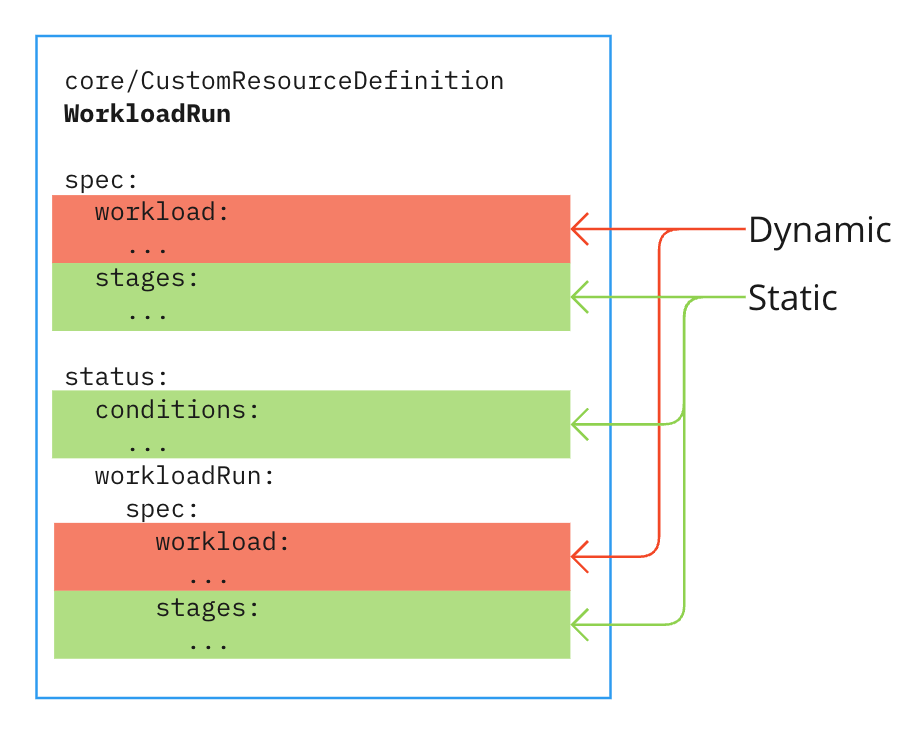

# WorkloadRun CRD

{{> 'partials/supply-chain/beta-banner' }}

This topic describes the `WorkloadRun` resource of Tanzu Supply Chain.

`WorkloadRun` resources are Custom Kubernetes Resources (CRDs) created by `SupplyChains`.
They are also one of the two duck type resources in Tanzu Supply Chain.

## Static CustomResourceDefinitions API

Every `WorkloadRun` resource is defined as a `CustomResourceDefinition`:

```yaml
apiVersion: apiextensions.k8s.io/v1
kind: CustomResourceDefinition
```

### `metadata.labels`

Workload CRDs always have the following labels. The `chain-name` and `chain-namespace` labels
reference the location of the SupplyChain resource that created this WorkloadRun. The `chain-role`
identifies this as a WorkloadRun. The other possible value is `workload`.

```yaml
metadata:
  labels:
    supply-chain.apps.tanzu.vmware.com/chain-name: apps.example.com-1.0.0
    supply-chain.apps.tanzu.vmware.com/chain-namespace: app-sc
    supply-chain.apps.tanzu.vmware.com/chain-role: workload-run
```

### `metadata.name`

The name of the resource is always in the form `<singular>runs.<group>` from the
[Supply Chain Defines API](supplychain.hbs.md#specdefines).

#### Example

```yaml
metadata:
  name: appv1runs.widget.com
```

### `spec.group`, `spec.names` and `spec.versions`

The CRD's `group`, `names` and `versions` is filled in with the details found in the
[Supply Chain Defines API](supplychain.hbs.md#specdefines). However, most names have the word `run`
appended.

Additionally, the `spec.names[].categories[]` array includes a category of `all-runs`. This ensures
that commands such as `kubectl get all-runs` find all the `SupplyChain` defined `WorkloadRuns` a user
can access.

#### Example

```yaml
spec:
  conversion:
    strategy: None
  group: example.com
  names:
    categories:
      - all-runs
    kind: AppV1Run
    listKind: AppV1RunList
    plural: appv1runs
    singular: appv1run
  scope: Namespaced
  versions:
    name: v1alpha1
    schema:
      openAPIV3Schema:
        ...
```

## Self-Replicating State

`WorkloadRuns` have a complex self-referencing status, that is described in detail
in [Core Concepts: WorkloadRuns](../../platform-engineering/explanation/workload-runs.hbs.md).
The majority of the `WorkloadRun` specification appears again in `status.workloadRun`.

This image shows the static and dynamic sections of a WorkloadRun.



> **Note** The duplication of the `WorkloadRun` `spec` into `spec.status.workloadRun.spec` is shown here.

> **Note** The `status` is not duplicated again into the `status.workloadRun` field.

## Static WorkloadRun API

`Static` means that the schema of these sections of the `WorkloadRun` is unchanging. This does not
mean that these sections do not mutate during the life of the `WorkloadRun`. They do, because they
track the progress of the `WorkloadRun`.

### `spec.stages[]` and `status.workloadrun.spec.stages[]`

`spec.stages[]` is empty if the run was triggered by a new workload generation, or, if triggered by
a Resumption, contains the stages up to but excluding the stage containing the resumption trigger.

`spec.workloadrun.spec.stages[]` initially contains a copy of `spec.stages[]` (if any exist), and as
the `WorkloadRun` proceeds, contains the rest of the results for subsequent stages.

### `spec.stages[].name` and `status.workloadrun.spec.stages[].name`

`name` is the name of this stage as defined in the SupplyChain.

### `spec.stages[].componentRef` and `status.workloadrun.spec.stages[].componentRef`

The sub-fields, `name` and `namespace`, refer to the component that will/has run this stage.

```yaml
name: source-1.0.0
namespace: test-basic
```

### `spec.stages[].outputs[]` and `status.workloadrun.spec.stages[].outputs[]`

Each output contains the following fields:

| Field     | Description                                                                                                             |
|-----------|-------------------------------------------------------------------------------------------------------------------------|
| `name:`   | The name of the output, defined in the [Component] for this stage.                                                      |
| `type:`   | The type of the output, defined in the [Component] for this stage.                                                      |
| `url:`    | The url to the artifact where this output is stored. All outputs are stored as supply chain accessible resources (URLs) |
| `digest:` | A digest representing the state of the output.                                                                          |

<!--[//]: # (TODO: Explainer has to describe inputs and outputs clearly)-->

### `spec.stages[].pipeline` and `status.workloadrun.spec.stages[].pipeline`

Each stage has one `pipeline` object with the following fields:

| Field        | Description                                                                                |
|--------------|--------------------------------------------------------------------------------------------|
| `passed:`    | Empty (`""`) means running, otherwise this is `false` for failed, and `true` for succeeded |
| `started:`   | The Date/Time this pipeline started. Empty (`""`) if not started.                          |
| `completed:` | The Date/Time this pipeline finished. Empty (`""`) if still running.                       |
| `message:`   | Output from the pipeline, which updates until the pipeline is completed.                   |
| `results:`   | A copy of the [Tekton PipelineRun results].                                                |

#### Example

```yaml
pipeline:
  passed: true
  started: "2024-02-25T19:31:48Z"
  completed: "2024-02-25T19:33:27Z"
  message: 'Tasks Completed: 3 (Failed: 0, Cancelled 0), Skipped: 0'
  results:
    - name: url
      value: registry.io/my-test/package-store@sha256:bad70a84441cfa49fea2a16a1fb0db3148f260242cf31bb8fde9547c09ece4bf
    - name: digest
      value: bad70a84441cfa49fea2a16a1fb0db3148f260242cf31bb8fde9547c09ece4bf
```

## Dynamic WorkloadRun API

### `spec.workload` and `spec.status.workloadRun.spec.workload`

These are the same. Technically, `spec.workload` is the state of the `Workload` when the run is
created, and `spec.status.workloadRun.spec.workload` is the state of the `Workload` after the run
starts, but they never change, so are in fact identical.

Both contain the `workload.metadata` and `workload.spec` sections of the workload that were used in
this run. The `WorkloadRun` "closes over" this state so that it cannot be lost. When viewing a run,
you can always tell which `Workload` resource's state was used during the run.

## Status

### `status.conditions[]`

Every `status.conditions[]` in Tanzu Supply Chain resources follows a
[strict set of conventions](statuses.hbs.md)

The top-level condition type is `Succeeded` because `Workload` is a batch resource.

The sub-types are:

#### PipelinesSucceeded

| Reason         | Meaning                                                                                                                                                  |
|----------------|----------------------------------------------------------------------------------------------------------------------------------------------------------|
| Succeeded      | All [Tekton PipelineRuns] are complete                                                                                                                   |
| Running        | [Tekton PipelineRuns] are not all complete.                                                                                                              |
| Failed         | A [Tekton PipelineRun] failed, and it's likely that the developer can remedy any issues by following the guidance in the message.                        |
| PlatformFailed | A [Tekton PipelineRun]  failed, and it's unlikely the problem can be remedied with changes to the workload or developer provided input (such as source). |

`Message` contains processing information and error messages produced in the pipeline. This
information must be specifically appended to the Tekton result named `message` to appear here.

#### ResumptionsSucceeded

| Reason         | Meaning                                                                                                                                                              |
|----------------|----------------------------------------------------------------------------------------------------------------------------------------------------------------------|
| Succeeded      | All [Tekton TaskRuns] for all resumptions are complete.                                                                                                              |
| Running        | A [Tekton TaskRun] for a resumption is incomplete.                                                                                                                   |
| Failed         | A [Tekton TaskRun] for a resumption failed, and it's likely that the developer can remedy any issues by following the guidance in the message.                       |
| PlatformFailed | A [Tekton TaskRun] for a resumption failed, and it's unlikely the problem can be remedied with changes to the workload or developer provided input (such as source). |

`Message` contains processing information and error messages produced in the taskRun. This
information must be specifically appended to the Tekton result named `message` to appear here.

<!--
[Workload]: workload.hbs.md
[WorkloadRun]: workloadrun.hbs.md
[Components]: component.hbs.md
[Component]: component.hbs.md
[Input]: component.hbs.md#inputs
[Output]: component.hbs.md#outputs
[Object Kind]: https://kubernetes.io/docs/concepts/overview/working-with-objects/ "Kubernetes documentation for Objects"
[CRD]: https://kubernetes.io/docs/concepts/extend-kubernetes/api-extension/custom-resources/ "Kubernetes Custom Resource documentation"
[CustomResourceDefinition]: https://kubernetes.io/docs/reference/kubernetes-api/extend-resources/custom-resource-definition-v1/ "Kuberneted Custom Resource Definition API specification"
[CustomResourceDefinitionSpec]: https://kubernetes.io/docs/reference/kubernetes-api/extend-resources/custom-resource-definition-v1/#CustomResourceDefinitionSpec "Kuberneted CRD Spec API specification"
[Duck Typed Resources]: ./duck-types.hbs.md
[SupplyChain]: ./supplychain.hbs.md
[SupplyChains]: supplychain.hbs.md
[Kind]: https://kubernetes.io/docs/concepts/overview/working-with-objects/ "Kubernetes documentation for Objects"
[Tekton PipelineRun]: https://tekton.dev/docs/pipelines/pipelineruns/
[Tekton PipelineRuns]: https://tekton.dev/docs/pipelines/pipelineruns/
[Tekton Pipeline]: https://tekton.dev/docs/pipelines/pipelines/
[Tekton Pipelines]: https://tekton.dev/docs/pipelines/pipelines/
[Tekton Workspaces]: https://tekton.dev/docs/pipelines/pipelineruns/#specifying-workspaces
[Tekton PipelineRun Parameters]: https://tekton.dev/docs/pipelines/pipelineruns/#specifying-parameters
[Tekton TaskRun Parameters]: https://tekton.dev/docs/pipelines/taskruns/#specifying-parameters
[Tekton Taskruns]: https://tekton.dev/docs/pipelines/taskruns/
[Tekton Taskrun]: https://tekton.dev/docs/pipelines/taskruns/
[Tekton Task]: https://tekton.dev/docs/pipelines/tasks/
[Tekton PipelineRun results]: https://tekton.dev/docs/pipelines/pipelines/#emitting-results-from-a-pipeline
-->