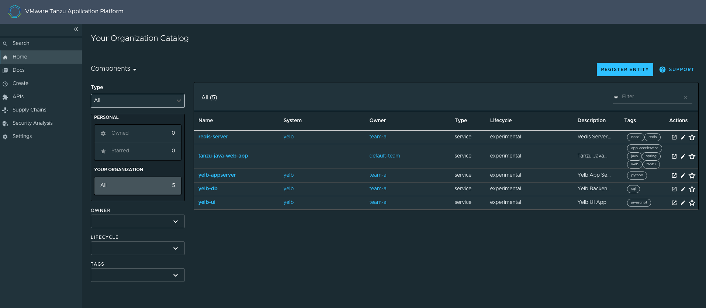

# Overview of Tanzu Application Platform GUI

Tanzu Application Platform GUI is a tool for your developers to view your
applications and services running for your organization.
This portal provides a central location in which you can view dependencies, relationships, technical
documentation, and the service status.

Tanzu Application Platform GUI is built from the
[Cloud Native Computing Foundation's](https://www.cncf.io/) project [Backstage](https://backstage.io/).

Tanzu Application Platform GUI consists of the following components:

* **Your organization catalog:**
  The catalog serves as the primary visual representation of your running services (components) and
  applications (systems).

* **Tanzu Application Platform GUI plug-ins:**
  These plug-ins expose capabilities regarding specific Tanzu Application Platform tools.
  Initially the included plug-ins are:

  * Runtime Resources Visibility
  * Application Live View
  * Application Accelerator
  * API Documentation
  * Supply Chain Choreographer

* **TechDocs:**
  This plug-in enables you to store your technical documentation in Markdown format in a source-code
  repository and display it alongside the relevant catalog entries.

  

* **A Git repository:**
  Tanzu Application Platform GUI stores the following in a Git repository:

  * The structure for your application catalog.
  * Your technical documentation about the catalog items, if you enable Tanzu Application Platform GUI
  TechDocs capabilities.

You can host the structure for your application catalog and your technical documentation in the same
repository as your source code.
