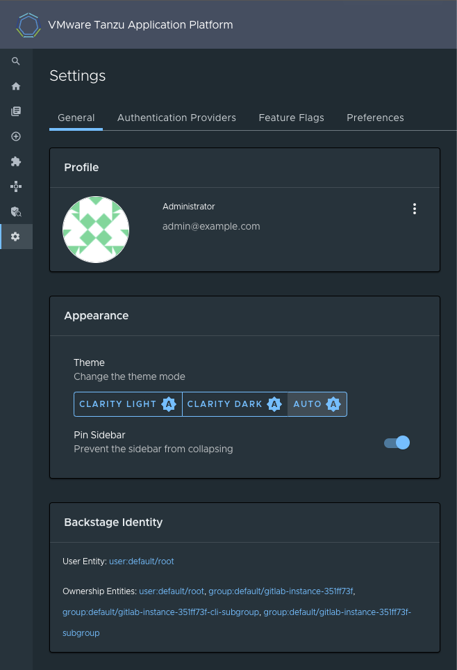

# Set up authentication for Tanzu Application Platform GUI

Tanzu Application Platform GUI extends the current Backstage authentication plug-in so that you
can see a login page based on the authentication providers configured at installation.
This feature is a work in progress.

Tanzu Application Platform GUI currently supports the following authentication providers:

- [Auth0](https://backstage.io/docs/auth/auth0/provider/)
- [Azure](https://backstage.io/docs/auth/microsoft/provider/)
- [Bitbucket](https://backstage.io/docs/auth/bitbucket/provider/)
- [GitHub](https://backstage.io/docs/auth/github/provider/)
- [GitLab](https://backstage.io/docs/auth/gitlab/provider/)
- [Google](https://backstage.io/docs/auth/google/provider/)
- [Okta](https://backstage.io/docs/auth/okta/provider/)
- [OneLogin](https://backstage.io/docs/auth/onelogin/provider/)

You can also configure a custom OpenID Connect (OIDC) provider.

## <a id='backstage-identity'></a> View your Backstage Identity

A Backstage identity is defined as a combination of:

- The user reference: each entity in the catalog is uniquely identified by the triplet of its
  [kind](https://backstage.io/docs/features/software-catalog/descriptor-format/#apiversion-and-kind-required)
- A [namespace](https://backstage.io/docs/features/software-catalog/descriptor-format/#namespace-optional)
- A [name](https://backstage.io/docs/features/software-catalog/descriptor-format/#name-required)

For example, the user Jane can be assigned to the user entity `user:default/jane` and an ownership
reference, which is used to determine what that user owns.
Jane (`user:default/jane`) might have the ownership references `user:default/jane`,
`group:default/team-a`, and `group:default/admins`. This would mean that Jane belongs to those groups
and, therefore, owns those references.

To view your current Backstage identity, in the **Settings** section of the left side navigation
pane click the **General** tab.

  

## <a id='config-auth-prov'></a> Configure an authentication provider

Configure a supported authentication provider or a custom OIDC provider:

- To configure a supported authentication provider, see the
[Backstage authentication documentation](https://backstage.io/docs/auth/).

- To configure a custom OIDC provider, edit your `tap-values.yaml` file or your
  custom configuration file to include an OIDC authentication provider.
  Configure the OIDC provider with your OAuth App values. For example:

  ```yaml
  shared:
    ingress_domain: "INGRESS-DOMAIN"

  # ... any existing values

  tap_gui:
    # ... any other TAP GUI values
    app_config:
      auth:
        environment: development
        session:
          secret: custom session secret
        providers:
          oidc:
            development:
              metadataUrl: AUTH-OIDC-METADATA-URL
              clientId: AUTH-OIDC-CLIENT-ID
              clientSecret: AUTH-OIDC-CLIENT-SECRET
              tokenSignedResponseAlg: AUTH-OIDC-TOKEN-SIGNED-RESPONSE-ALG # default='RS256'
              scope: AUTH-OIDC-SCOPE # default='openid profile email'
              prompt: auto # default=none (allowed values: auto, none, consent, login)
  ```

  Where `AUTH-OIDC-METADATA-URL` is a JSON file with generic OIDC provider configuration.
  It contains `authorizationUrl` and `tokenUrl`.
  Tanzu Application Platform GUI reads these values from `metadataUrl`,
  so you must not specify these values explicitly in the earlier authentication configuration.

  You must also the provide the redirect URI of the Tanzu Application Platform GUI instance to your
  identity provider.
  The redirect URI is sometimes called the redirect URL, the callback URL, or the callback URI.
  The redirect URI takes the following form:

  ```code
  SCHEME://tap-gui.INGRESS-DOMAIN/api/auth/oidc/handler/frame
  ```

  Where:

  - `SCHEME` is the URI scheme, most commonly `http` or `https`
  - `INGRESS-DOMAIN` is the host name you selected for your Tanzu Application Platform GUI instance

  When using `https` and `example.com` as examples for the two placeholders respectively, the
  redirect URI reads as follows:

  ```code
  https://tap-gui.example.com/api/auth/oidc/handler/frame
  ```

  For more information, see
  [this example](https://github.com/backstage/backstage/blob/e4ab91cf571277c636e3e112cd82069cdd6fca1f/app-config.yaml#L333-L347)
  in GitHub.

## <a id='allow-guest-access'></a> (Optional) Allow guest access

Enable guest access with other providers by adding the following flag under your authentication
configuration:

```yaml
auth:
  allowGuestAccess: true
```

**Note** Guests cannot view catalog entities if you have permission plugin enabled.

## <a id='customize-login'></a> (Optional) Customize the login page

Change the card's title or description for a specific provider with the following configuration:

```yaml
auth:
  environment: development
  providers:
    ... # auth providers config
  loginPage:
    github:
      title: Github Login
      message: Enter with your GitHub account
```

For a provider to appear on the login page, ensure that it is properly configured under the
`auth.providers` section of your values file.

## <a id='enable-permission'></a> (Optional) Enable permission

Enable permission plugin to limit catalog access to only owners, allowlisted users/groups, and
catalog admins:

```yaml
permission:
  enabled: true
  adminRefs:
    # - <user|group>:<namespace>/<name>
    - user:default/admin
    - group:test-namespace/operators
```

To allowlist a user/group, annotate the entity as follows:

```yaml
apiVersion: backstage.io/v1alpha1
kind: Component
metadata:
  annotations:
    backstage.tanzu.vmware.com/<group|user>.<namespace>.<name>: 'catalog.entity.read, catalog.entity.delete'
```

The value of this annotation is a comma delimited list of permissions for the specified user/group.
Here is a list of valid catalog entity permissions:

- catalog.entity.create
- catalog.entity.read
- catalog.entity.update
- catalog.entity.delete

**Note** If a group is granted ownership/access to an entity, all users within that group will
automatically inherit the same access. But it does not work for nested group ownerships.

**Disclaimer** When permission plugin is turned on with the default permission policy, API Auto
Registration will no longer work due to lack of user identities. Requests against the Catalog API
will no longer work as before.

### <a id='use-custom-permission-policy'></a> (Optional) Use custom permission policy

If you'd like to incorporate your own permission policy into your TAP Portal, you may follow the
 instruction outlined in [this section](somewhere in TPB docs???).

<!-- The following section can go into the TPB docs -->

#### Create custom policy

In your custom TPB plugin, create a [custom permission policy](https://backstage.io/docs/permissions/writing-a-policy).
For example:

```typescript
export class CustomPermissionPolicy implements PermissionPolicy {
  async handle(request: PolicyQuery): Promise<PolicyDecision> {
    if (request.permission.name === 'catalog.entity.delete') {
      return {
        result: AuthorizeResult.DENY,
      };
    }
    return { result: AuthorizeResult.ALLOW };
  }
}
```

This example permission policy would allow access to view all catalog entities, but will deny all
delete requests.

#### Set custom policy on the permission policy surface

Once you have your custom permission policy created, you may set it on the `PermissionPolicySurface`.
Please note that there can only be one permission policy applied, otherwise you will see an error at
build time.

```typescript
export const CustomPermissionPolicyPlugin: BackendPluginInterface =
  () => surfaces => {
    surfaces.applyTo(PermissionPolicySurface, surface => {
      surface.set(new CustomPermissionPolicy());
    });
  };
```
