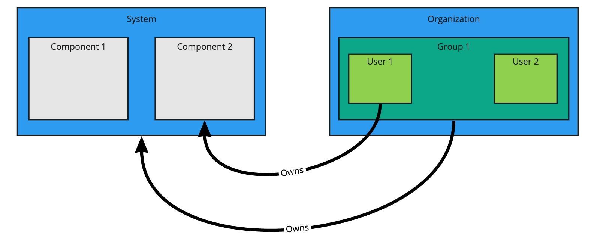

# Catalog operations

The software catalog setup procedures in this topic make use of Backstage.
For more information about Backstage, see the
[Backstage documentation](https://backstage.io/docs/features/software-catalog/).

## <a id='add-cat-entities'></a> Adding catalog entities

This section describes how you can format your own catalog.
Creating catalogs consists of building metadata YAML files stored together with the code.
This information is read from a Git-compatible repository consisting of these YAML catalog definition
files.
Changes made to the catalog definitions on your Git infrastructure are automatically reflected every
200 seconds or when manually registered.

For each catalog entity kind you create, there is a file format you must follow.
For information about all types of entities, see the
[Backstage documentation](https://backstage.io/docs/features/software-catalog/descriptor-format).

You can use the example blank catalog described in the Tanzu Application Platform GUI
[prerequisites](../../prerequisites.md#tap-gui) as a foundation for creating user, group, system,
and main component YAML files.

The organization contains Group 1, and Group 1 contains Users 1 and 2. System contains Components 1
and 2. User 1 owns Component 2. Group 1 owns System.



### <a id='users-and-groups'></a> Users and groups

A user entity describes a specific person and is used for identity purposes.
Users are members of one or more groups.
A group entity describes an organizational team or unit.

Users and groups have different descriptor requirements in their descriptor files:

- User descriptor files require `apiVersion`, `kind`, `metadata.name`, and `spec.memberOf`.
- Group descriptor files require `apiVersion`, `kind`, and `metadata.name`. They also require
  `spec.type` and `spec.children` where `spec.children` is another group.

To link a logged-in user to a user entity, include the optional `spec.profile.email` field.

Sample user entity:

```yaml
apiVersion: backstage.io/v1alpha1
kind: User
metadata:
  name: default-user
spec:
  profile:
    displayName: Default User
    email: guest@example.com
    picture: https://avatars.dicebear.com/api/avataaars/guest@example.com.svg?background=%23fff
  memberOf: [default-team]
```

Sample group entity:

```yaml
apiVersion: backstage.io/v1alpha1
kind: Group
metadata:
  name: default-team
  description: Default Team
spec:
  type: team
  profile:
    displayName: Default Team
    email: team-a@example.com
    picture: https://avatars.dicebear.com/api/identicon/team-a@example.com.svg?background=%23fff
  parent: default-org
  children: []
```

For more information about user entities and group entities, see the
[Backstage documentation](https://backstage.io/docs/features/software-catalog/descriptor-format#kind-group).

### <a id='systems'></a> Systems

A system entity is a collection of resources and components.

System descriptor files require values for `apiVersion`, `kind`, `metadata.name`, and also `spec.owner`
where `spec.owner` is a user or group.

A system has components when components specify the system name in the field `spec.system`.

Sample system entity:

```yaml
apiVersion: backstage.io/v1alpha1
kind: System
metadata:
  name: backstage
  description: Tanzu Application Platform GUI System
spec:
  owner: default-team
```

For more information about system entities, see the
[Backstage documentation](https://backstage.io/docs/features/software-catalog/descriptor-format#kind-system).

### <a id='components'></a> Components

A component describes a software component, or what might be described as a unit of software.

Component descriptor files require values for `apiVersion`, `kind`, `metadata.name`, `spec.type`,
`spec.lifecycle`, and `spec.owner`.

Some useful optional fields are `spec.system` and `spec.subcomponentOf`, both of which link a component
to an entity that it is part of.

```yaml
apiVersion: backstage.io/v1alpha1
kind: Component
metadata:
  name: backstage-component
  description: Tanzu Application Platform GUI Component
  annotations:
    'backstage.io/kubernetes-label-selector': 'app=backstage' #Identifies the Kubernetes objects that make up this component
    'backstage.io/techdocs-ref': dir:. #TechDocs label
spec:
  type: service
  lifecycle: alpha
  owner: default-team
  system: backstage
```

For more information about component entities, see the
[Backstage documentation](https://backstage.io/docs/features/software-catalog/descriptor-format#kind-component).

## <a id='update-catalogs'></a> Update software catalogs

The following procedures describe how to update software catalogs.

### <a id='register-comp'></a> Register components

To update your software catalog with new entities without re-deploying the entire `tap-gui`
package:

1. Go to your **Software Catalog** page.
2. Click **Register Entity** at the top-right of the page.
3. Enter the full path to link to an existing entity file and start tracking your entity.
4. Import the entities and view them in your **Software Catalog** page.

### <a id='deregister-comp'></a> Deregister components

To deregister an entity:

1. Go to your **Software Catalog** page.
2. Select the entity to deregister, such as component, group, or user.
3. Click the three dots at the top-right of the page and then click **Unregister...**.

### <a id='add-or-change'></a> Add or change organization catalog locations

To add or change organization catalog locations, you can use static configuration or you can use
`GitLabDiscoveryProcessor` to discover and register catalog entities that match the configured path.

Use static configuration
: To use static configuration to add or change catalog locations:

   1. Update components by changing the catalog location in either the `app_config` section of
      `tap-gui-values.yaml` or the custom values file you used when installing. For example:

        ```yaml
        tap_gui:
          app_config:
            catalog:
              locations:
                - type: url
                  target: UPDATED-CATALOG-LOCATION
        ```

   2. Register components by adding the new catalog location in either the `app_config` section of
      `tap-gui-values.yaml` or the custom values file you used when installing. For example:

        ```yaml
        tap_gui:
          app_config:
            catalog:
              locations:
                - type: url
                  target: EXISTING-CATALOG-LOCATION
                - type: url
                  target: EXTRA-CATALOG-LOCATION
        ```

      When targeting GitHub, don't write the raw URL. Instead, use the URL that you see when you
      navigate to the file in the browser. The catalog processor cannot set up the files properly if
      you use the raw URL.

      - Example raw URL: `https://raw.githubusercontent.com/user/repo/catalog.yaml`
      - Example target URL: `https://github.com/user/repo/blob/main/catalog.yaml`

      When targeting GitLab, use a
      [scoped route](https://docs.gitlab.com/ee/development/routing.html#project-routes) to the
      catalog file. This is a route with the `/-/` separator after the project name.
      If you don't use a scoped route, your entity fails to appear in the catalog.

      - Example unscoped URL: `https://gitlab.com/group/project/blob/main/catalog.yaml`
      - Example target URL: `https://gitlab.com/group/project/-/blob/main/catalog.yaml`

      For more information about static catalog configuration, see the
      [Backstage documentation](https://backstage.io/docs/features/software-catalog/configuration#static-location-configuration).

Use GitLabDiscoveryProcessor
: To use `GitLabDiscoveryProcessor` to discover and register catalog entities:

   1. Use `type: gitlab-discovery` to make `GitLabDiscoveryProcessor` crawl the GitLab
      instance to discover and register catalog entities that match the configured path.
      For more information, see the [Backstage documentation](https://backstage.io/docs/integrations/gitlab/discovery#alternative-processor).

   2. Update the package to include the catalog:

      - If you installed Tanzu Application Platform GUI by using a profile, run:

        ```console
        tanzu package installed update tap \
          --package-name tap.tanzu.vmware.com \
          --version PACKAGE-VERSION \
          --values-file tap-values.yaml \
          --namespace tap-install
        ```

      - If you installed Tanzu Application Platform GUI as an individual package, run:

        ```console
        tanzu package installed update tap-gui \
          --package-name tap-gui.tanzu.vmware.com \
          --version PACKAGE-VERSION \
          --values-file tap-gui-values.yaml \
          --namespace tap-install
        ```

   3. Verify the status of this update by running:

      ```console
      tanzu package installed list -n tap-install
      ```

## <a id='install-demo'></a> Install demo apps and their catalogs

To set up one of the demos, you can choose a blank catalog or a sample catalog.

### <a id='yelb-system'></a> Yelb system

The [Yelb](https://github.com/mreferre/yelb/tree/master/deployments/platformdeployment/Kubernetes/yaml)
demo catalog in GitHub includes all the components that make up the Yelb system and the default
Backstage components.

#### <a id='install-yelb'></a> Install Yelb

1. Download the appropriate file for running the Yelb application itself from
   [GitHub](https://github.com/mreferre/yelb/tree/master/deployments/platformdeployment/Kubernetes/yaml).
2. Install the application on the Kubernetes cluster that you used for Tanzu Application Platform.
   Preserve the metadata labels on the Yelb application objects.

#### <a id='install-yelb-cat'></a> Install the Yelb catalog

1. From the
[Tanzu Application Platform downloads](https://network.pivotal.io/products/tanzu-application-platform)
page, click **tap-gui-catalogs-latest** > **Tanzu Application Platform GUI Yelb Catalog**.
1. Follow the earlier steps for [Adding catalog entities](#add-cat-entities) to add `catalog-info.yaml`.
