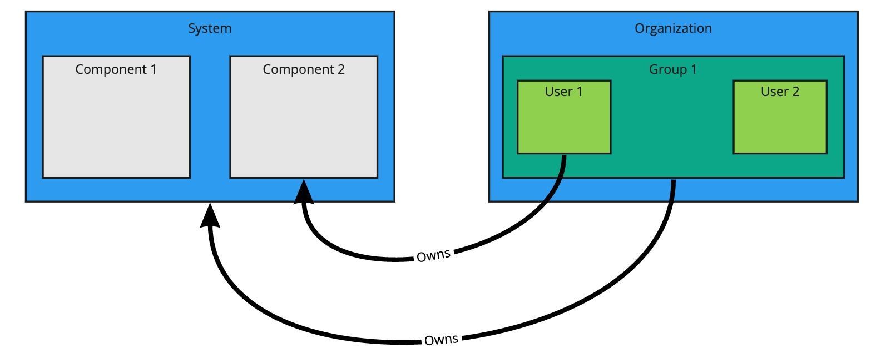

# Catalog operations

The software catalog setup procedures in this topic make use of Backstage.
For more information about Backstage, see the
[Backstage documentation](https://backstage.io/docs/features/software-catalog/software-catalog-overview).


## <a id='add-cat-entities'></a> Adding catalog entities

This section describes how you can format your own catalog.
Creating catalogs consists of building meta data YAML files stored together with the code.
This information is read from a Git-compatible repository consisting of these YAML catalog definition files.
Changes made to the catalog definitions on your Git infrastructure are automatically reflected every
200 seconds or when manually registered.

For each catalog entity kind you create, there is a file format you must follow.
Below is an overview of a few core entities, here are details about all types of
[entities](https://backstage.io/docs/features/software-catalog/descriptor-format).

You can use the example blank catalog described in [Prerequisites](../../prerequisites.html#tap-gui)
as a foundation for creating user, group, system, and main component YAML files.

Relationship Diagram:



### <a id='users-and-groups'></a> Users and groups

A User entity describes a specific person and is used for identity purposes.
A Group entity describes an organizational team or unit. Users are members of one or more Groups.

The descriptor files for both require values for `apiVersion`, `kind`, `metadata.name`.
Users also require `spec.memberOf`. Groups require `spec.type` and `spec.children`, where
`spec.children` is another Group.
To link a logged in user to a user entity, include the optional `spec.profile.email`
field.

Sample user entities:

```yaml
apiVersion: backstage.io/v1alpha1
kind: User
metadata:
  name: default-user
spec:
  profile:
    displayName: Default User
    email: guest@example.com
    picture: https://avatars.dicebear.com/api/avataaars/guest@example.com.svg?background=%23fff
  memberOf: [default-team]
```

Sample group entities:

```yaml
apiVersion: backstage.io/v1alpha1
kind: Group
metadata:
  name: default-team
  description: Default Team
spec:
  type: team
  profile:
    displayName: Default Team
    email: team-a@example.com
    picture: https://avatars.dicebear.com/api/identicon/team-a@example.com.svg?background=%23fff
  parent: default-org
  children: []
```

More information about user entities and group entities is available in
[Backstage documentation](https://backstage.io/docs/features/software-catalog/descriptor-format#kind-group).


### <a id='systems'></a> Systems

A System entity is a collection of resources and components.
System descriptor files require values for `apiVersion`, `kind`, `metadata.name`, and `spec.owner`,
where `spec.owner` is a User or Group. A system has components belonging to it when that component
specifies the System name in the field `spec.system`.

Sample system entity

```yaml
apiVersion: backstage.io/v1alpha1
kind: System
metadata:
  name: backstage
  description: Tanzu Application Platform GUI System
spec:
  owner: default-team
```

More information about system entities is available in
[Backstage documentation](https://backstage.io/docs/features/software-catalog/descriptor-format#kind-system).


### <a id='components'></a> Components

A Component describes a software component, or a "unit of software".
Component descriptor files require values for `apiVersion`, `kind`, `metadata.name`, `spec.type`,
`spec.lifecycle`, and `spec.owner`. Some useful optional fields are `spec.system` and
`spec.subcomponentOf`, both of which links a Component to an entity it is a part of.

```yaml
apiVersion: backstage.io/v1alpha1
kind: Component
metadata:
  name: backstage-component
  description: Tanzu Application Platform GUI Component
  annotations:
    'backstage.io/kubernetes-label-selector': 'app=backstage' #Identifies the Kubernetes objects that make up this component
    'backstage.io/techdocs-ref': dir:. #TechDocs label
spec:
  type: service
  lifecycle: alpha
  owner: default-team
  system: backstage
```


More information about component entities is available in
[Backstage documentation](https://backstage.io/docs/features/software-catalog/descriptor-format#kind-component).


## <a id='update-catalogs'></a> Update software catalogs

The following procedures cover updating software catalogs.


### <a id='register-comp'></a> Register components

You can update your software catalog with new entities without re-deploying the entire `tap-gui` package.
To do so:
​
1. Navigate to your **Software Catalog** page.
1. Click the **Register Entity** on the top-right of the page.
1. Link to an existing entity file to start tracking your entity by entering the full path.
1. Import the entities and view them in your **Software Catalog** page.
​

### <a id='deregister-comp'></a> Deregister components

To deregister an entity, follow these steps:

1. Navigate to your **Software Catalog** page.
1. Select the entity to deregister, such as component, group, or user.
1. Click the three dots at the top-right of the page and then click **Unregister...**.


### <a id='add-or-change'></a> Add or change organization catalog locations

1. Use static configuration to add or change catalog locations.

    * To update components, change the catalog location in either the `app_config` section of
    `tap-gui-values.yaml` or the custom values file you used when installing. For example:

        ```yaml
        catalog:
          locations:
            - type: url
              target: UPDATED-CATALOG-LOCATION
        ```

    * To register components, add the new catalog's location in either the `app_config` section of
    `tap-gui-values.yaml` or the custom values file you used when installing. For example:

        ```yaml
        catalog:
          locations:
            - type: url
              target: EXISTING-CATALOG-LOCATION
            - type: url
              target: EXTRA-CATALOG-LOCATION
        ```

    When targeting GitHub, don't write the raw URL. Instead, use the URL that you see when you
    navigate to the file in the browser, otherwise the catalog processor is unable to properly
    set up the files.

    For example:

    - Raw URL: `https://raw.githubusercontent.com/user/repo/catalog.yaml`
    - Target URL: `https://github.com/user/repo/blob/main/catalog.yaml`

    For more information about static catalog configuration, see the
    [Backstage documentation](https://backstage.io/docs/features/software-catalog/configuration#static-location-configuration).

1. Update the package to include the catalog by running:

    ```console
    tanzu package installed update backstage \
      --version PACKAGE-VERSION \
      -f VALUES-FILE
    ```

1. Verify the status of this update by running:

    ```console
    tanzu package installed list
    ```


## <a id='install-demo'></a> Installing demo apps and their catalogs

To set up one of our demos, you can choose between a blank or a sample catalog.


### <a id='yelb-system'></a> Yelb system

The [Yelb](https://github.com/mreferre/yelb/tree/master/deployments/platformdeployment/Kubernetes/yaml)
demo catalog in GitHub includes all the components that make up the Yelb system and the default
Backstage components.


#### <a id='install-yelb'></a> Install Yelb

1. Download the appropriate file for running the Yelb application itself from
[GitHub](https://github.com/mreferre/yelb/tree/master/deployments/platformdeployment/Kubernetes/yaml).
1. Install the application on the Kubernetes cluster that you've used for Tanzu Application Platform.
It's important to preserve the metadata labels on the Yelb application's objects.


#### <a id='install-yelb-cat'></a> Install Yelb catalog

1. Save the **Tanzu Application Platform GUI Yelb Catalog** from the Tanzu Network's
[Tanzu Application Platform downloads](https://network.pivotal.io/products/tanzu-application-platform)
under the **Tap-GUI-Catalogs** directory.
1. Use the steps for [Adding catalog entities](#add-cat-entities) from earlier to add the `catalog-info.yaml`.
