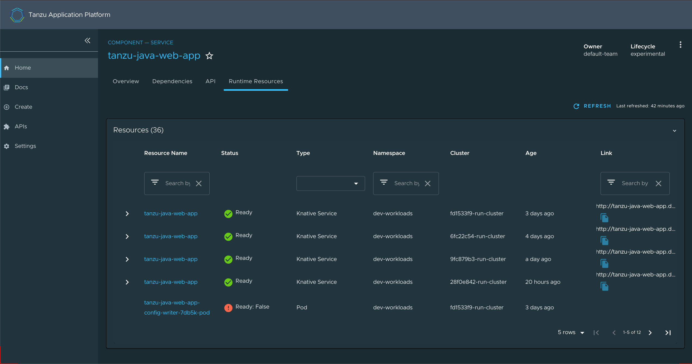

# Viewing resources on multiple clusters in Tanzu Application Platform GUI

You can configure Tanzu Application Platform GUI to retrieve Kubernetes object details from multiple
clusters and then surface those details in the Runtime Resources Visibility plug-in.

## <a id="set-up-service-account"></a> Set up a Service Account to view resources on a cluster

To view resources on a cluster, you must create a service account on the cluster that can
`get`, `watch`, and `list` resources on that cluster.
You first create a `ClusterRole` with these rules and a `ServiceAccount` in its own `Namespace`, and
then bind the `ClusterRole` to the `ServiceAccount`.

To do so:

1. Copy this YAML content into a file called `tap-gui-viewer-service-account-rbac.yaml`.

    ```yaml
    apiVersion: v1
    kind: Namespace
    metadata:
      name: tap-gui
    ---
    apiVersion: v1
    kind: ServiceAccount
    metadata:
      namespace: tap-gui
      name: tap-gui-viewer
    ---
    apiVersion: rbac.authorization.k8s.io/v1
    kind: ClusterRoleBinding
    metadata:
      name: tap-gui-read-k8s
    subjects:
    - kind: ServiceAccount
      namespace: tap-gui
      name: tap-gui-viewer
    roleRef:
      kind: ClusterRole
      name: k8s-reader
      apiGroup: rbac.authorization.k8s.io
    ---
    apiVersion: rbac.authorization.k8s.io/v1
    kind: ClusterRole
    metadata:
      name: k8s-reader
    rules:
    - apiGroups: ['']
      resources: ['pods', 'pods/log', 'services', 'configmaps']
      verbs: ['get', 'watch', 'list']
    - apiGroups: ['apps']
      resources: ['deployments', 'replicasets']
      verbs: ['get', 'watch', 'list']
    - apiGroups: ['autoscaling']
      resources: ['horizontalpodautoscalers']
      verbs: ['get', 'watch', 'list']
    - apiGroups: ['networking.k8s.io']
      resources: ['ingresses']
      verbs: ['get', 'watch', 'list']
    - apiGroups: ['networking.internal.knative.dev']
      resources: ['serverlessservices']
      verbs: ['get', 'watch', 'list']
    - apiGroups: [ 'autoscaling.internal.knative.dev' ]
      resources: [ 'podautoscalers' ]
      verbs: [ 'get', 'watch', 'list' ]
    - apiGroups: ['serving.knative.dev']
      resources:
      - configurations
      - revisions
      - routes
      - services
      verbs: ['get', 'watch', 'list']
    - apiGroups: ['carto.run']
      resources:
      - clusterconfigtemplates
      - clusterdeliveries
      - clusterdeploymenttemplates
      - clusterimagetemplates
      - clusterruntemplates
      - clustersourcetemplates
      - clustersupplychains
      - clustertemplates
      - deliverables
      - runnables
      - workloads
      verbs: ['get', 'watch', 'list']
    - apiGroups: ['source.toolkit.fluxcd.io']
      resources:
      - gitrepositories
      verbs: ['get', 'watch', 'list']
    - apiGroups: ['source.apps.tanzu.vmware.com']
      resources:
      - imagerepositories
      - mavenartifacts
      verbs: ['get', 'watch', 'list']
    - apiGroups: ['conventions.carto.run']
      resources:
      - podintents
      verbs: ['get', 'watch', 'list']
    - apiGroups: ['kpack.io']
      resources:
      - images
      - builds
      verbs: ['get', 'watch', 'list']
    - apiGroups: ['scanning.apps.tanzu.vmware.com']
      resources:
      - sourcescans
      - imagescans
      - scanpolicies
      verbs: ['get', 'watch', 'list']
    - apiGroups: ['tekton.dev']
      resources:
      - taskruns
      - pipelineruns
      verbs: ['get', 'watch', 'list']
    - apiGroups: ['kappctrl.k14s.io']
      resources:
      - apps
      verbs: ['get', 'watch', 'list']
    ```

    This YAML content creates `Namespace`, `ServiceAccount`, `ClusterRole`, and `ClusterRoleBinding`.

1. Create `Namespace`, `ServiceAccount`, `ClusterRole`, and `ClusterRoleBinding` by running:

    ```console
    kubectl create -f tap-gui-viewer-service-account-rbac.yaml
    ```

    This ensures the `kubeconfig` context is set to the cluster with resources to be viewed in
    Tanzu Application Platform GUI.

1. Discover the `CLUSTER_URL` and `CLUSTER_TOKEN` values by running:

    ```console
    CLUSTER_URL=$(kubectl config view --minify -o jsonpath='{.clusters[0].cluster.server}')

    CLUSTER_TOKEN=$(kubectl -n tap-gui get secret $(kubectl -n tap-gui get sa tap-gui-viewer -o=json \
    | jq -r '.secrets[0].name') -o=json \
    | jq -r '.data["token"]' \
    | base64 --decode)

    echo CLUSTER_URL: $CLUSTER_URL
    echo CLUSTER_TOKEN: $CLUSTER_TOKEN
    ```

1. (Optional) Configure the Kubernetes client to verify the TLS certificates presented by a cluster's
API server. To do this, discover `CLUSTER_CA_CERTIFICATES` by running:

    ```console
    CLUSTER_CA_CERTIFICATES=$(kubectl config view --raw -o jsonpath='{.clusters[0].cluster.certificate-authority-data}')

    echo CLUSTER_CA_CERTIFICATES: $CLUSTER_CA_CERTIFICATES
    ```

1. Record the `CLUSTER_URL` and `CLUSTER_TOKEN` values for when you
[Update Tanzu Application Platform GUI to view resources on multiple clusters](#update-tap-gui) later.

## <a id="update-tap-gui"></a> Update Tanzu Application Platform GUI to view resources on multiple clusters

The cluster must be identified to Tanzu Application Platform GUI with the `ServiceAccount` token
and the cluster Kubernetes control plane URL.

You must add a `kubernetes` section to the `app_config` file that Tanzu Application Platform GUI uses.
This section must have an entry for each cluster that has resources to view.

To do so:

1. Copy this YAML content into `tap-gui-values.yaml`:

    ```yaml
    app_config:
      kubernetes:
        serviceLocatorMethod:
          type: 'multiTenant'
        clusterLocatorMethods:
          - type: 'config'
            clusters:
              - url: CLUSTER-URL
                name: CLUSTER-NAME
                authProvider: serviceAccount
                serviceAccountToken: "CLUSTER-TOKEN"
                skipTLSVerify: true
    ```

    Where:

    - `CLUSTER-URL` is the value you discovered earlier.
    - `CLUSTER-TOKEN` is the value you discovered earlier.
    - `CLUSTER-NAME` is a unique name of your choice.

    If there are resources to view on the cluster that hosts Tanzu Application Platform GUI, add an
    entry to `clusters` for it as well.

    If you would like the Kubernetes client to verify the TLS certificates presented by a cluster's
    API server, set the following properties for the cluster:

    ```yaml
    skipTLSVerify: false
    caData: CLUSTER-CA-CERTIFICATES
    ```

    Where `CLUSTER-CA-CERTIFICATES` is the value you discovered earlier.

1. Update the `tap-gui` package by running this command:

    ```console
    tanzu package installed update tap-gui -n tap-install --values-file tap-gui-values.yaml
    ```

1. Wait a moment for the `tap-gui` package to update and then verify that `STATUS` is
`Reconcile succeeded` by running:

    ```console
    tanzu package installed get tap-gui -n tap-install
    ```


## <a id="runtime-resrc-plug-in"></a> View resources on multiple clusters in the Runtime Resources Visibility plug-in

To view resources on multiple clusters in the Runtime Resources Visibility plug-in:

1. Navigate to the Runtime Resources Visibility plug-in for a component that is running on multiple
clusters.

1. View the multiple resources and their statuses across the clusters.

    
