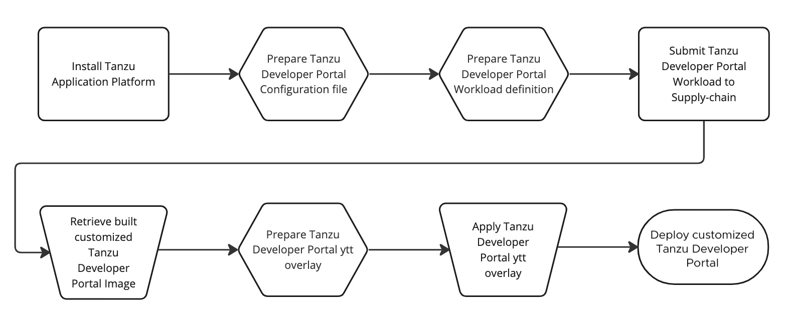
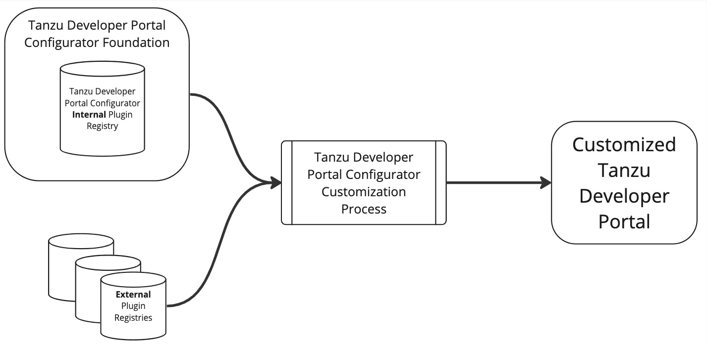
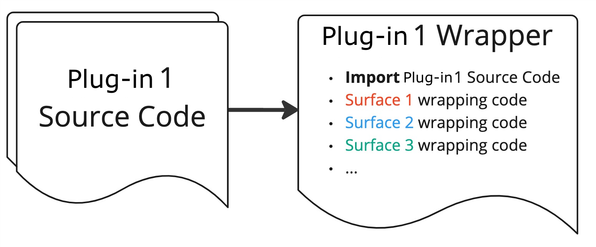

# Tanzu Developer Portal Configurator Concepts

This topic gives you conceptual overviews of how Tanzu Developer Portal
(formerly named Tanzu Application Platform GUI) Configurator works.

##  Overview of how to customize your portal

To use your customized portal with all the runtime configuration values used in your pre-built
version:

1. Install a working installation of Tanzu Application Platform with a working instance of the
   pre-built Tanzu Developer Portal.
1. Prepare your Configurator buildtime configuration file.
1. Prepare your Configurator workload definition YAML.
1. Submit your Configurator workload definition YAML to your supplychain.
1. After the image is built, retrieve your customized Tanzu Developer Portal image from your
   supplychain deliverables.
1. To run your customized portal, prepare a ytt overlay to replace the pre-built Tanzu Developer Portal
   in Tanzu Application Platform with your customized version. For more information about ytt, see the
   [Carvel documentation](https://carvel.dev/ytt/).
1. Apply the ytt overlay to your cluster.

##  Overviews of buildtime configuration and runtime configuration

The following sections describe the differences between buildtime configuration and runtime
configuration.

###  Buildtime configuration

Buildtime configuration refers to the customization of how plug-ins are included in the
Tanzu Developer Portal image that you run on your Tanzu Application Platform cluster.

Configurator reads this buildtime configuration to help build your customized instance of
Tanzu Developer Portal. Buildtime configuration values can include:

- Which plug-ins are included in your portal
- How plug-ins are linked on the sidebar for your portal
- Which cards are available and how they appear in the software catalog

###  Runtime configuration

Runtime configuration refers to the values that you use to configure the portal. You provide these
values in `tap-values.yaml` when you install and run your portal. Runtime configuration values can
include:

- The name of your portal
- Integrations (GitHub or GitLab keys, identity provider configuration, and so on)
- The locations of any catalogs on GitHub or GitLab
- Security overrides
- Showing or hiding the included Tanzu Application Platform plug-ins

##  Tanzu Developer Portal Configurator Foundation

The Tanzu Developer Portal Configurator Foundation is the image that contains everything necessary
to build a customized version of Tanzu Developer Portal. Foundation includes the templated
Tanzu Developer Portal, an internal registry of Tanzu Developer Portal plug-ins, and tools to enable
the build process to incorporate external plug-ins.

##  Internal plug-ins and external plug-ins

Internal plug-ins are included inside the Tanzu Developer Portal Configurator Foundation image.
These include Tanzu Application Platform plug-ins as well as [Backstage](https://backstage.io) core
plug-ins.

External plug-ins are not in the Tanzu Developer Portal Configurator Foundation image. They are added
from external registries. They can include custom plug-ins as well as
[third-party Backstage plug-ins](https://backstage.io/plugins/).

###  Plug-in surfaces and wrappers

Tanzu Developer Portal Configurator introduces plug-in surfaces and plug-in wrappers.

####  Plug-in surfaces

A surface is a discrete capability that a plug-in provides. This can include:

- The ability to show up on the sidebar
- The ability to be accessed at a URL, such as `https://YOUR_PORTAL_URL/plugin`
- The ability to show up as a Catalog Overview tab

####  Plug-in wrappers

A wrapper is a method of exposing a plug-in's surfaces to the Tanzu Developer Portal Configurator so
that the plug-in can be integrated into a customized portal. A wrapper imports a reference to the
underlying plug-in. A wrapper is also, in fact, a plug-in itself.

