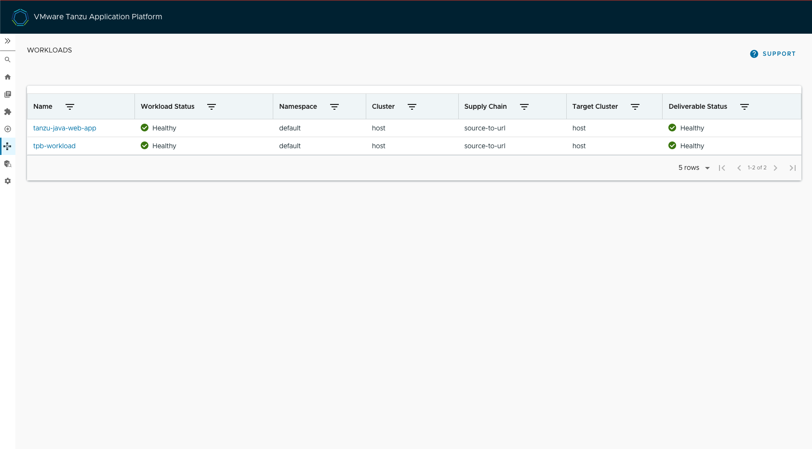
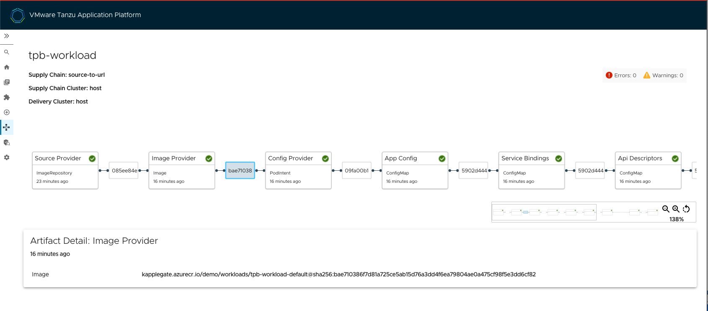

# Run your Customized Tanzu Developer Portal

At this stage, you have [built your customized Tanzu Developer Portal with Configurator](building.hbs.md).

After the build has completed, you retrieve the image reference of the built portal.
You then use the image reference to perform a [ytt](https://carvel.dev/ytt/) overlay to substitute
that image name for the one running the pre-built Tanzu Developer Portal on your cluster.

## <a id="identify"></a> Identify the customized image reference

Identify the image that the supply chain built so that you can use the image reference in your
[ytt](https://carvel.dev/ytt/) overlay in the next section. There are several ways to retrieve this
image name, including using the Kubernetes command-line tool (kubectl) or using the
Tanzu Developer Portal GUI.

kubectl
: Run:

    ```console
    kubectl -n DEVELOPER-NAMESPACE get images.kpack.io WORKLOAD-NAME -o jsonpath={.status.latestImage}
    ```

    Where:

    - `DEVELOPER-NAMESPACE` is the configured developer namespace on the cluster where you ran the workload.
    - `WORKLOAD-NAME` is the name of the workload you used.

    For example:

    ```console
    > kubectl -n default get images.kpack.io tpb-workload -o jsonpath={.status.latestImage}
    > kapplegate.azurecr.io/demo/workloads/tpb-workload-default@sha256:bae710386f7d81a725ce5ab15d76a3dd4f6ea79804ae0a475cf98f5e3dd6cf82
    ```

Tanzu Developer Portal GUI
: Within the Tanzu Developer Portal GUI:

    1. Select your workload in the Supply Chain view.
       
    2. Record the Artifact Detail image value you see in the detailed view of the workload.
       

## <a id="prepare"></a> Prepare to overlay your customized image onto the currently running instance

To prepare to overlay your customized image onto the currently running instance:

1. Create the [ytt](https://carvel.dev/ytt/) overlay secret.

1. Create a file called `tdp-overlay-secret.yaml` with the following content:

    ```yaml
    apiVersion: v1
    kind: Secret
    metadata:
      name: tpb-app-image-overlay-secret
      namespace: tap-install
    stringData:
      tpb-app-image-overlay.yaml: |
        #@ load("@ytt:overlay", "overlay")

        #! makes an assumption that tap-gui is deployed in the namespace: "tap-gui"
        #@overlay/match by=overlay.subset({"kind": "Deployment", "metadata": {"name": "server", "namespace": "tap-gui"}}), expects="1+"
        ---
        spec:
          template:
            spec:
              containers:
                #@overlay/match by=overlay.subset({"name": "backstage"}),expects="1+"
                #@overlay/match-child-defaults missing_ok=True
                - image: IMAGE-REFERENCE
                #@overlay/replace
                  args:
                  - -c
                  - |
                    export KUBERNETES_SERVICE_ACCOUNT_TOKEN="$(cat /var/run/secrets/kubernetes.io/serviceaccount/token)"
                    exec /layers/tanzu-buildpacks_node-engine-lite/node/bin/node portal/dist/packages/backend  \
                    --config=portal/app-config.yaml \
                    --config=portal/runtime-config.yaml \
                    --config=portal/app-config.pack.yaml \
                    --config=/etc/app-config/app-config.yaml
                  #@overlay/replace
                  ports:
                    - containerPort: 7007
                  #@overlay/replace
                  livenessProbe:
                    httpGet:
                      port: 7007
                  #@overlay/replace
                  readinessProbe:
                    httpGet:
                      port: 7007

        #@ load("@ytt:overlay", "overlay")
        #@overlay/match by=overlay.subset({"kind": "Service", "metadata": {"name": "server", "namespace": "tap-gui"}}), expects="1+"
        ---
        spec:
        #@overlay/replace
          ports:
          - protocol: TCP
            targetPort: 7007
            port: 7000
    ```

    Where `IMAGE-REFERENCE` is the customized image you retrieved earlier

1. Apply the secret by running:

   ```console
   kubectl apply -f tdp-overlay-secret.yaml
   ```

1. Add the secret to `tap-values.yaml`, the file used to install Tanzu Application Platform.
   For example:

    ```yaml
    profile: full
    tap_gui:
      ...
    package_overlays:
    - name: tap-gui
      secrets:
      - name: tpb-app-image-overlay-secret
    ```

1. Update your installation to use the modified `tap-values.yaml` file. The exact steps vary depending
   on your installation method (GitOps, online install, or offline install).

   For how to do so for an online installation, see
   [Install your Tanzu Application Platform package](../../install-online/profile.hbs.md#install-your-tanzu-application-platform-package).
