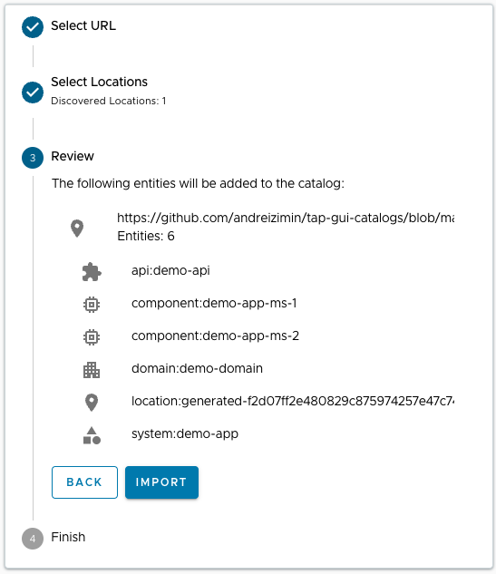
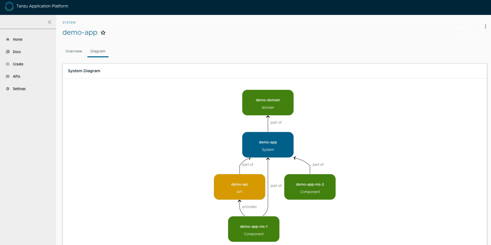
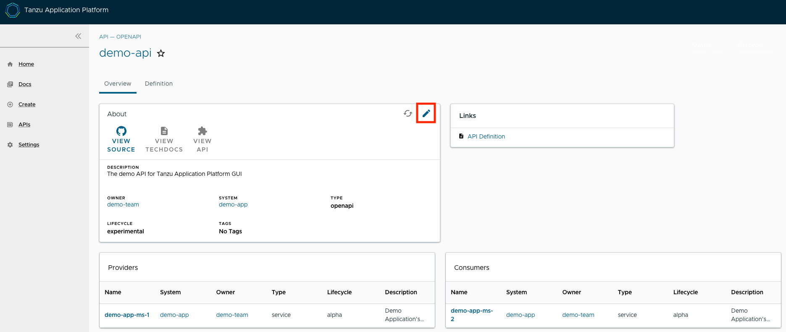

# Getting started with API documentation plug-in

This topic describes how to get started with the API documentation plug-in.


## <a id="dev-first-app"></a> Add your API entry to the Tanzu Application Platform GUI software catalog

In this section, you will:

- [Learn about API entities of the Software Catalog](#about-app-accs)
- [Add a demo API entity and its related Catalog objects to Tanzu Application Platform GUI](#deploy-your-app)
- [Update your demo API entry](#deploy-your-app)


### <a id="about-app-accs"></a> About API entities

The list of API entities is visible on the left-hand side navigation panel of
Tanzu Application Platform GUI.
It is also visible on the overview page of specific components on the home page.
APIs are a definition of the interface between components.

Their definition is provided in machine-readable ("raw") and human-readable formats.
For more information, see [API plugin documentation](api-docs.html).


### <a id="deploy-your-app"></a> Add a demo API entity to Tanzu Application Platform GUI software catalog

To add a demo API entity and its related Catalog objects, follow the same steps as registering any other software catalog entity:

1. Navigate to the home page of Tanzu Application Platform GUI. Click **Home** on the left-side navigation bar.
   Click **REGISTER ENTITY**.

    

1. **Register an existing component** prompts you to type a repository URL. Type the link to the `catalog-info.yaml` file of your choice or use the following sample definition. Save this code block as `catalog-info.yaml`, upload it to the Git repository of your choice, and copy the link to `catalog-info.yaml`.

    This demo setup includes a domain called `demo-domain` with a single system called `demo-system`.
    This systems consists of two microservices - `demo-app-ms-1` and `demo-app-ms-1` - and one API
    called `demo-api` that `demo-app-ms-1` provides and `demo-app-ms-2` consumes.

    ```yaml
    apiVersion: backstage.io/v1alpha1
    kind: Domain
    metadata:
      name: demo-domain
      description: Demo Domain for Tanzu Application Platform
      annotations:
        'backstage.io/techdocs-ref': dir:.
    spec:
      owner: demo-team

    ---

    apiVersion: backstage.io/v1alpha1
    kind: Component
    metadata:
      name: demo-app-ms-1
      description: Demo Application's Microservice-1
      tags:
        - microservice
      annotations:
        'backstage.io/kubernetes-label-selector': 'app.kubernetes.io/part-of=demo-app-ms-1'
        'backstage.io/techdocs-ref': dir:.
    spec:
      type: service
      providesApis:
       - demo-api
      lifecycle: alpha
      owner: demo-team
      system: demo-app

    ---

    apiVersion: backstage.io/v1alpha1
    kind: Component
    metadata:
      name: demo-app-ms-2
      description: Demo Application's Microservice-2
      tags:
        - microservice
      annotations:
        'backstage.io/kubernetes-label-selector': 'app.kubernetes.io/part-of=demo-app-ms-2'
        'backstage.io/techdocs-ref': dir:.
    spec:
      type: service
      consumesApis:
       - demo-api
      lifecycle: alpha
      owner: demo-team
      system: demo-app

    ---

    apiVersion: backstage.io/v1alpha1
    kind: System
    metadata:
      name: demo-app
      description: Demo Application for Tanzu Application Platform
      annotations:
        'backstage.io/techdocs-ref': dir:.
    spec:
      owner: demo-team
      domain: demo-domain

    ---

    apiVersion: backstage.io/v1alpha1
    kind: API
    metadata:
      name: demo-api
      description: The demo API for Tanzu Application Platform GUI
      links:
        - url: https://api.agify.io
          title: API Definition
          icon: docs
    spec:
      type: openapi
      lifecycle: experimental
      owner: demo-team
      system: demo-app # Or specify system name of your choice
      definition: |
        openapi: 3.0.1
        info:
          title: Demo API
          description: defaultDescription
          version: '0.1'
        servers:
          - url: https://api.agify.io
        paths:
          /:
            get:
              description: Auto generated using Swagger Inspector
              parameters:
                - name: name
                  in: query
                  schema:
                    type: string
                  example: type_any_name
              responses:
                '200':
                  description: Auto generated using Swagger Inspector
                  content:
                    application/json; charset=utf-8:
                      schema:
                        type: string
                      examples: {}
    ```

1. Paste the link to the `catalog-info.yaml` and click **ANALYZE**. Review the catalog entities and click **IMPORT**.

    

1. Navigate to the **API** page by clicking **APIs** on the left-hand side navigation panel. The catalog changes and entries are visible for further inspection. If you select the system **demo-app**, the diagram appears as follows:

    


### <a id="deploy-your-app"></a> Update your demo API entry

To update your demo API entry:

1. To update your demo API entity, select **demo-api** from the list of available APIs in your software catalog and click the **Edit** icon on the **Overview** page.

    

    It opens the source `catalog-info.yaml` file that you can edit. For example, change the `spec.paths.parameters.example` from `type_any_name` to `Tanzu` and save your changes.

2. After you made the edits, Tanzu Application Platform GUI re-renders the API entry with the next refresh cycle.
