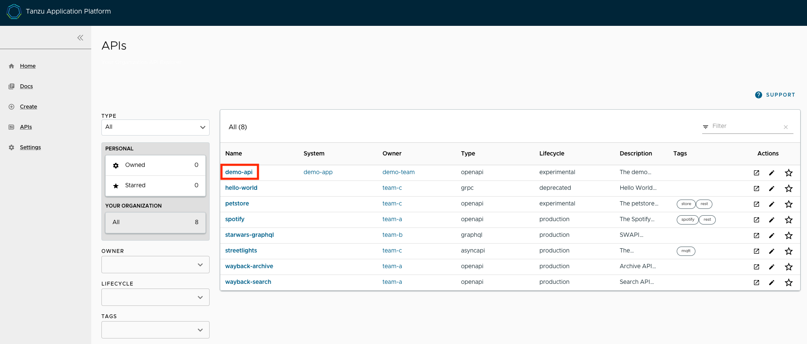
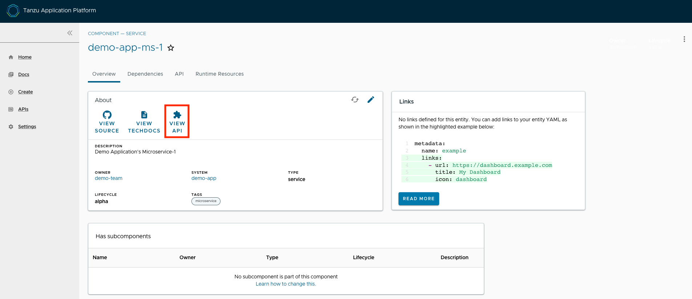
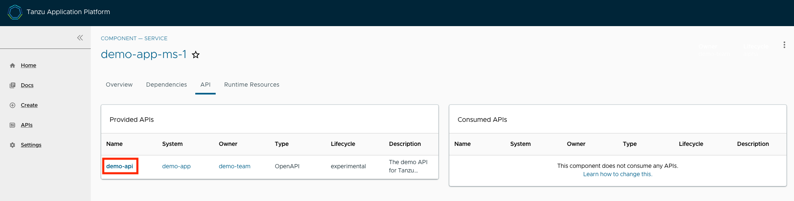
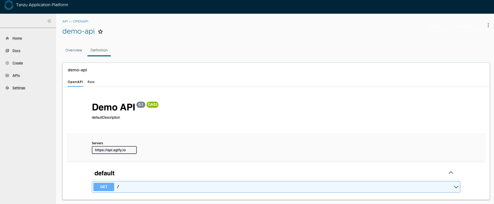
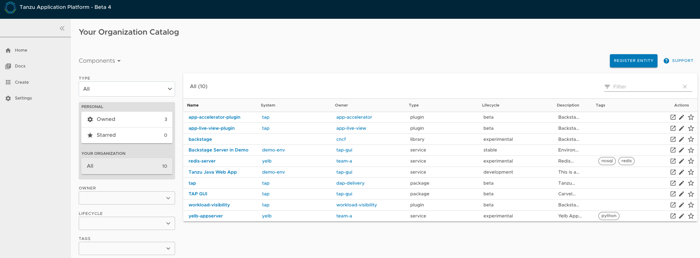
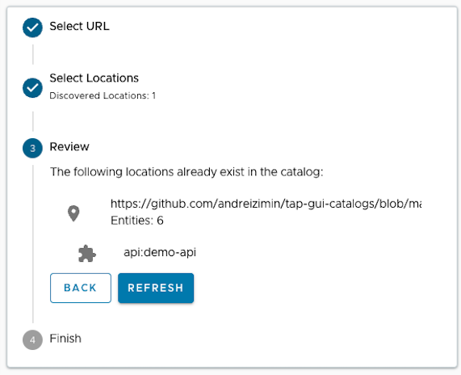

# API documentation plug-in in Tanzu Application Platform GUI

This section provides a general overview of the API documentation plug-in of the
Tanzu Application Platform GUI.
For more information, see [Getting started with API documentation plug-in](api-docs-getting-started.html).


## <a id="overview"></a> Overview

The API documentation plug-in provides a standalone list of APIs that can be connected to
components and systems of the Tanzu Application Platform GUI software catalog.

Each API entity can reflect the components that provide that API and the list of components
that are consumers of that API.
Also, an API entity can be associated to systems and show up on the system diagram.
To show such dependency, make the `spec.providesApis:` and `spec.consumesApis:` sections of the
component definition files reference the name of the API entity.

Here's a sample of how you can add `providesApis` and `consumesApis` to an existing component's
catalog definition, linking them together.

```yaml
apiVersion: backstage.io/v1alpha1
kind: Component
metadata:
  name: example-component
  description: Example Component
spec:
  type: service
  lifecycle: experimental
  owner: team-a
  system: example-system
  providesApis: # list of APIs provided by the Component
    - example-api-1
  consumesApis: # list of APIs consumed by the Component
    - example-api-2
```

For more information about the structure of the definition file for an API entity, see the
[Backstage Kind: API documentation](https://backstage.io/docs/features/software-catalog/descriptor-format#kind-api).
For more information about the API documentation plug-in, see the
[Backstage API documentation](https://github.com/backstage/backstage/blob/master/plugins/api-docs/README.md)
in GitHub.


## <a id='use-api-docs-plug-in'></a> Use the API documentation plug-in

The API documentation plug-in is part of Tanzu Application Platform GUI.

The first way to use the API documentation plug-in is API-first.
Click **APIs** in the left-hand navigation sidebar of Tanzu Application Platform GUI.
This opens the **API catalog page**.



On that page, you can view all the APIs already registered in the catalog regardless of whether they
are associated with components or systems.

The second way to use the API documentation plug-in is by using components and systems of the
software catalog, listed on the home page of Tanzu Application Platform GUI.
If there is an API entity associated with the selected component or system, the **VIEW API** icon
is active.



The **VIEW API** tab displays which APIs are being consumed by a component and which APIs are
being provided by the component.



Clicking on the API itself takes you to the catalog entry for the API, which the Kind
type listed in the upper-left corner denotes.
Every API entity has a title and short description, including a reference to the team that owns the
definition of that API and the software catalog objects that are connected to it.


By choosing the **Definition** tab on the top of the API page, you can see the definition of that
API in human-readable and machine-readable format.



The API documentation plug-in supports the following API formats:

- OpenAPI 2 & 3
- AsyncAPI
- GraphQL
- Plain (to support any other format)


## <a id='create-project'></a> Create a new API entry

To create a new API entity, you must follow the same steps as if you were registering any other
software catalog entity:

1. Click the **Home** icon located on the left-side navigation bar to access the home page of Tanzu Application Platform GUI.

1. Click **REGISTER ENTITY**.

    

1. **Register an existing component** prompts you to type a repository URL.
Paste the link to the `catalog-info.yaml` file of your choice that contains the definition of your
API entity.
For example, you can copy the following YAML content and save it as `catalog-info.yaml` on a Git
repository of your choice.

    ```yaml
    apiVersion: backstage.io/v1alpha1
    kind: API
    metadata:
      name: demo-api
      description: The demo API for Tanzu Application Platform GUI
      links:
        - url: https://api.agify.io
          title: API Definition
          icon: docs
    spec:
      type: openapi
      lifecycle: experimental
      owner: demo-team
      system: demo-app # Or specify system name of your choice
      definition: |
        openapi: 3.0.1
        info:
          title: defaultTitle
          description: defaultDescription
          version: '0.1'
        servers:
          - url: https://api.agify.io
        paths:
          /:
            get:
              description: Auto generated using Swagger Inspector
              parameters:
                - name: name
                  in: query
                  schema:
                    type: string
                  example: type_any_name
              responses:
                '200':
                  description: Auto generated using Swagger Inspector
                  content:
                    application/json; charset=utf-8:
                      schema:
                        type: string
                      examples: {}        
    ```

1. Click **ANALYZE** and then review the catalog entities to be added.

    

1. Click **IMPORT**.

1. Click **APIs** on the left-hand side navigation panel to view entries on the **API** page.
