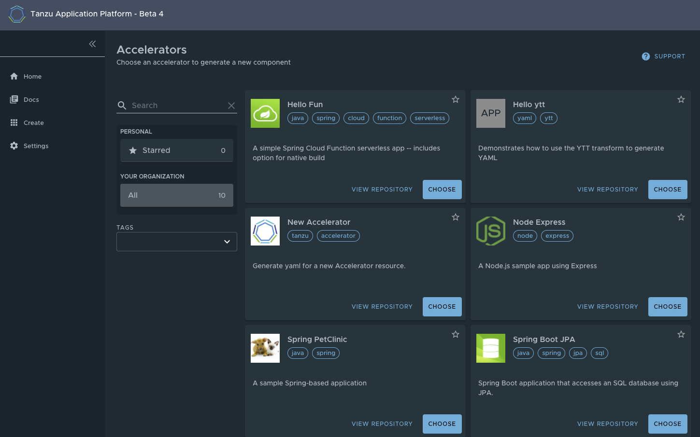

# API Documentation plugin in Tanzu Application Platform GUI

## <a id="overview"></a> Overview

The API Documentation plugin provides a standalone list of APIs that can be connected to Components and Systems of Tanzu Application Platform GUI's Software Catalog. Each API entity can reflect the Components that provide that API, as well as the list of Components that are consumers of that API. Also, an API entity can be associated to Systems and show up on the System's diagram. To show such dependency, `spec.providesApis:` and `spec.consumesApis:` sections of the Component definition files should reference the name of the API entity.

Here's a sample of how `providesApis` and `consumesApis` can be added to an existing Component's catalog definition, linking them together.
```yaml
apiVersion: backstage.io/v1alpha1
kind: Component
metadata:
  name: example-component
  description: Example Component
spec:
  type: service
  lifecycle: experimental
  owner: team-a
  system: example-system
  providesApis: # list of APIs provided by the Component
    - example-api-1
  consumesApis: # list of APIs consumed by the Component
    - example-api-2
```

For more information on the structure of the definition file for an API entity, please refer to [Backstage Kind: API](https://backstage.io/docs/features/software-catalog/descriptor-format#kind-api). For more information on the API Documentation plugin, please refer to [Backstage API Documentation](https://github.com/backstage/backstage/blob/master/plugins/api-docs/README.md).

## <a id='utilizing'></a>Utilizing the API Documentation plugin

The API Documentation plugin is part of Tanzu Application Platform GUI. 

The first way to use the API Documentation plugin is API-first. Click **APIs** in the left-hand navigation sidebar of Tanzu Application Platform GUI. This opens the **API catalog page**.



On that page, you can view all the APIs already registered in the catalog regardless if they are associated with Components or Systems. 

The second way to utilize the API Documentation plugin is through Components and Systems of the Software Catalog, listed on the Home page of Tanzu Application Platform GUI. If there is an API entity associated with the selected Component or System, the **VIEW API** icon shall be active.


The **VIEW API** tab demonstrates which APIs are being consumed by a Component and which APIs are being provided by the Component.


Clicking on the API itself takes you to the Catalog entry for the API (denoted by the Kind type listed in the upper-left corner). Every API entity has a title and short description, including reference to the team that owns the definition of that API and the Software Catalog objects that are connected to it.


By choosing the **Definition** tab on the top of the API page, you can see the definition of that API in human-readable and machine-readable format.


The API Documentation plugin supports the following API formats
* OpenAPI 2 & 3
* AsyncAPI
* GraphQL
* Plain (to support any other format)

## <a id='create-project'></a>Creating a new API entry

To create a new API entity, you must follow the same steps as if you were registering any other Software Catalog entity.

1. Navigate to the home page of Tanzu Application Platform GUI by clicking on the **Home** icon, located on the left-side navigation bar. Click **REGISTER ENTITY**.

    

2. **Register an existing component** prompts you to type a repository URL. Paste the link to the `catalog-info.yaml` file of your choice that contains the defintion of your API entity. For example, you can copy the text below and save it as `catalog-info.yaml` on a Git repository of your choice.

    ```
    apiVersion: backstage.io/v1alpha1
    kind: API
    metadata:
        name: demo-api
        description: The demo API entity
    tags:
        - demo
        - rest
    links:
        - url: https://github.com/swagger-api/swagger-petstore
        title: Documentation
    spec:
        type: openapi
        lifecycle: experimental
        owner: team-a
        system: demo-app
    definition: |
        TO BE ADDED
    ```


3. Click **ANALYZE**, review the catalog entities to be added and click **IMPORT**.

    

4. Navigate to the API page by clicking the **APIs** button on the left-hand side navigation panel. The catalog changes and entries are visible for further inspection.

---

## <a id="dev-first-app"></a>Add your API entry to the Tanzu Application Platform GUI Software Catalog

In this section, you are going to:

  - Learn about API entities of the Software Catalog
  - Add a demo API entity to Tanzu Application Platform GUI Software Catalog
  - Update your demo API entry

### <a id="about-app-accs"></a>About API entities

The list of API entities is visible on the left-hand side navigation panel of Tanzu Application Platform GUI and on the overview page of specific components on the Home page. APIs are a definition of the interface between components. Their definition is provided in machine-readable ("raw")  and human-readable formats. For more details, see [API plugin documentation](#TO-BE-ADDED).


### <a id="deploy-your-app"></a>Add a demo API entity to Tanzu Application Platform GUI Software Catalog

To add a demo API entity, you must follow the same steps as if you were registering any other Software Catalog entity.

1. Navigate to the home page of Tanzu Application Platform GUI and click **Home**, located on the left-side navigation bar.
   Click **REGISTER ENTITY**.

    

2. **Register an existing component** prompts you to type a repository URL.
Type the link to the `catalog-info.yaml` file of your choice or use demo link here:
`DEMO LINK TO BE ADDED`.

1. Click **ANALYZE**.

    

2. Review the catalog entities to be added and click **IMPORT**.

    

3. Navigate to the API page by clicking the **APIs** button on the left-hand side navigation panel. The catalog changes and entries are visible for further inspection.

### <a id="deploy-your-app"></a>Update your demo API entry

1. To update your demo API entity, select it from the list of available APIs in your Software Catalog and press the Edit icon. 

    

That would open the source `catalog-info.yaml` file that you can edit. 

2. After your edits have been made, Tanzu Application Platform GUI shall re-render the API entry with the next refresh cycle.