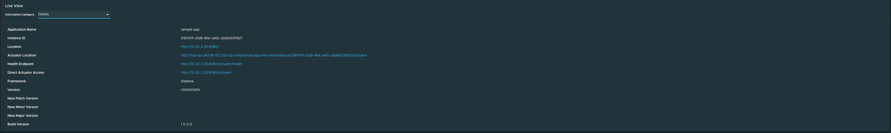
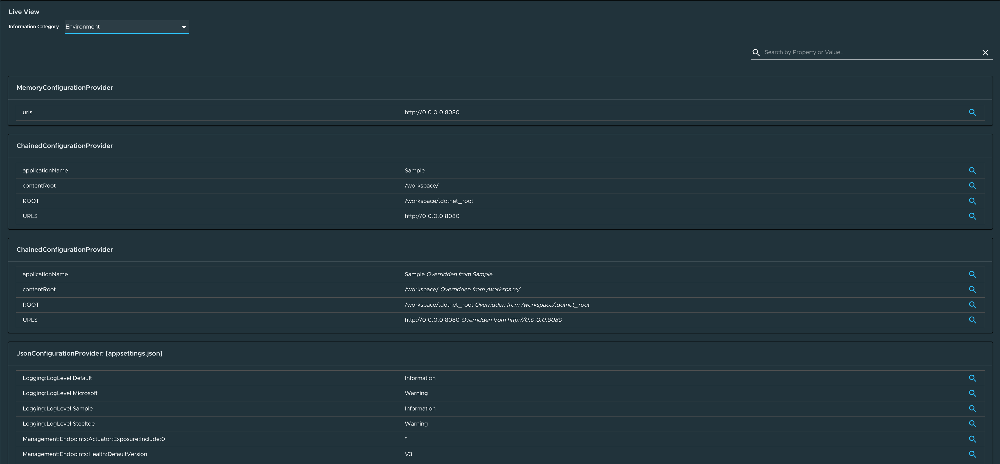
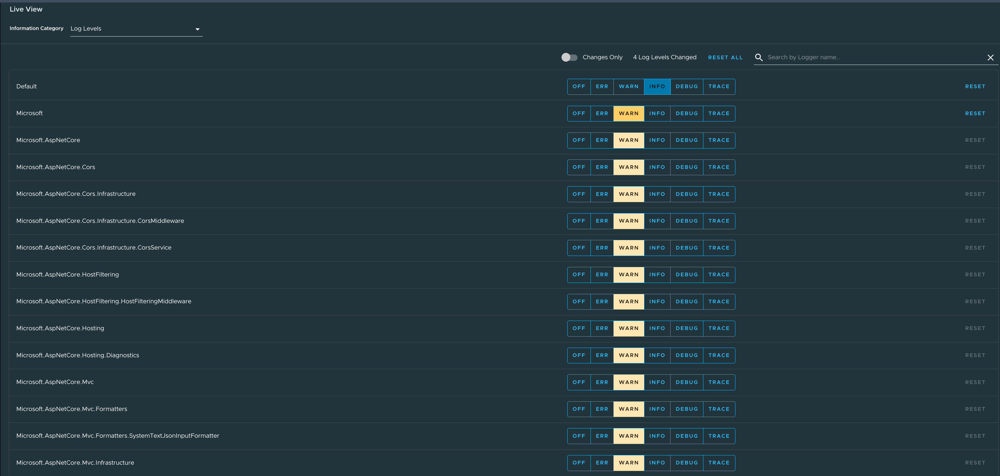
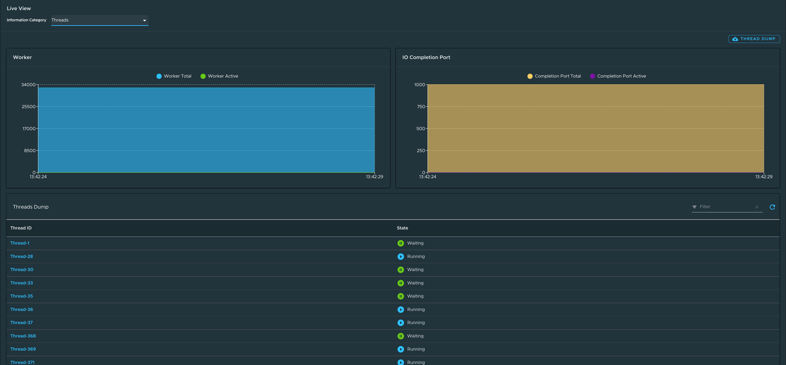
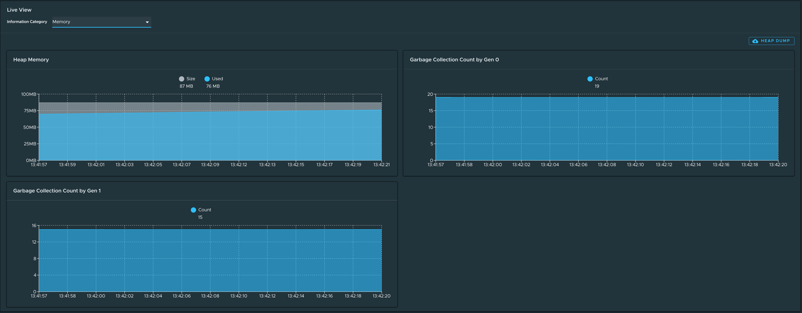
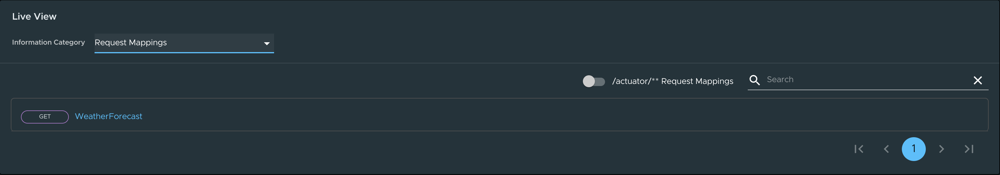
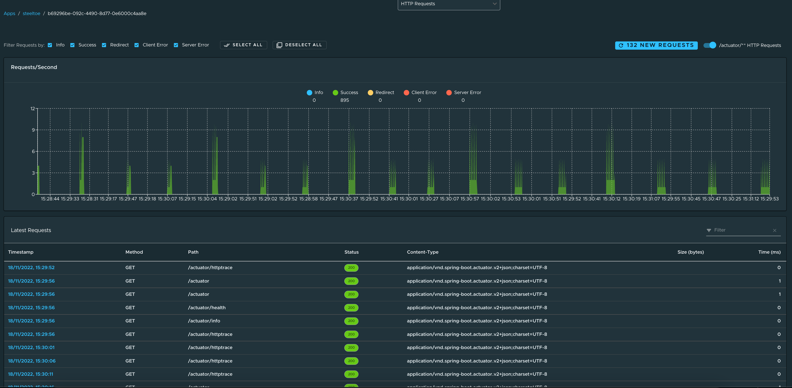
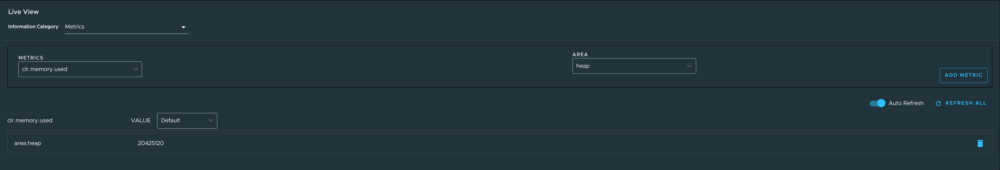
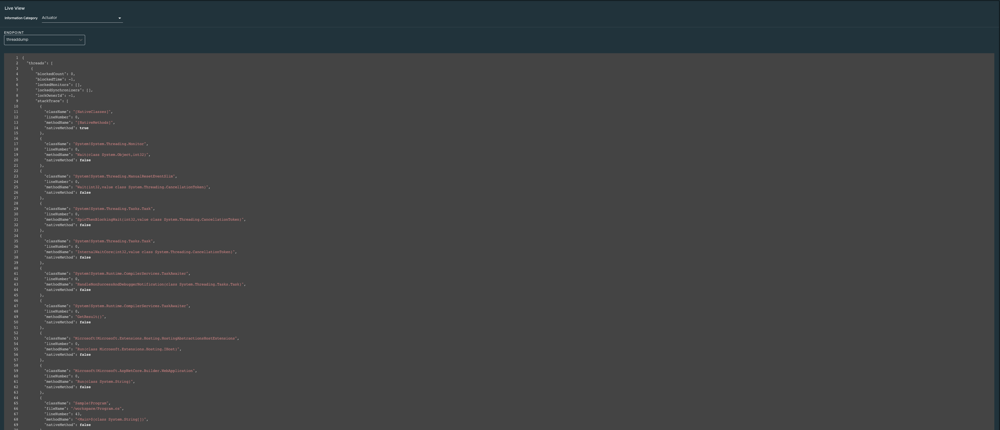

# Application Live View for Steeltoe applications in Tanzu Application Platform GUI

This topic tells you about the Application Live View pages for Steeltoe applications in
Tanzu Application Platform GUI (commonly called TAP GUI).

##  Details page

This is the default page loaded in the **Live View** section.
This page gives a tabular overview containing the following information:

- Application name
- Instance ID
- Location
- Actuator location
- Health endpoint
- Direct actuator access
- Framework
- Version
- New patch version
- New major version
- Build version

You can navigate between **Information Categories** by selecting from the drop-down menu on the
top right corner of the page.

##  Health page

To access the health page, select the **Health** option from the **Information Category** drop-down
menu.

The health page provides detailed information about the health of the application.
It lists all the components that make up the health of the application, such as readiness, liveness,
and disk space.
It displays the status and details associated with each of the components.

##  Environment page

To access the **Environment** page, select the **Environment** option from the
**Information Category** drop-down menu.

The Environment page contains details of the applications' environment.
It contains properties including, but not limited to, system properties, environment variables, and
configuration properties (such as appsettings.json) in a Steeltoe application.

The page includes the following capabilities for `viewing` configured environment properties:

- The UI has a search feature that enables the user to search for a property or values.
- Each property has a search icon at the right corner which helps the user quickly see all the
  occurrences of a specific property key without manually typing in the search box.
  Clicking the search button locates the property name.
- The **Refresh Scope** button on the top right corner of the page probes the application to refresh
  all the environment properties.

The page also includes the following capabilities for `editing` configured environment properties:

- The UI allows the user to edit environment properties and see the live changes in the application.
  These edits are temporary and go away if the underlying pod is restarted.
- For each of the configured environment properties, the user can edit its value by clicking on the
  **Override** button in the same row.
  After the value is saved, the user can view the message that the property was overridden from the
  initial value. Also, the updated property is visible in the **Applied Overrides** section at the
  top of the page.
  The **Reset** button in the same row resets the environment property to the initial state.
- The user can also edit or remove the overridden environment variables in the **Applied Overrides**
  section.
- The **Applied Overrides** section also enables the user to add new environment properties to the
  application.

> **Note** The `management.endpoint.env.post.enabled=true` must be set in the application config
> properties of the application, and a corresponding editable environment must be present in the
> application.

##  Log Levels page

To go to the **Log Levels** page, select the **Log Levels** option from the **Information Category**
drop-down menu.
The **Log Levels** page provides access to the application’s loggers and the configuration of the
levels.

You can:

- Configure log levels, such as **INFO**, **DEBUG**, and **TRACE**, in real time from the UI
- Search for a package and edit its respective log level
- Configure the log levels at a specific class and package
- Deactivate all the log levels by changing the log level of root logger to **OFF**

Use the **Changes Only** toggle to display the changed log levels.
Use the search feature to search by logger name.
Click **Reset All** to reset all the loggers to the default state.

> **Note** The UI allows the user to change the log levels and see the live changes on the application.
> These changes are temporary and go away if the underlying pod is restarted.

##  Threads page

To access the **Threads** page, select the **Threads** option from the **Information Category**
drop-down menu.

This page displays all details related to CLR threads and running processes of the application.
This tracks worker threads and completion port threads in real time.
Navigating to a thread state displays all the information about a particular thread and its stack
trace.

- The refresh icon refreshes to the latest state of the threads.
- To view more thread details, click the thread ID.
- The page has a feature to download the thread dump for analysis.
- The page has a feature to view the CPU stats for a Steeltoe application.

##  Memory page

To access the **Memory** page, select the **Memory** option from the **Information Category**
drop-down menu.

This page displays all details related to used and committed memory of the application.
This also displays the garbage collection count by generation (gen0/gen1).
The page also has a feature to download the heap dump for analysis.
The page also has a feature to view the CPU stats for a Steeltoe application

##  Request Mappings page

To access the **Request Mappings** page, select the **Request Mappings** option from the
**Information Category** drop-down menu.

This page provides information about the application’s request mappings.
For each mapping, the page displays the request handler method.
The user can view more details of the request mapping, such as the header metadata of the application.

When a user clicks on the request mapping, a side panel appears.
This panel contains information about the mapping-media types `Produces` and `Consumes`.
The panel also displays the `Handler` class for the request.
The search feature enables the user to search for the request mapping or the method.
The toggle **/actuator/\*\* Request Mappings** displays the actuator-related mappings of the
application.

##  HTTP Requests page

To access the **HTTP Requests** page, select the **HTTP Requests** option from the
**Information Category** drop-down menu.

The **HTTP Requests** page provides information about HTTP request-response exchanges to the
application.

The graph visualizes the requests per second, which indicates the response status of all the requests.
The user can filter by the response statuses, which include **info**, **success**, **redirects**,
**client-errors**, and **server-errors**.
The trace data is captured in detail in a tabular format with metrics, such as **timestamp**,
**method**, **path**, **status**, **content-type**, **length**, and **time**.

The search feature on the table filters the traces based on the search text box value.
By clicking on the timestamp, the user can view more details of the request, such as method, headers,
and the response of the application.

The refresh icon above the graph loads the latest traces of the application.
The toggle **/actuator/\*\*** on the top-right corner of the page displays the actuator-related
traces of the application.

##  Metrics page

To access the **Metrics** page, select the **Metrics** option from the **Information Category**
drop-down menu.

The metrics page provides access to application metrics information.
You can choose from the list of various metrics available for the application, such as
`clr.memory.used`, `System.Runtime.gc-committed`, `clr.threadpool.active`, and so on.

After you choose the metric, you can view the associated tags.
You can choose the value of each of the tags based on filtering criteria.
Click **Add Metric** to add the metric to the page. The page is refreshed every 5 seconds by default.

The UI on the **Metrics** page includes features that enable you to:

- Pause the auto refresh feature by deactivating the **Auto Refresh** toggle.
- Refresh the metrics manually by clicking **Refresh All**.
- Change the format of the metric value according to your needs.
- Delete a particular metric by clicking the minus-sign button in the relevant row.

##  Actuator page

To access the **Actuator** page, select the **Actuator** option from the **Information Category**
drop-down menu.
The actuator page provides a tree view of the actuator data.
You can choose from a list of actuator endpoints and parse through the raw actuator data.

##  Troubleshooting

You might run into cases where a workload running on your cluster does not show up in the
Application Live View overview, or the Details pages do not load any information while running, or
other similar issues.
For help with troubleshooting common issues, see [Troubleshooting](../../app-live-view/troubleshooting.hbs.md).