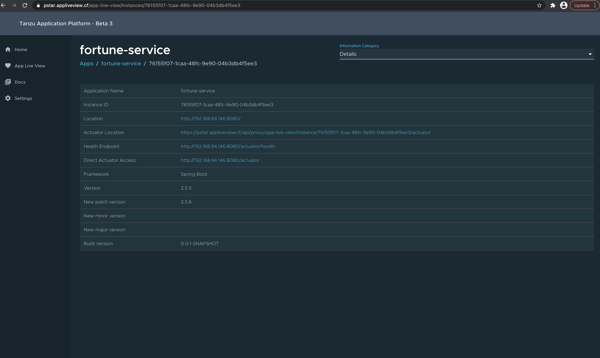
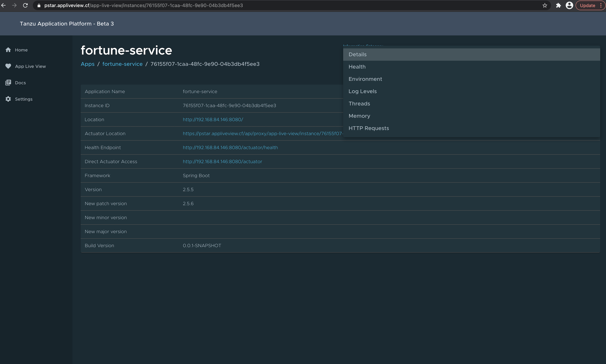
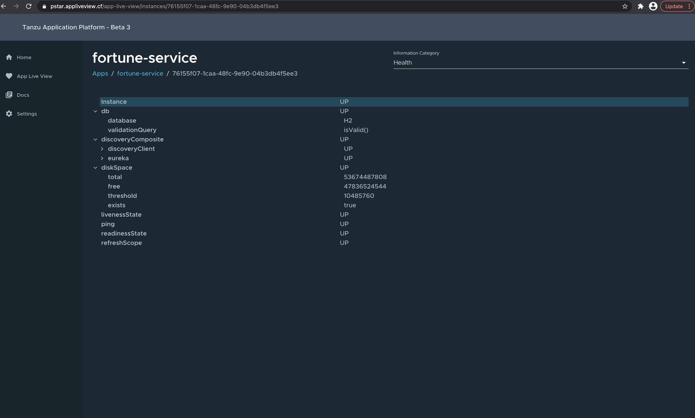
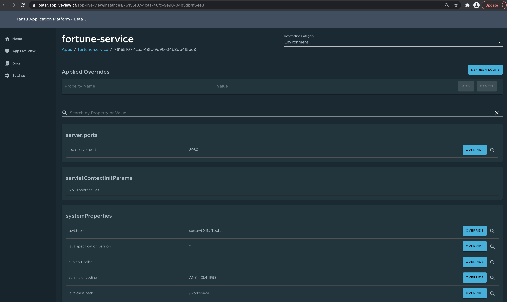
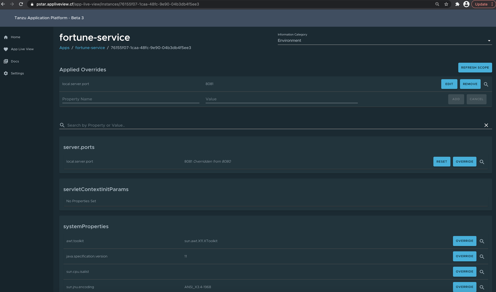
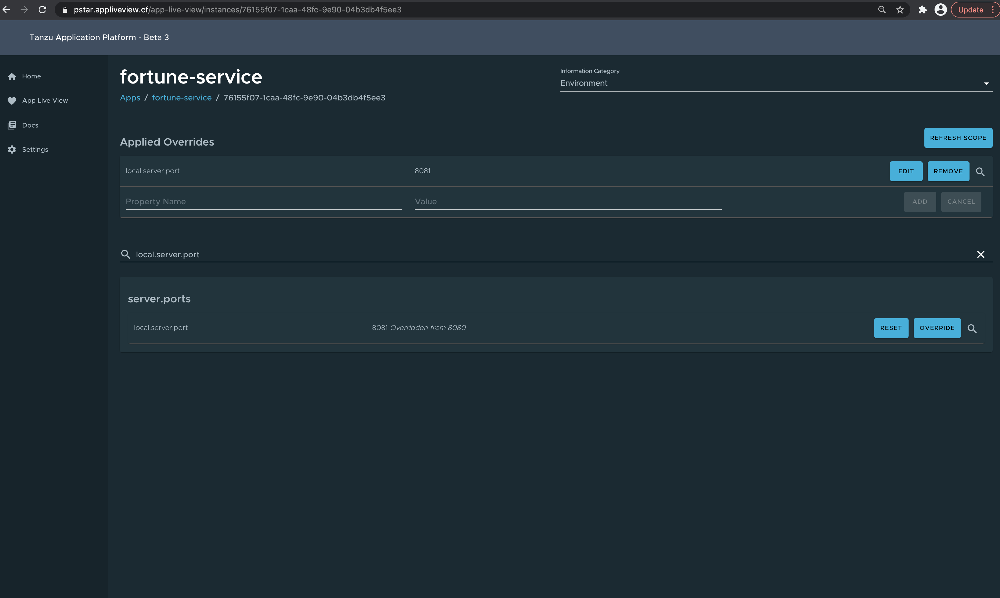
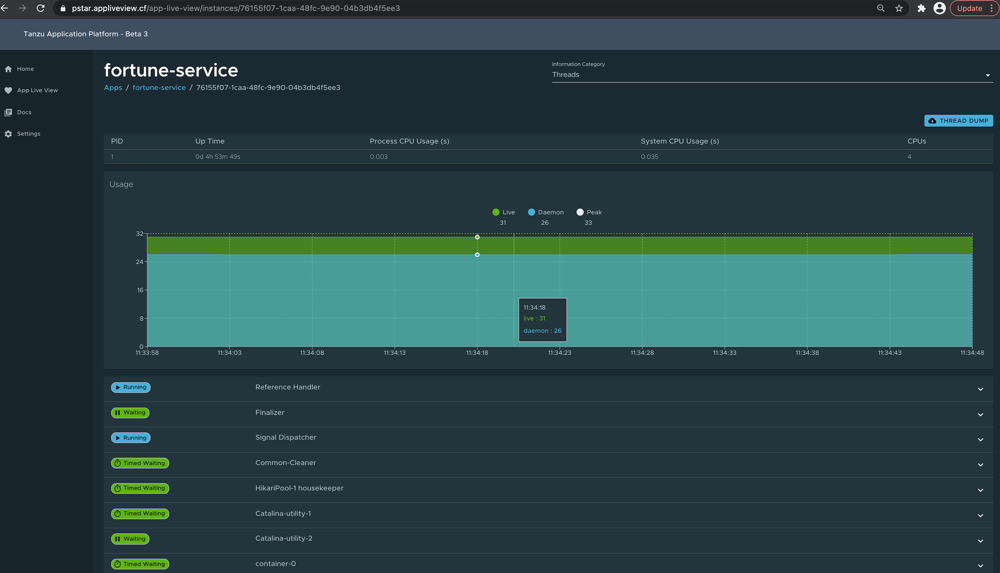
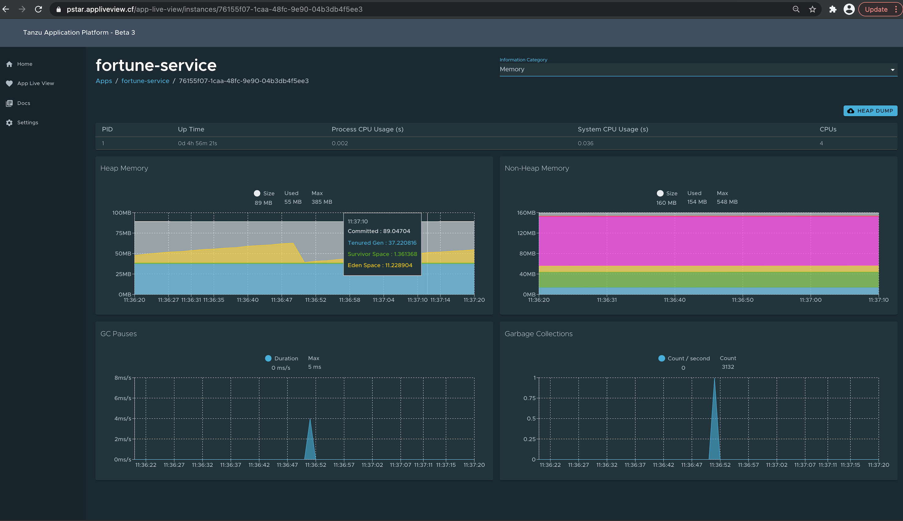
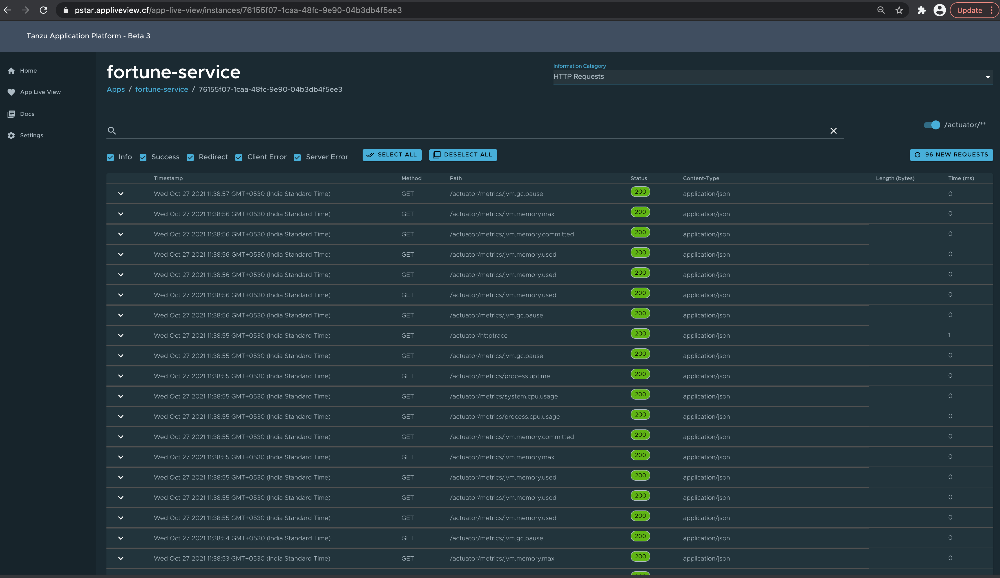

# Application Live View in Tanzu Application Platform GUI

## What is Application Live View?

The Application Live View features of the Tanzu Application Platform include sophisticated components to give developers and operators a view into their running workloads on Kubernetes.

Application Live View will show an individual running process, for example a Spring Boot application deployed as a workload resulting in a JVM process running inside of a pod.
This is an important concept of Application Live View: only running processes are recognized by Application Live View.
If there is not a running process inside of a running pod, Application Live View does not show anything.

Under the hood, Application Live View uses the concept of Spring Boot Actuators to gather data from those running processes.
It visualizes them in a semantically meaningful way and allows users to interact with the inner workings of the running processes (within limited boundaries).

The actuator data serves as the source of truth. Application Live View provides a live view of the data from inside of the running processes only.
Application Live View does not store any of that data for further analysis or historical views.
This easy-to-use interface provides ways to troubleshoot, learn, and maintain an overview of certain aspects of the running processes.
It gives a level of control to the users to change some parameters, such as environment properties, without a restart (where the Spring Boot application, for example, supports that).

## Landing Page and Instance List Page (the temporary entry point in Tanzu Application Platform Beta 3)

The temporary main page of App Live View in Tanzu Application Platform GUI, and the following list of individual instances (when you click on the application entries on the first page),
gives you an overview of all running processes recognized by the underlying Application Live View infrastructure.

__IMPORTANT: The landing and instance list page, as well as the overall visual appearance, is a temporary experience at the moment. The entry points, as well as many of the visuals, are not yet aligned and/or embedded into the main Tanzu Application Platform GUI experience. This is will change in future versions. Therefore, some details on the overview pages and where they appear (like name of the application, number of instances, framework, version, build version and health alerts, and so on) will likely change as well in future versions.__

## Connected instances (on the level of a process running inside of a pods)

Once you arrive on an individually running process (like a Spring Boot application that you are running inside of a pod on your cluster), you will be able to see all the details, do some lightweight troubleshooting and interact with the application in certain boundaries.

### Details Page

This is the default page loaded when the user clicks on any of the instances in the Instance List page. This page gives a tabular overview containing the application name, instance id, location, actuator location, health endpoint, direct actuator access, framework , version, new patch version, new major version, build version. The user can navigate between Information Categories by selecting from the drop down on the top right corner of the page.

### Health Page

To navigate to the health page, the user should select the Health option from the Information Category dropdown.
The health page provides detailed information about the health of the application.
It lists all the components that make up the health of the application like readiness, liveness and disk space.
It displays the status, details associated with each of the components. 

### Environment Page

To navigate to the Environment page, the user should select the Environment option from the Information Category dropdown.
The Environment page contains details of the applications' environment.
It contains properties including, but not limited to, system properties, environment variables, and configuration properties (like application.properties) in a Spring Boot application.
  
The page includes the below features:
  
  * The UI has search feature that enables the user to search for a property or values
  * Each property has a search icon at the right corner which helps the user quickly see all the occurrences of a specific property key without manually typing in the search field. Clicking on this button trims down the page to that property name
  * The _Refresh Scope_ button on the top right corner of the page is used to probe the application to refresh all the environment properties
  * The user can modify existing property by clicking on the override button in the row and editing the value. Once the value is saved, the user can see the updated property in the Applied overrides section at the top of the page
  * The _Reset_ button is used to reset the environment property to the original state
  * The overridden environment variables in the _Applied Overrides_ section can be edited or removed
  * The _Applied Overrides_ section also enables the user to add new environment properties to the application

> **_NOTE:_** The `management.endpoint.env.post.enabled=true` has to be set in the application config properties of the application as well as a corresponding, editable Environment has to be present in the (here Spring Boot) application.

### Threads Page
    
To navigate to the Threads page, the user should select the Threads option from the Information Category dropdown.
This page displays all details related to JVM threads and running processes of the application.
This tracks live threads and daemon threads real-time. It is a snapshot of different thread states.
Navigating to a thread state displays all the information about a particular thread and its stack trace.
The page also has a feature to download thread dump for analysis purposes.

### Memory Page

To navigate to the Memory page, the user should select the Memory option from the Information Category dropdown.
* The memory page highlights the memory usage inside of the JVM. It displays a graphical representation of the different memory regions within heap and non-heap memory. Please note that this visualizes data from inside of the JVM (in case of Spring Boot apps running on a JVM) and therefore provides memory insights into the application in contrast to "outside" information on the k8s pod level.
* The real-time graphs displays a stacked overview of the different spaces in memory along with the total memory used and total memory size. The page contains graphs to display the GC pauses and GC events. The Heap Dump button on top right corner allows the user to download heap dump data.

_Please keep in mind that this graphical visualization happens in real-time and shows real-time data only. As mentioned at the top, the Application Live View features do not store any information. That means the graphs visualize the data over time only for as long as you stay on that page._

### HTTP Requests Page

To navigate to the HTTP Requests page, the user should select the HTTP Requests option from the Information Category dropdown.
The HTTP Requests page provides information about HTTP request-response exchanges to the application.
The graph visualizes the requests per second indicating the response status of all the requests.
The response statuses include info, success, redirects, client-errors, server-errors.
The search feature filters the traces based on the search field value.
The trace data is captured in detail in a tabular format with metrics such as timestamp, method, path, status, content-type, length, time. 
  
The refresh icon above the graph loads the latest traces of the application.
The toggle '/actuator/**' on the top right corner of the page displays the actuator related traces of the application.

## Troubleshoot

You might run into cases where a workload running on your cluster does not show up in the Application Live View overview, the detail pages do not load any information from the running process, or similar issues.
Please refer to the troubleshooting section of the Application Live View documentation for details on how to solve these issues.
