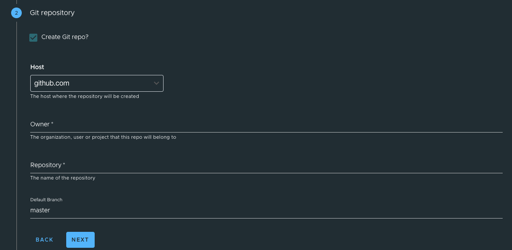
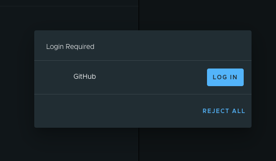
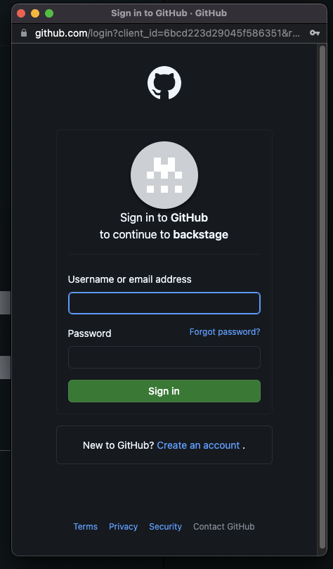
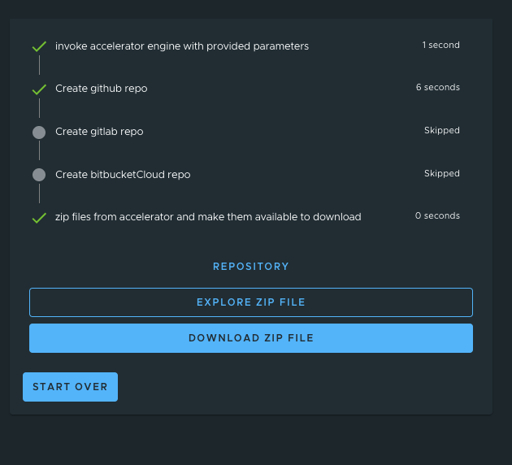

# Create an Application Accelerator Git repository during project creation

This topic tells you how to enable and use GitHub repository creation in the Application Accelerator
plug-in of Tanzu Application Platform GUI (commonly called TAP GUI).

## <a id="overview"></a> Overview

The Application Accelerator plug-in uses the Backstage GitHub provider integration and the
authentication mechanism to retrieve an access token. Then it can interact with the provider API to
create GitHub repositories.

## <a id="supported-providers"></a> Supported Providers

The supported Git providers are GitHub and GitLab.

## <a id="configuration"></a> Configure

The following steps describe an example configuration that uses GitHub:

1. Create an **OAuth App** in GitHub based on the configuration
   described in this [Backstage documentation](https://backstage.io/docs/auth/github/provider).
   GitHub Apps are not supported. For more information about creating an OAuth App in GitHub, see
   the [GitHub documentation](https://docs.github.com/en/developers/apps/building-oauth-apps/creating-an-oauth-app).

   These values appear in your `app-config.yaml` or `app-config.local.yaml` for local development.
   For example:

   ```yaml
   auth:
     environment: development
     providers:
       github:
         development:
           clientId: GITHUB-CLIENT-ID
           clientSecret: GITHUB-CLIENT-SECRET
   ```

2. Add a GitHub integration in your `app-config.yaml` configuration. For example:

   ```yaml
   app_config:
      integrations:
         github:
            - host: github.com
   ```

   For more information, see the
   [Backstage documentation](https://backstage.io/docs/integrations/github/locations).

### <a id="deactiv-git-repo-creation"></a> (Optional) Deactivate Git repository creation in the Application Accelerator extension for VS Code

From Tanzu Application Platform v1.4, the Application Accelerator extension for VS Code uses the
Tanzu Application Platform GUI URL to interact with the accelerator system.
There is a new plug-in called `gitProviders` that you can configure to deactivate Git repository
creation in the VS Code extension.

To deactivate Git repository creation, set `app_config.gitProviders.active` to `false` in
`tap-values.yaml` as shown in the following example:

```yaml
   app_config:
      gitProviders:
         active: false
```

## <a id="creating-project"></a> Create a Project

To create a project:

1. Go to Tanzu Application Platform GUI, access the Accelerators section, and then select an
   accelerator. The accelerator form now has a second step named **Git repository**.

2. Fill in the accelerator options and click **Next**.

3. Select the **Create Git repo?** check box.

4. Fill in the **Owner**, **Repository**, and **Default Branch** text boxes.

   

5. After entering the repository name, a dialog box appears that requests GitHub credentials.
   Log in and then click **Next**.

   

   

6. Click **GENERATE ACCELERATOR**. A link to the repository location appears.

   
