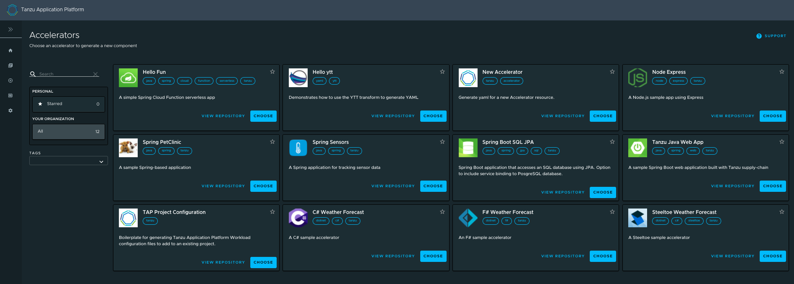
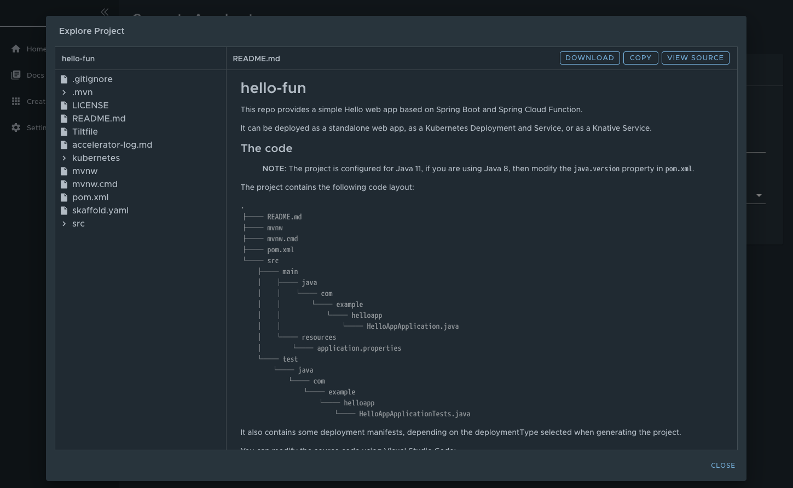
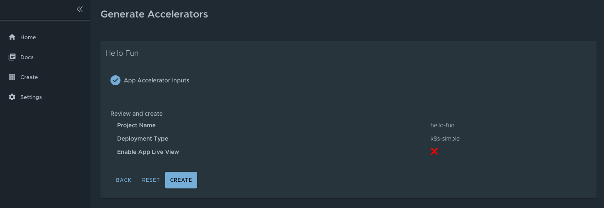

# Application Accelerator in Tanzu Application Platform GUI

This topic describes how to use Application Accelerator in Tanzu Application Platform GUI.

##  Overview

Application Accelerator for VMware Tanzu helps you bootstrap developing and deploying your
applications in a discoverable and repeatable way.

Enterprise architects author and publish accelerator projects that provide developers and operators
with ready-made, enterprise-conforming code and configurations.
You can then use Application Accelerator to create new projects based on those accelerator projects.

The Application Accelerator UI enables you to discover available accelerators, configure them, and
generate new projects to download.

## Access Application Accelerator

To open the Application Accelerator UI plug-in and select an accelerator:

1. Within Tanzu Application Platform, click **Create** in the left navigation pane to open the
   **Accelerators** page.

    

    Here you can view accelerators already registered with the system.
    Developers can add new accelerators by registering them with Kubernetes.

2. Every accelerator has a title and short description.
   Click **VIEW REPOSITORY** to view an accelerator definition. This opens the accelerator's Git
   repository in a new browser tab.

3. Search and filter based on text and tags associated with the accelerators to find the accelerator
   representing the project you want to create.

4. Click **CHOOSE** for the accelerator you want. This opens the **Generate Accelerators** page.

##  Configure project generation

To configure how projects are generated:

1. On the **Generate Accelerators** page, add any configuration values needed to generate the
   project. The application architect defined these values in `accelerator.yaml` in the accelerator
   definition.
   Filling some text boxes can cause other text boxes to appear. Fill them all in.

    

2. Click **EXPLORE** to open the **Explore Project** page and view the project before it is generated.

    

3. After configuring your project, click **NEXT STEP** to see the project summary page.

4. Review the values you specified for the configurable options.

5. Click **BACK** to make more changes, if necessary. Otherwise, proceed to [create the project](#create-project).

    

##  Create the project

To create the project:

1. Click **Create** to start generating your project. See the progress on the **Task Activity** page.
   A detailed log is displayed on the right.

    

2. After the project is generated, click **EXPLORE ZIP FILE** to open the **Explore Project** page
   to verify configuration.

3. Click **DOWNLOAD ZIP FILE** to download the project in a ZIP file.

## Develop your code

To develop your code:

1. Expand the ZIP file.
2. Open the project in your integrated development environment (IDE).

    

## Next steps

To learn more about Application Accelerator for VMware Tanzu, see the
[Application Accelerator documentation](../../application-accelerator/about-application-accelerator.md).
