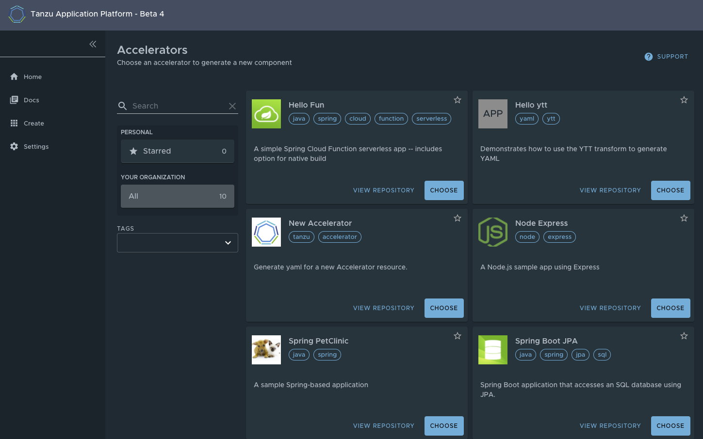

# Application Accelerator in Tanzu Application Platform GUI

## What is Application Accelerator?

Application Accelerator for VMware Tanzu is designed to help bootstrap the development of applications and their deployment in a discoverable and repeatable manner.

Enterprise Architects author and publish Accelerator projects that provide developers and operators with ready-made, enterprise-conformant, code and configurations.

Developers can then use Application Accelerator to create new projects based on those defined base Accelerator projects.

The user interface makes it easy for developers to discover available Accelerators, to provide configuration for them and then generate new projects that can be downloaded.

## Entry point to Application Accelerator

The Application Accelerator UI plug-in is part of the Tanzu Application Platform GUI. To access the Application Accelerator page,
click `Create` in the left hand navigation bar.

On this page you can browse the set of Accelerators that have been registered with the system.
New accelerators can be added by registering them with Kubernetes following these instructions.

Every Accelerator provides a title and short description and you can choose to browse the Accelerator definition directly by clicking `View Repository` which will open a new tab browsing the Git repository for it.

This main page provides the ability to search and filter based on text and tags associated with the Accelerators.

Once you have chosen the Accelerator representing the project you want to create, click `Choose`.

## Configuring project generation

On the `Generate Accelerators` page that appears you will need to supply any configuration options required for the project to be generated.
The Application Architect will have defined these in the `accelerator.yaml` in the Accelerator definition. Setting some options may
cause others to appear that also need to be specified. If there any errors on this page, for example missing option values for options
that are required, you will get an error indication in the UI.

Required fields are marked with a `*`.

At this stage it is possible to browse the project that would be generated if you proceed by pressing `Explore`. 

## Exploring a project during configuration

This is an example of choosing to `Explore` a project from the `Generate Accelerators` page.

Once happy with your configuration, click `Next Step` to see the project summary page, you are ready to create the project.

## Project summary

This page shows the values you have specified for the configurable options.

At this point you can return to customize options (click `Back`) or you can proceed with generation by clicking `Create`

## Creating the project

You will now see the system generate the project. The Task Activity page will show the steps being taken together with detailed logs on the right side.

Once complete you can `Explore Zip File` which is similar to the `Explore` option we could have done earlier, or you
can click `Download Zip File` to grab the project and download it as a .zip.

## Developer your code

Now the application is downloaded, expand the zip and open in your favourite IDE.

