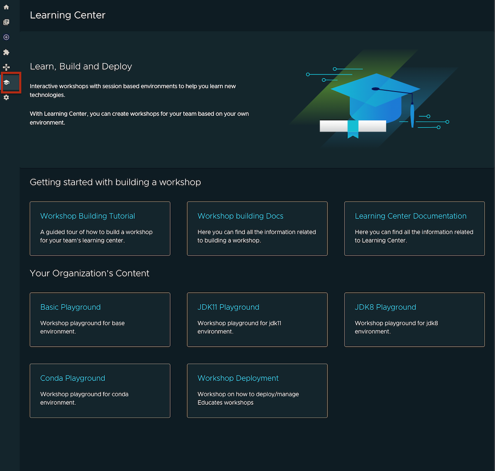
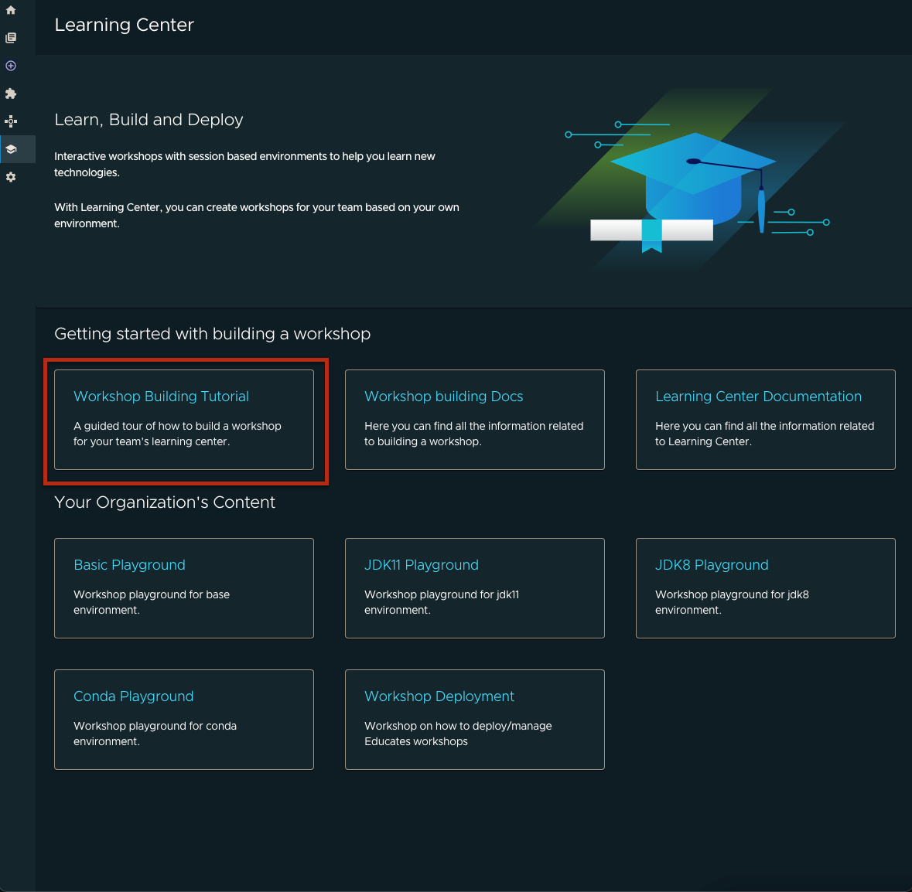
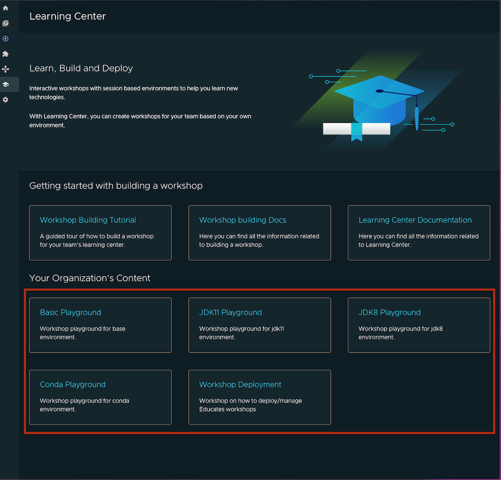

# Learning Center in Tanzu Application Platform GUI

The Learning Center plug-in in Tanzu Application Platform GUI allows you to view and access your workshops and your organization's workshops.
For more information about Learning Center, see [Learning Center for Tanzu Application Platform](../../learning-center/about.md).

## <a id="prerequisite"></a> Prerequisite

In order to access the Learning Center plug-in, you must first successfully install Tanzu Application Platform. For more information, see [Installing Tanzu Application Platform](../../install-intro.md). Tanzu Application Platform includes
Tanzu Application Platform GUI and Learning Center. This plug-in requires that both are deployed on the same Kubernetes cluster.

## <a id="enable-disable-plugin"></a> Enable/Disable the Learning Center plug-in

The Learning Center plug-in can be enabled or disabled by the Tanzu Application Platform GUI configuration, in the app-config.yaml file.

### <a id="enable-plugin"></a> Enable the Learning Center plug-in

Enable the Learning Center plug-in by setting the following in your app-config.yaml:

   ```yaml
    learningCenter:
        enablePlugin: true
   ```

If you enable the plug-in in your app-config.yaml file, be sure to yarn install to install appropriate dependencies. Some plug-ins are installed by default, so check the app-config.yaml file to see which plug-ins are enabled by the configuration.

### <a id="disable-plugin"></a> Disable the Learning Center plug-in

Disable the Learning Center plug-in by removing the learningCenter.enablePlugin configuration from the app-config.yaml file.

## <a id="view-app"></a> View your Learning Center workshops

To view your Learning Center workshops in Tanzu Application Platform GUI:

1. Ensure you have a running instance of the following:

    - [Learning Center Operator](../../learning-center/getting-started/learning-center-operator.md)
    - [Workshops](../../learning-center/getting-started/workshops.md)
    - [Learning Center TrainingPortal](../../learning-center/getting-started/training-portal.md). 
  
    These are required to see content on the plug-in's main page.

2. Ensure that the Learning Center plug-in is enabled by the configuration in the Tanzu Application Platform GUI app-config.yaml file.

3. Navigate to the Learning Center plug-in screen and select the Learning Center plug-in from the sidebar. You can view the list of running workshops with documentation links and additional resources.

    

## <a id="lc-get-started-section"></a> Get started building a workshop section

To open a guided tour workshop in a separate tab:

- Select the **Workshop Building Tutorial** card.

    

To view documentation on how to build a workshop:

- Select the **Workshop building Docs** card.

To view documentation on the Learning Center:

- Select the **Learning Center Documentation** card.

## <a id="lc-org-content-section"></a> Your Organization's Content section

Here you can view all deployed workshops from a specific [trainingportal](../../learning-center/getting-started/training-portal.md).


