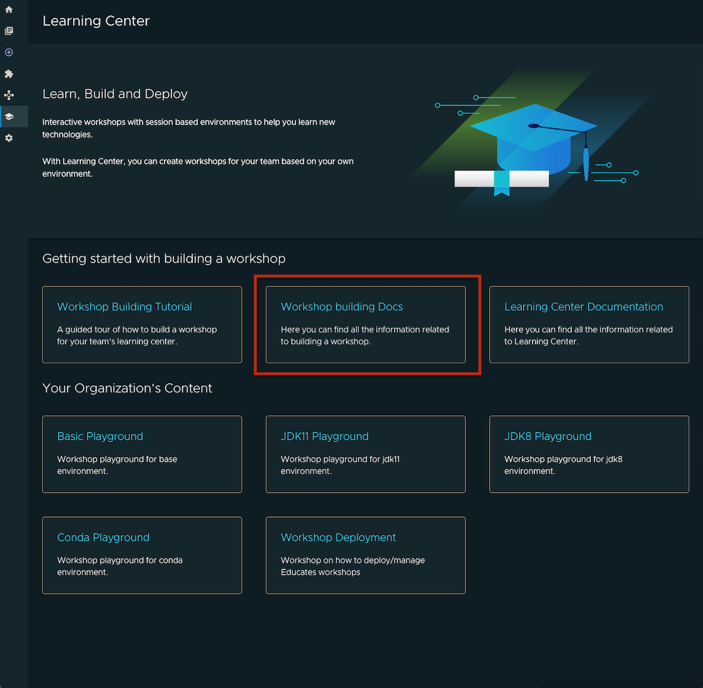

# Learning Center in Tanzu Application Platform GUI

This topic describes Learning Center in Tanzu Application Platform GUI.

## <a id="Introduction"></a> Introduction

The Learning Center plug-in part of Tanzu Application Platform GUI provides a platform for viewing and accessing both your own workshops and your organizations workshops. See [Learning Center](../../learning-center/about.md) to find out more.

<!-- It allows content creators to create workshops from markdown files that are displayed to the learner in a terminal shell environment with an instructional wizard UI. The UI can embed slide content, an integrated development environment (IDE), a web console for accessing the Kubernetes cluster, and other custom web applications.  -->

## <a id="prerequisite"></a> Prerequisite

In order to access the Learning Center plug-in, you must first have successfully
[installed Tanzu Application Platform](../../install-intro.md), which includes
Tanzu Application Platform GUI and Learning Center for Tanzu Application Platform. This plugin currently assumes both Tap-gui and Learning Center have been deployed on the same kubernetes cluster.

## <a id="Visualize-app"></a> Visualize Learning Center's icon on Tanzu Application Platform GUI sidebar

In order to view your Learning Center workshops on Tanzu Application Platform GUI, use the following steps:

1. Ensure you have a running instance of the [LearningCenter Operator](../../learning-center/getting-started/learning-center-operator.md), [Workshops](../../learning-center/getting-started/workshops.md), and [LearningCenter Training Portal](../../learning-center/getting-started/training-portal.md). These instances are required for you to see content on the plugins main page.
2. Enable the Learning Center plug-in by setting the following in your app-config.yaml:

   ```
    learningCenter:
        enablePlugin: true
   ```

Note\* If you set the enable plugin in your app-config ensure you yarn install to install appropriate dependencies.

## <a id="lc-plugin-screen"></a> Navigate to the **Learning Center Plugin** screen

You can view the list of running workshops along with documentation links and additional resources on the screen.

To view the list of your running workshops:

- Select the Learning Center Plugin from the sidebar.


## <a id="lc-getting-started-section"></a> Getting Started with building a workshop section

To open a guided tour workshop in a seperate tab:

- Select the Workshop Building Tutorial card.


To view documentation on how to build a workshop:

- Select the Workshop building Docs card.



To view documentation on the Learning Center:

- Select the Learning Center documentation card.

  

## <a id="lc-organization-content-section"></a> Your Organization's Content section

In this section we list all deployed workshops from a specific [trainingportal](../../learning-center/getting-started/training-portal.md).


