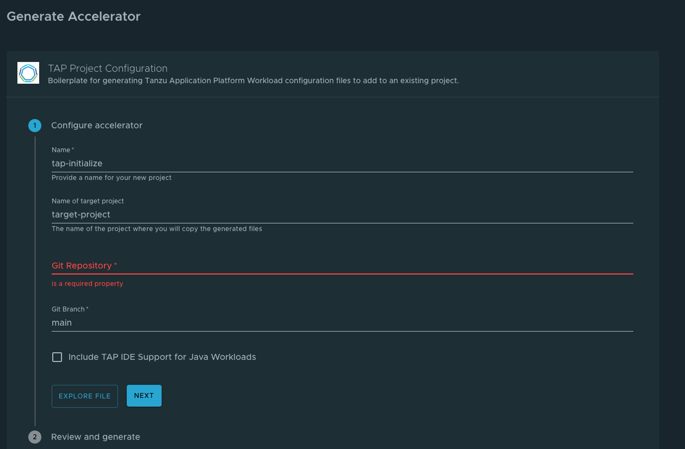
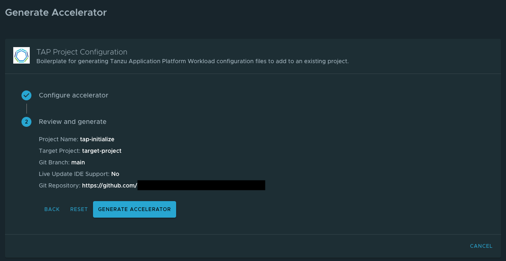
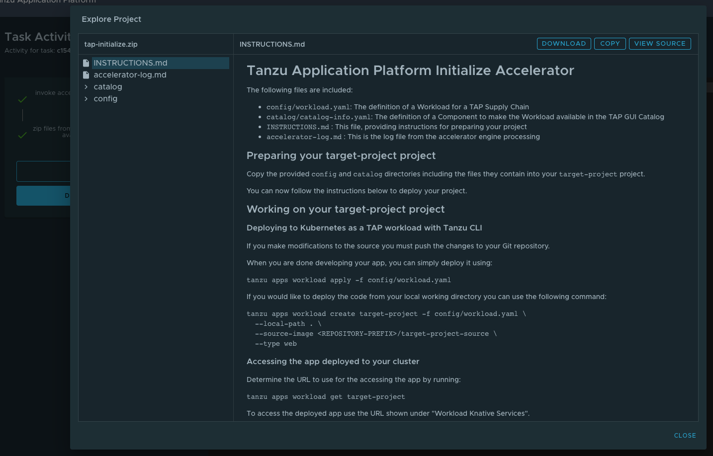

# Runtime resources visibility

The Runtime Resources tab shows developers the details and status of their component's Kubernetes resources to understand their structure and debug issues.


## <a id="prerequisites"></a> Prerequisites

To ensure your component and its resources are displayed, you need:

- A YAML file describing your component.
- All resources created for your application must have a label `'app.kubernetes.io/part-of'` with your application's name.

Developers must follow these instructions to see their resources on the dashboard:

1. Define a Backstage component with a `backstage.io/kubernetes-label-selector` annotation. See
   [Components](../catalog/catalog-operations.md#components) in the Catalog operations documentation.

   You can use a tool to create this file, or you can do it manually:

   - Use [Tanzu Developer Tools for Visual Studio Code](../../vscode-extension/about.md) to generate the component's YAML. For information about this file, see [catalog-info.yaml](../../vscode-extension/usage-getting-started.md#catalog-infoyaml).
   - Use [Tanzu Application Platform Initializer](https://github.com/sample-accelerators/tap-initialize/blob/main/README.md) in [Application Accelerator](application-accelerator.md) to generate the  `catalog-info.yaml` file. For additional instructions, see [Generate YAML files using Tanzu Application Platform Initializer](#gen-yaml-files-using-init).
   - Create the file using your preferred IDE. For example:

       ```
        apiVersion: backstage.io/v1alpha1
        kind: Component
        metadata:
          name: petclinic
          description: Spring PetClinic
          annotations:
            'backstage.io/kubernetes-label-selector': 'app.kubernetes.io/part-of=petclinic-server'
        spec:
          type: service
          lifecycle: demo
          owner: default-team
          system:
        ```

2. Commit and push the component definition created in the previous steps, to a Git repository registered as a catalog location. See [Adding
   catalog entities](../catalog/catalog-operations.md#adding-catalog-entities) in the Catalog operations documentation.
3. Create a Kubernetes resource with a label matching the component's selector in a cluster available to Tanzu Application Platform GUI. A resource is one of the following:

   - `v1/Service`
   - `apps/v1/Deployment`
   - `serving.knative.dev/v1/Service`

   You can create the YAML file with the workload's definition by using one of these options:

   - Use [Tanzu Developer Tools for Visual Studio Code](../../vscode-extension/about.md)to generate the workload's definition YAML. For information about this file, see [workload.yaml](../../vscode-extension/usage-getting-started.md#snippets-workload).
   - Use [Tanzu Application Platform Initializer](https://github.com/sample-accelerators/tap-initialize/blob/main/README.md) in [Application Accelerator](application-accelerator.md) to generate the  `workload.yaml` file. For additional instructions, see [Generate YAML files using Tanzu Application Platform Initializer](#gen-yaml-files-using-init).
   - Create the file manually with your preferred IDE. For example:

         ```
         $ cat <<EOF | kubectl apply -f -
         ---
         apiVersion: serving.knative.dev/v1
         kind: Service
         metadata:
           name: petclinic
           namespace: default
           labels:
             'app.kubernetes.io/part-of': petclinic-server
         spec:
           template:
             metadata:
               labels:
                 'app.kubernetes.io/part-of': petclinic-server
             spec:
               containers:
                 - image: springcommunity/spring-framework-petclinic
         EOF
         ```

## <a id="gen-yaml-files-using-init"></a> Generate YAML files using Tanzu Application Platform Initializer

Tanzu Application Platform Initializer is available in [Application Accelerator](application-accelerator.md). To learn more about the package, see the [README.md](https://github.com/sample-accelerators/tap-initialize/blob/main/README.md) in GitHub.

You can follow these steps to generate YAML files by using Tanzu Application Platform Initializer:

- Access the Tanzu Application Platform Project Configuration in the Accelerators page or access it directly through Tanzu Application Platform GUI by using `<TAP-GUI-URL>/create/templates/tap-initialize`.
- Enter the required information and click **Next**.
  
- Verify the parameters and click **Generate Accelerator**.
  
- After the process is complete, download the package (a zip file that includes the generated files), uncompress it and follow the instructions in the `INSTRUCTIONS.md` file.
  

## <a id="nav-rr-vis-screen"></a>Navigate to the Runtime Resources visibility screen

You can view the list of running resources and details about their status, type, namespace, cluster, and public URL if
applicable for the resource type.

To view the list of your running resources:

1. Select your component from the Catalog index page.

   

2. Select the **Runtime Resources** tab.

   

### <a id="view-resource-details"></a>View details for a specific resource

The Resources index table shows Deployments, Pods, ReplicaSets and Services that match the label indicated in the component's definition. You can see a hierarchical structure showing the owner-dependent relationship between the objects. Resources without an owner are listed in the table as independent elements.

For information about owners and dependents, see [Kubernetes documentation](https://kubernetes.io/docs/concepts/overview/working-with-objects/owners-dependents/).

Here is an example of the expanded index table showing one of the owner resources and its dependents.


## <a id="detail-pages"></a>Detail pages

The Runtime Resources visibility plug-in provides detail pages with the most relevant characteristics of many resources, including direct links to other ones.

These following sections explain the boxes included on all detail pages:

### <a id="overview-section"></a>Overview section

The overview section is the first card in every detail page. Most of the information in it comes from the `metadata` attribute in each object.
Some attributes displayed here include:

  1. **.YAML** button: When you click on the **.YAML** button, a side panel opens showing the current object's definition in YAML. You can copy the full content of the **.YAML** file by using the icon in the top-right corner of the side panel..
  2. Name
  3. Namespace
  4. Age or Creation date
  5. Cluster: The value displayed corresponds to the name used in the cluster's configuration.
  6. URL: URL is available for Knative services and Kubernetes services.


### <a id="status-section"></a>Status section

The status section displays all of the conditions in the resource's attribute `status.conditions`. Not all resources have conditions, and they can be different for each resource.

See [Concepts - Object Spec and Status](https://kubernetes.io/docs/concepts/_print/#object-spec-and-status) in the Kubernetes documentation.


### <a id="ownership-section"></a>Ownership section

Depending on the resource that you are viewing, the ownership section presents all the resources specified in the `metadata.ownerReferences`. You can use this section to navigate between resources.

See [Owners and Dependents](https://kubernetes.io/docs/concepts/overview/working-with-objects/owners-dependents/) in the Kubernetes documentation.


### <a id="annotations"></a>Annotations and Labels

The Annotations and Labels sections show information about `metadata.annotations` and `metadata.labels`.


## <a id="navigating-to-pods"></a>Navigating to Pods

You can navigate directly to the Pod's detail page from the Resources index table.


You can use the table listing Pods in each owner object's detail page. Columns can be different on each detail page.


## <a id="knative-service-details"></a>Knative service details page

To view details about your Knative services, select any resource that has the "Knative Service" type.
In this page, additional information is available for Knative resources, including:

- status
- an ownership hierarchy
- incoming routes
- revisions
- Pod details


## <a id="pod-details"></a>Pod details page

This page shows you most relevant information for a specific Pod including its containers and the [Application Live View](app-live-view.md) information.


