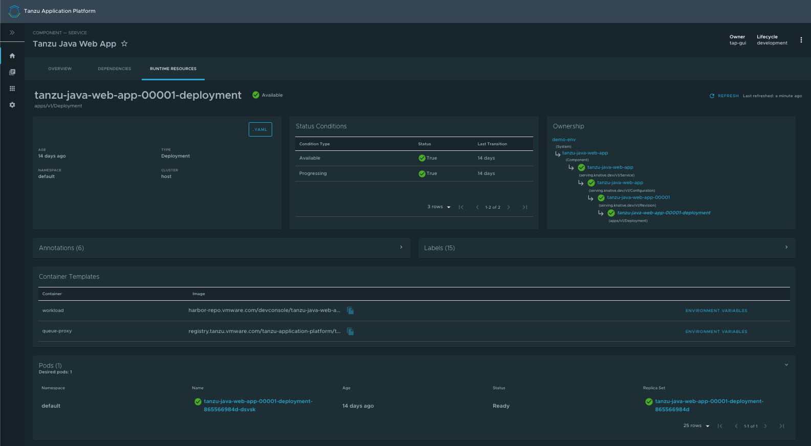
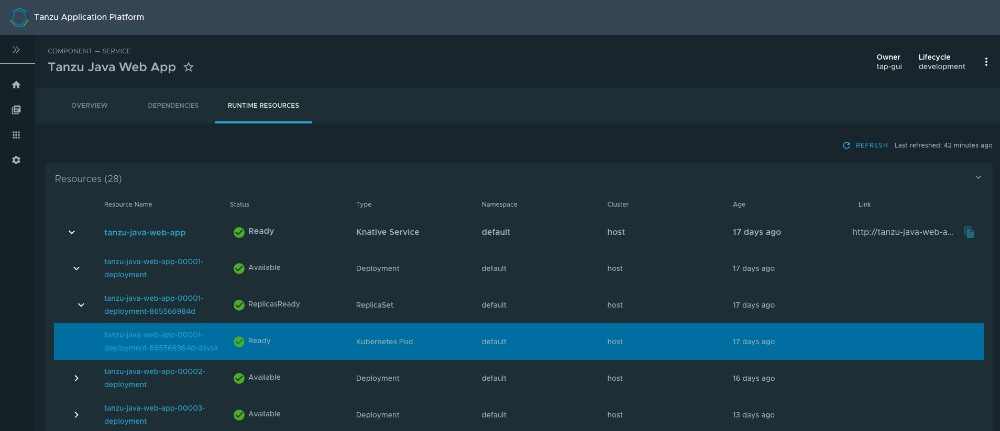

# Runtime resources visibility

##  Introduction
Runtime Resources Visibility plugin part of Tanzu Application Platform (TAP) GUI allows users to visualize their Kubernetes resources associated with their Workloads. 

##  Prerequisite

In order to access the Runtime Resources Visibility plugin, you must first have successfully [installed TAP](https://docs.vmware.com/en/Tanzu-Application-Platform/1.0/tap/GUID-install-intro.html) which includes TAP GUI.

##  Visualize Workloads on the Tanzu Application Paltform GUI

In order to view your applications on the TAP GUI, you need to follow the steps below:
1. [Develop your application on the Tanzu Application Platform via Application Accelerators](https://docs.vmware.com/en/Tanzu-Application-Platform/1.0/tap/GUID-getting-started.html#section-1-develop-your-first-application-on-the-tanzu-application-platform-2) 
2. [Add your application to Tanzu Application Platform GUI Software Catalog](https://docs.vmware.com/en/Tanzu-Application-Platform/1.0/tap/GUID-getting-started.html#add-your-application-to-tanzu-application-platform-gui-software-catalog-5)

## Navigate to the Runtime Resources visibility screen

You can view the list of running resources and the details of their status, type, namespace, cluster, and public URL if
applicable for the resource type.

To view the list of your running resources:

1. Select your component from the Catalog index page.

   

2. Select the **Runtime Resources** tab.

   

## Knative service details page

To view details about your Knative services, select any resource that has a "Knative Service" type.
In this page, additional information is available for Knative resources, including:

- status
- an ownership hierarchy
- incoming routes
- revisions
- Pod details

## View details for a specific resource

The Resources index table shows Knative Services, Deployments, Pods, ReplicaSets and Kubernetes Services that match the label indicated in the component's definition. 

You can see a hierarchical structure showing the owner-dependent relationship between the objects. Resources without an owner are listed in the table as independent elements.

For information about owners and dependents, see [Kubernetes documentation](https://kubernetes.io/docs/concepts/overview/working-with-objects/owners-dependents/).

See an example below of the expanded index table showing one of the owner resources and its dependents.

## Detail pages

The Runtime Resources Visibility plug-in provides additional details of the Kubernetes resources in the Detail pages.

### Overview card

All detail pages provide an overview card with information related to the selected resource. Most of the information feeds from the `metadata` attribute in each object.
The following are some attributes that are displayed in the overview card:

  1. .YAML button
  2. URL (URL is available for Knative services and Kubernetes services)
  3. Type
  4. System
  5. Namespace
  6. Cluster

### Status card

The status section displays all of the conditions in the resource's attribute `status.conditions`. Not all resources have conditions, and they can vary from one resource to the other.

See [Concepts - Object Spec and Status](https://kubernetes.io/docs/concepts/_print/#object-spec-and-status) in the Kubernetes documentation.

### Ownership card

Depending on the resource that you are viewing, the ownership section presents all the resources specified in the `metadata.ownerReferences`. You can use this section to navigate between resources.

See [Owners and Dependents](https://kubernetes.io/docs/concepts/overview/working-with-objects/owners-dependents/) in the Kubernetes documentation.

### Annotations and Labels

The Annotations and Labels card show information about `metadata.annotations` and `metadata.labels`.

## Navigating to Pod Details Page

You can navigate directly to the Pod's detail page from the Resources index table.

Alternatively, you can refer to the Pod table in each resource details page as shown in the screenshot below. 

## Navigating to Application Live View

To view additional information about your running applications, you can refer to the [Application Live View](app-live-view.md) section in the Pod Details page.

