# Runtime resources visibility

This topic describes runtime resources visibility.

The Runtime Resources Visibility plug-in enables users to visualize their Kubernetes resources
associated with their workloads.

##  Prerequisite

Do one of the following actions to access the Runtime Resources Visibility plug-in:

- [Install the Tanzu Application Platform Full or View profile](../../install-intro.md)
- [Install Tanzu Application Platform without using a profile](../../install-intro.md) and then install
[Tanzu Application Platform GUI separately](../install-tap-gui.md).

##  Visualize Workloads on Tanzu Application Platform GUI

In order to view your applications on Tanzu Application Platform GUI, use the following steps:

1. [Deploy your first application on the Tanzu Application Platform](../../getting-started/deploy-first-app.md)
1. [Add your application to Tanzu Application Platform GUI Software Catalog](../../getting-started/deploy-first-app.html#add-app-to-gui-cat)

##  Navigate to the **Runtime Resources Visibility** screen

You can view the list of running resources and the details of their status, type, namespace, cluster,
and public URL if applicable for the resource type.

To view the list of your running resources:

1. Select your component from the Catalog index page.

   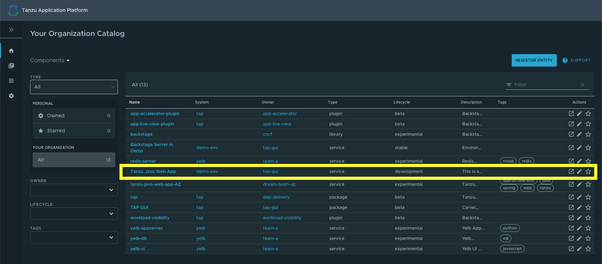

1. Select the **Runtime Resources** tab.

   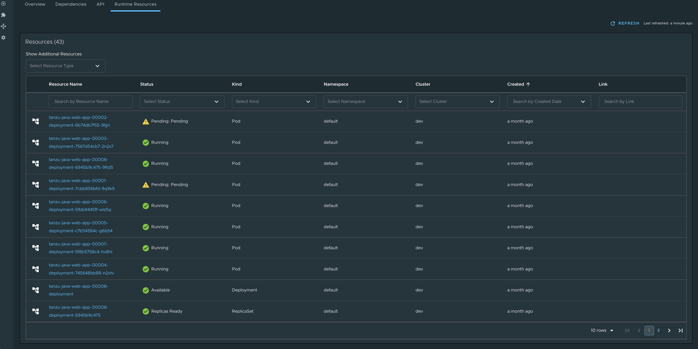

###  Resources

Built-in Kubernetes resources in this view are:

- Services
- Deployments
- ReplicaSets
- Pods

The Runtime Resource Visibility plug-in also displays CRDs created with the
Supply Chain, including:

- Cartographer Workloads
- Knative Services, Configurations, Revisions, and Routes

For more information, see
[Supply Chain Choreographer in Tanzu Application Platform GUI](scc-tap-gui.html).

CRDs from Supply Chain are associated with Knative Resources, further down the chain, and built-in
resources even further down the chain.

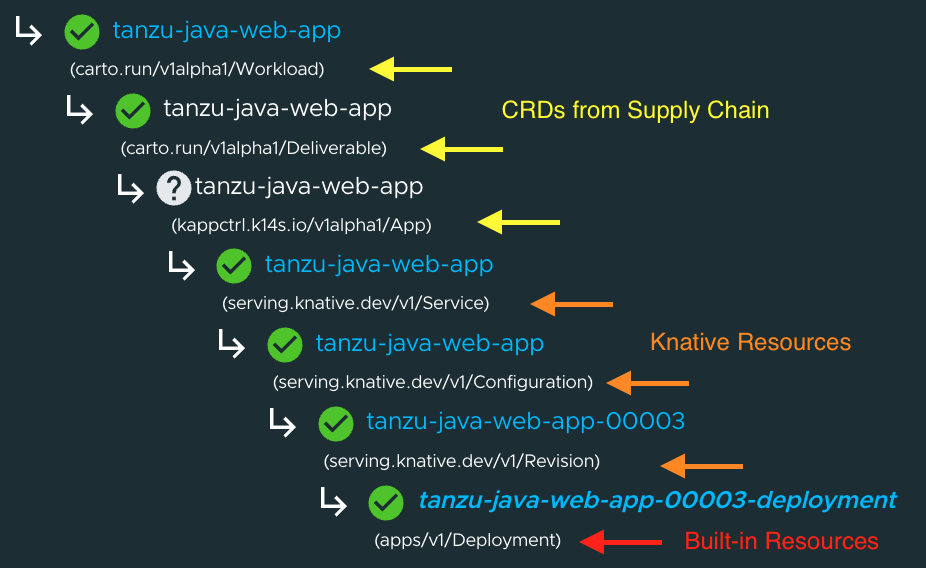

##  Knative service details page

To view details about your Knative services, select any resource that has a Knative Service type.
In this page, additional information is available for Knative resources, including:

- status
- an ownership hierarchy
- incoming routes
- revisions
- pod details

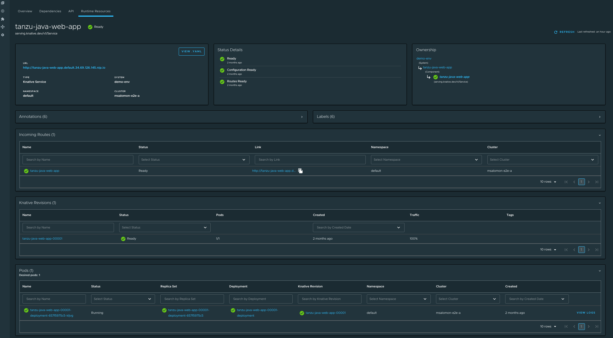

##  Detail pages

The Runtime Resources Visibility plug-in provides additional details of the Kubernetes resources in
the Detail pages.

###  Overview card

All detail pages provide an overview card with information related to the selected resource.
Most of the information feeds from the `metadata` attribute in each object.
The following are some attributes that are displayed in the overview card:

- **View Pod Logs** button
- **View .YAML** button
- URL, which is for Knative and Kubernetes service detail pages
- Type
- System
- Namespace
- Cluster

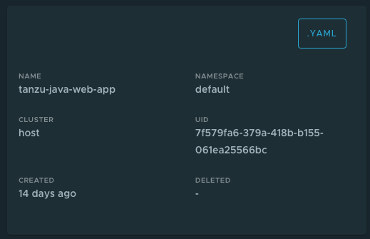

>**Note:** The **VIEW CPU AND MEMORY DETAILS** and **VIEW THREADS** sections are only available for
applications supporting Application Live View.

### Status card

The status section displays all of the conditions in the resource's attribute `status.conditions`.
Not all resources have conditions, and they can vary from one resource to the other.

For more information about object `spec` and `status`, see the
[Kubernetes documentation](https://kubernetes.io/docs/concepts/_print/#object-spec-and-status).

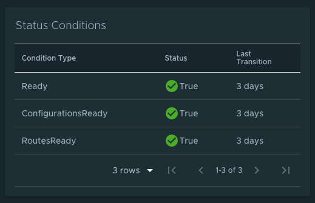

### Ownership card

Depending on the resource that you are viewing, the ownership section displays all the resources
specified in `metadata.ownerReferences`. You can use this section to navigate between resources.

For more information about owners and dependents, see the
[Kubernetes documentation](https://kubernetes.io/docs/concepts/overview/working-with-objects/owners-dependents/).

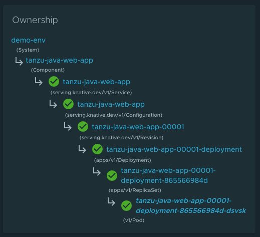

### Annotations and Labels

The Annotations and Labels card displays information about `metadata.annotations` and `metadata.labels`.

## Selecting completed supply chain pods

Completed supply chain pods (build pods and ConfigWriter pods) are hidden by default in the index table.
Users can choose to display them from the **Show Additional Resources** drop-down menu above the
Resources index table.
This drop-down menu is only visible if the resources include Build or ConfigWriter pods.

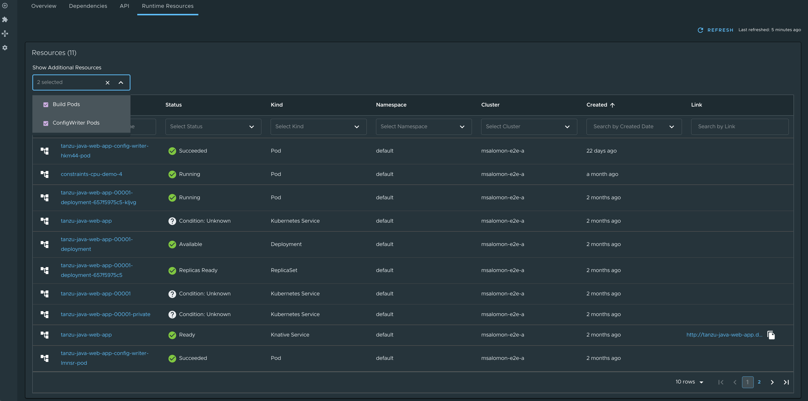

## Navigating to the Pod Details page

Users can see the pod table in each resource details page.

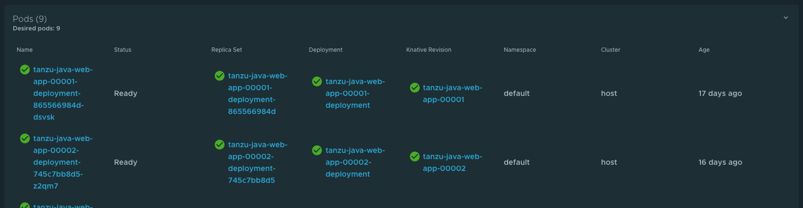

###  Overview of pod metrics

The overview card displays the user-configured resource limits on the pod, defined in accordance with
the [Kubernetes documentation](https://kubernetes.io/docs/concepts/configuration/manage-compute-resources-container/).
These limits do not represent actual real-time resource use. To monitor actual real-time resource use,
see [Application Live View for Spring Boot Applications in Tanzu Application Platform GUI](app-live-view-springboot.html).

Each container displays its resource limits, if defined.

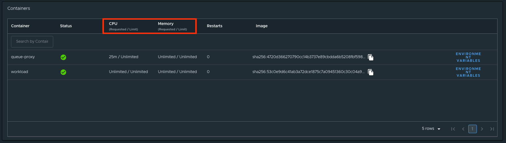

Pods display the sum of the limits of all their containers.
If a limit is not specified for a container, both the container and its pod are deemed to require
unlimited resources.

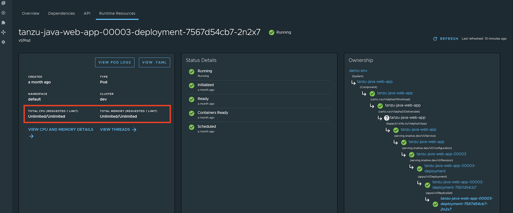

Namespace-level resource limits, such as default memory limits and default CPU limits, are not
considered as part of these calculations.

For more information about
[default memory limits](https://kubernetes.io/docs/tasks/administer-cluster/manage-resources/memory-default-namespace/)
and [default CPU limits](https://kubernetes.io/docs/tasks/administer-cluster/manage-resources/cpu-default-namespace/)
see the Kubernetes documentation.

These limits apply only for Memory and CPU that a pod or container can use.
Kubernetes manages these resource units by using a binary base, which is explained in the
[Kubernetes documentation](https://kubernetes.io/docs/reference/kubernetes-api/common-definitions/quantity/).

## Navigating to Application Live View

To view additional information about your running applications, see the
[Application Live View](app-live-view-springboot.md) section in the **Pod Details** page.

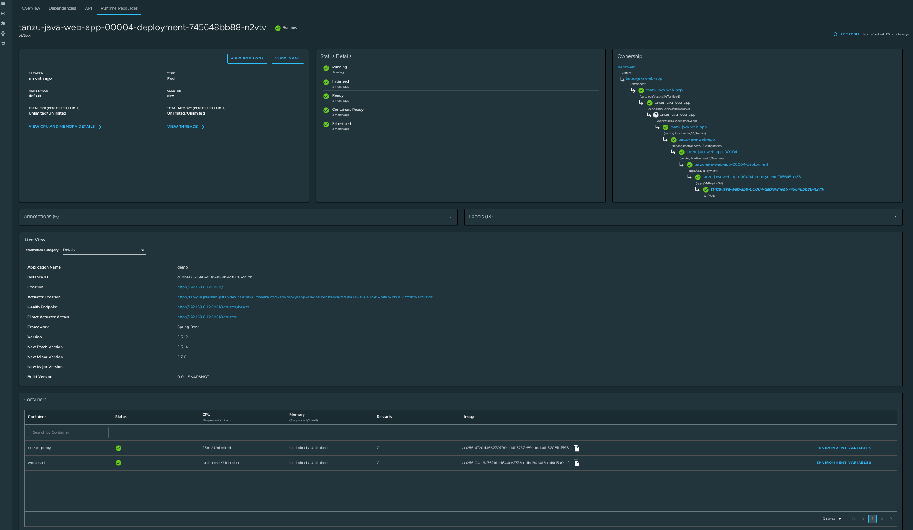

## Viewing pod logs

To view logs for a pod, click **View Pod Logs** from the **Pod Details** page.
By default, you see all the logs for the pod since its creation for all the pod's containers.

> **Note:** The logs displayed are not streamed in real time. To fetch new log entries, click
> **Refresh** in the upper right corner of the page.

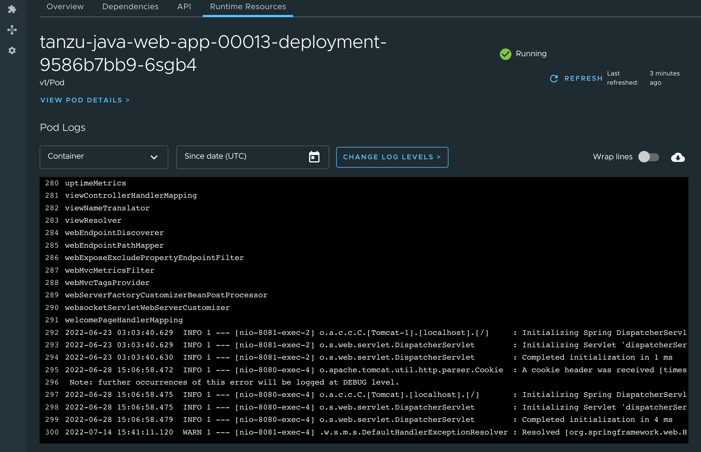

### Filtering by container

To display logs for a specific container only, select the desired container from the **Container**
drop-down menu. Deselecting this drop-down menu causes logs for all containers within the pod to appear.

### Filtering by date and time

To see all logs since a specific date and time, select or type the UTC timestamp in the
**Since date** field.
If no logs are displayed, adjust the timestamp to an earlier time.
Deselect this field to see all logs created since the pod was created.

### Changing log levels

If the pod is associated with an application that supports [Application Live View](app-live-view.html),
you can change the application's log levels by clicking the **Change Log Levels** button.
You then see a panel that allows you to select levels for each logger associated with your application.

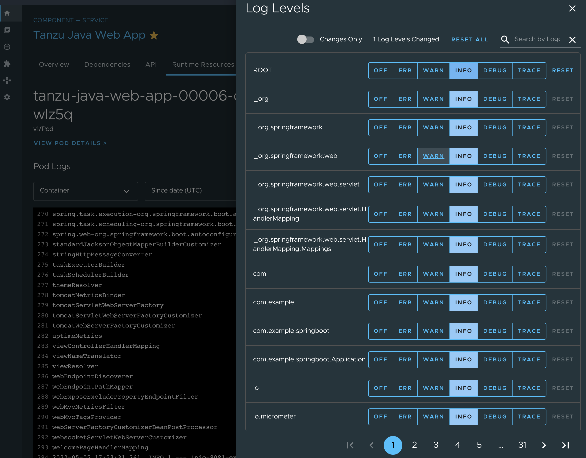

To change the levels for your application, select the desired level for each logger presented and then
close the panel by clicking **X** in the upper right corner of the panel or by pressing
the Escape key on your keyboard.

Because adjusting log levels makes a real-time configuration change to your application, log-level
adjustments are only reflected in log entries that your application produces after the change.
Click **Refresh** in the upper right corner of the page to fetch new messages after changing log levels.

After refreshing, if no log entries for the expected levels appear, ensure that:

1. You adjusted the correct application loggers
1. You are viewing logs for the correct container and time frame
1. Your application is producing logs at the expected levels. Your application might be idling or
otherwise not running a code path that starts the desired logger.
