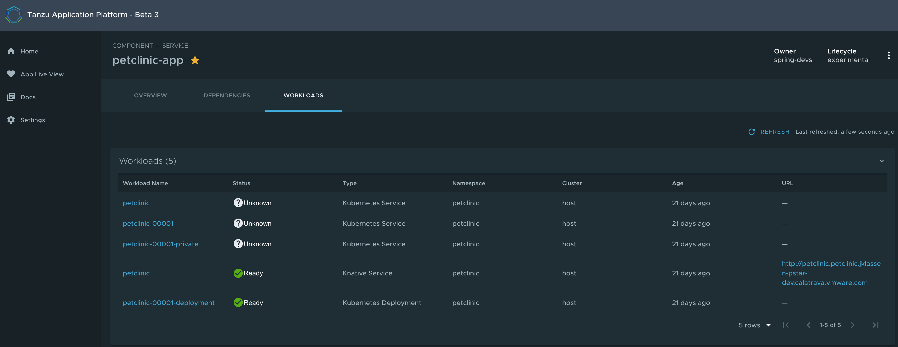
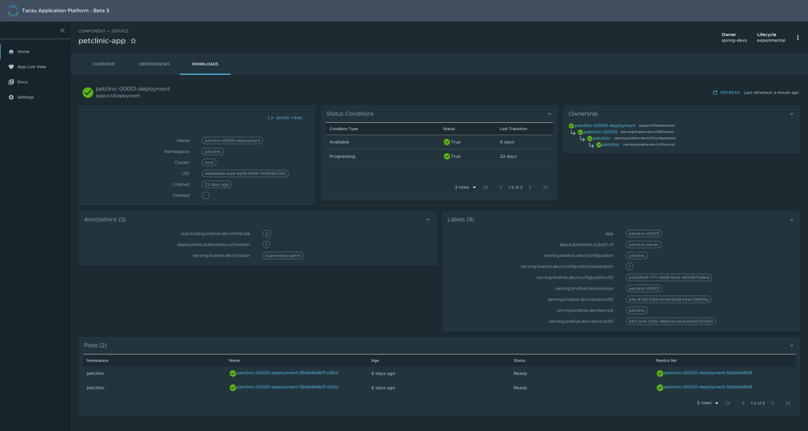

# Workload Visibility user guide

The Workload Visibility screen lets developers view the details and status of their Kubernetes
Workloads to understand their structure, and debug issues.

## Before you begin

Developers must perform the following actions to see their Workloads on the dashboard:

1. Define a Backstage Component with a `backstage.io/kubernetes-label-selector` annotation. See
  [Components](../catalog/catalog-operations.md#components) in the Catalog Operations documentation.
  ```
  apiVersion: backstage.io/v1alpha1
  kind: Component
  metadata:
    name: petclinic
    description: Spring PetClinic
    annotations:
      'backstage.io/kubernetes-label-selector': 'app.kubernetes.io/part-of=petclinic-server'
  spec:
    type: service
    lifecycle: demo
    owner: default-team
    system:
  ```

1. Commit and push the Component definition to a Git repository that is registered as a Catalog Location. See [Adding
  Catalog Entities](../catalog/catalog-operations.md#adding-catalog-entities) in the Catalog Operations documentation.
2. Create a Kubernetes Workload with a label matching the Component's selector, in a cluster
available to the Tanzu Application Platform GUI. A Workload is one of the following:

    - `v1/Service`
    - `apps/v1/Deployment`
    - `serving.knative.dev/v1/Service`

    For example:

    ```
    $ cat <<EOF | kubectl apply -f -
    ---
    apiVersion: serving.knative.dev/v1
    kind: Service
    metadata:
      name: petclinic
      namespace: default
      labels:
        'app.kubernetes.io/part-of': petclinic-server
    spec:
      template:
        metadata:
          labels:
            'app.kubernetes.io/part-of': petclinic-server
        spec:
          containers:
            - image: springcommunity/spring-framework-petclinic
    EOF
    ```

## Navigate to the Workload Visibility screen

You can view the list of running Workloads and details about their status, type, namespace, cluster, and public URL if
applicable for the Workload type.

To view the list of your running Workloads:

1. Select the Component from the Catalog index page.
1. Select the Workloads tab.



## Knative service details page

To view the Knative services details of your Workloads, select the Workload with 'Knative Service' type.
In this page, additional information is available for Knative workloads including status, an ownership hierarchy,
incoming routes, revisions, and pod details.



