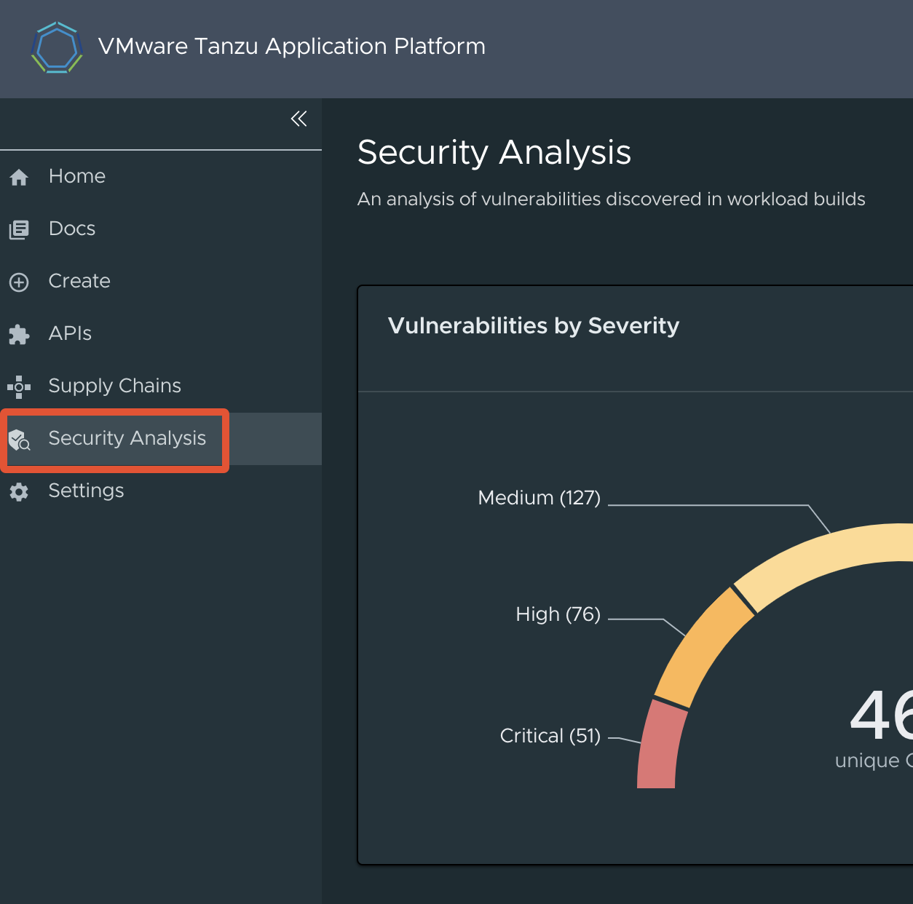
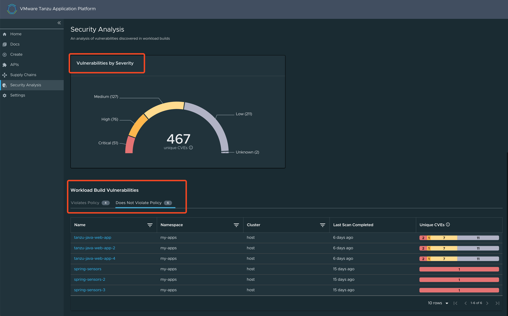
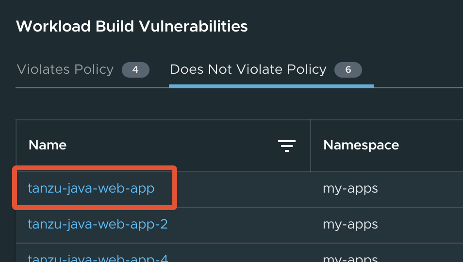
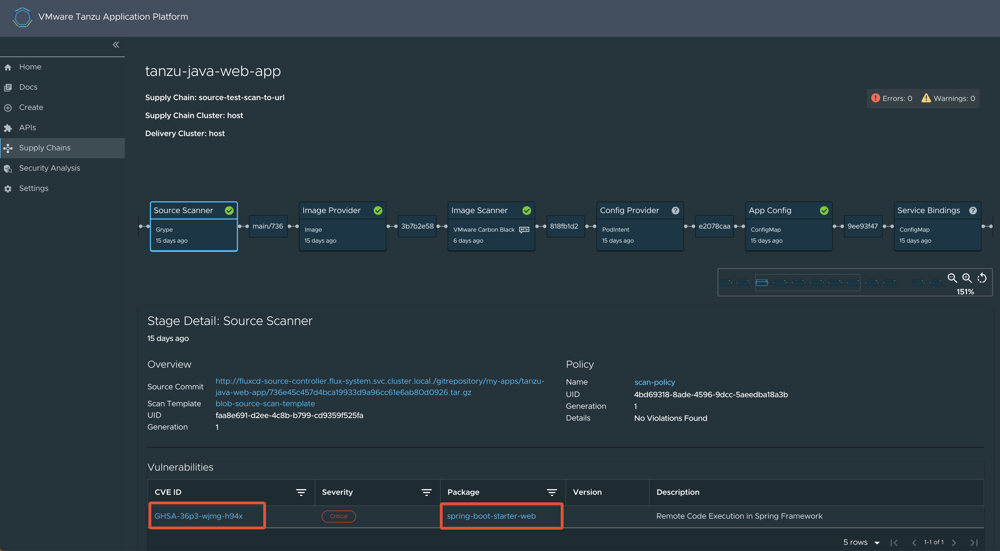
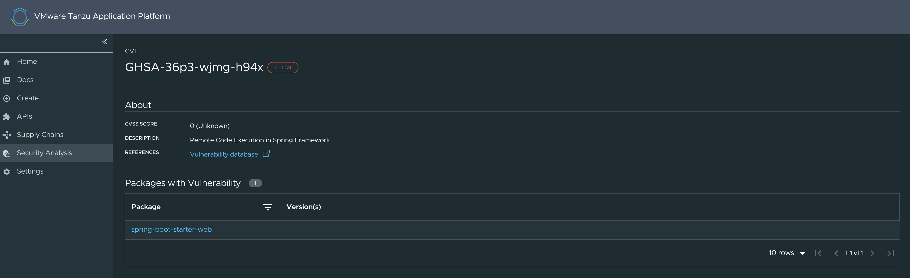
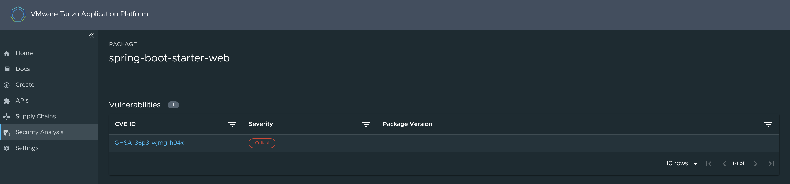

# Security Analysis in Tanzu Application Platform GUI

This topic describes the Security Analysis plug-in.

##  Overview

The Security Analysis plug-in summarizes vulnerability data across all workloads running in
Tanzu Application Platform, enabling faster identification and remediation of CVEs.

##  Installing and configuring

The Security Analysis plug-in is installed by default.
It is tightly coupled with the [Supply Chain Choregrapher plug-in](scc-tap-gui.hbs.md).
After installing and configuring the Supply Chain Choreographer GUI plug-in, there is no additional
configuration needed for the Security Analysis plug-in.

The Security Analysis plug-in is part of the Tanzu Application Platform Full and View profiles.

##  Accessing the plug-in

The Security Analysis plug-in is always accessible from the left navigation pane.
Click the **Security Analysis** button to open the **Security Analysis** dashboard.

##  Viewing vulnerability data

The **Security Analysis** dashboard provides a summary of all vulnerabilities across all clusters for
single-cluster and multicluster deployments.

The **Vulnerabilities by Severity** widget quickly counts the number of critical, high, medium, low,
and unknown severity CVEs, based on the CVSS severity rating of each CVE.

It includes a sum of all workloads' source and image scan vulnerabilities.
For example, if CVE-123 exists in the latest source scans and image scans of Workload ABC and
Workload DEF, it is counted four times.

> **Note** The sum includes any CVEs on the allowlist (ignoreCVEs).

The **Workload Build Vulnerabilities** tables, with the **Violates Policy** tab and
**Does Not Violate** tab, separate workloads based on the scan policy.
For more information, see
[Enforce compliance policy using Open Policy Agent](../../scst-scan/policies.hbs.md)
The Unique CVEs column uses the same sum logic as described earlier, but for individual workloads.

The sum of a workload's CVEs might not match the
[Supply Chain Choreographer's Vulnerability Scan Results](scc-tap-gui.hbs.md#sc-view-scan-results).
The data on this dashboard is based on `kubectl describe` for `SourceScan` and `ImageScan`.
The data on the Supply Chain Choreographer's Vulnerability Scan Results is based on Metadata Store data.

Only vulnerability scans associated to a Cartographer workload appear.
Use [tanzu insight](../../cli-plugins/insight/cli-overview.hbs.md) to view results for
non-workload scan results.

##  Viewing CVE and package details

The Security Analysis plug-in has a **CVE** page and a **Package** page.
These are accessed by clicking on a workload name, which opens the Supply Chain Choregrapher plug-in.
Clicking on the CVE or Package name opens the **CVE** or **Package** page, respectively.

The **CVE** page contains basic information about the vulnerability and includes a table with
all affected packages and versions.

The **Package** page contains basic information about a package and includes a table with all
CVEs and the affected package versions.

