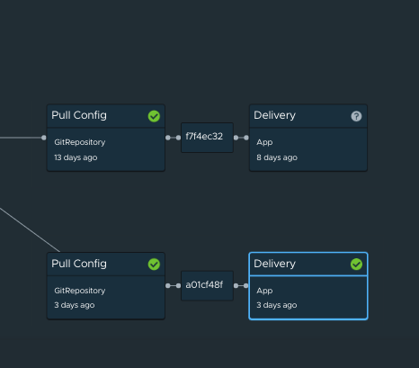
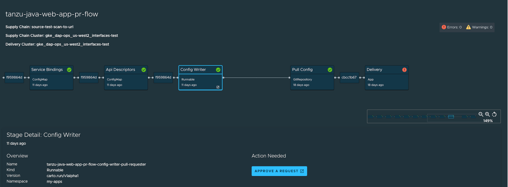

# Supply Chain Choreographer in Tanzu Application Platform GUI

This topic describes Supply Chain Choreographer in Tanzu Application Platform GUI.

## <a id="overview"></a> Overview

The Supply Chain Choreographer (SCC) plug-in enables you to visualize the execution of a workload by
using any of the installed Out-of-the-Box supply chains.
For more information about the Out-of-the-Box (OOTB) supply chains that are available in
Tanzu Application Platform, see [Supply Chain Choreographer for Tanzu](../../scc/about.hbs.md).

## <a id="prerequisites"></a> Prerequisites

To use Supply Chain Choreographer in Tanzu Application Platform GUI you must have:

- One of the following installed on your cluster:
  - [Tanzu Application Platform Full profile](../../install.hbs.md#install-profile)
  - [Tanzu Application Platform View profile](../../install.hbs.md#install-profile)
  - [Tanzu Application Platform GUI package](../install-tap-gui.hbs.md) and a metadata store package
- One of the following installed on the target cluster where you want to deploy your workload:
  - [Tanzu Application Platform Run profile](../../install.hbs.md#install-profile)
  - [Tanzu Application Platform Full profile](../../install.hbs.md#install-profile)

For more information, see [Overview of multicluster Tanzu Application Platform](../../multicluster/about.hbs.md)

## <a id="scan"></a> Enable CVE scan results

To see CVE scan results within Tanzu Application Platform GUI, connect Tanzu Application Platform GUI
to the Tanzu Application Platform component Supply Chain Security Tools - Store (SCST - Store).

### <a id="scan-auto"></a> Automatically connect Tanzu Application Platform GUI to the Metadata Store

Tanzu Application Platform GUI has automation for enabling connection between
Tanzu Application Platform GUI and SCST - Store.
To use this automation, add it to the Tanzu Application Platform GUI section within your
`tap-values.yaml` file.

The default value for `tap_gui.metadataStoreAutoconfiguration` is `false`. See the following example:

```yaml
# tap-values.yaml

# ...
tap_gui:
  # ...
  metadataStoreAutoconfiguration: true
```

This file change creates a service account for the connection with privileges scoped only to the
Metadata Store.
In addition it mounts the token of the service account into the Tanzu Application Platform GUI
pod and produces for you the `app_config` section necessary for Tanzu Application Platform GUI to
communicate with SCST - Store.

### <a id="scan-manual"></a> Manually connect Tanzu Application Platform GUI to the Metadata Store

To manually enable CVE scan results:

1. [Obtain the read-write token](../../scst-store/retrieve-access-tokens.hbs.md),
   which is created by default when installing Tanzu Application Platform. Alternatively,
   [create an additional read-write service account](../../scst-store/create-service-account.hbs.md#rw-serv-accts).
2. Add this proxy configuration to the `tap-gui:` section of `tap-values.yaml`:

    ```yaml
    tap_gui:
      app_config:
        proxy:
          /metadata-store:
            target: https://metadata-store-app.metadata-store:8443/api/v1
            changeOrigin: true
            secure: false
            headers:
              Authorization: "Bearer ACCESS-TOKEN"
              X-Custom-Source: project-star
    ```

    Where `ACCESS-TOKEN` is the token you obtained after creating a read-write service account.

> **Important** The `Authorization` value must start with the word `Bearer`.

## <a id="view-approvals"></a> Enable GitOps Pull Request Flow

To enable the supply chain box-and-line diagram to show **Approve a Request** in the **Config Writer**
stage details view when the **Config Writer** stage is clicked, set up for GitOps and pull requests. For more information, see
[GitOps vs. RegistryOps](../../scc/gitops-vs-regops.hbs.md).

## <a id="sc-visibility"></a> Supply Chain Visibility

Before using the SCC plug-in to visualize a workload, you must create a workload.

The workload must have the `app.kubernetes.io/part-of` label specified, whether you manually create
the workload or use one supplied with the OOTB supply chains.

Use the left sidebar navigation to access your workload and visualize it in the supply chain that is
installed on your cluster.

The example workload described in this topic is named `tanzu-java-web-app`.


Click **tanzu-java-web-app** in the **WORKLOADS** table to navigate to the visualization of the
supply chain.


There are two sections within this view:

- The box-and-line diagram at the top shows all the configured CRDs that this supply chain uses, and
  any artifacts that the supply chain's execution outputs
- The **Stage Detail** section at the bottom shows source data for each part of the supply chain that
  you select in the diagram view

This is a sample result of the Build stage for the `tanzu-java-web-app` from using
Tanzu Build Service:


This is a sample result of the **Image Scan** stage using Grype, which is only available in the
`test-scan` OOTB supply chain.
For more information, see the [View Vulnerability Scan Results](#sc-view-scan-results) section.


When a workload is deployed to a cluster that has the `deliverable` package installed, a new section
appears in the supply chain that shows **Pull Config** boxes and **Delivery** boxes.



When you have a `Pull Request` configured in your environment, access the merge request from the
supply chain by clicking **APPROVE A REQUEST**. This button is displayed after you click
**Config Writer** in the supply chain diagram.

In the following example, the merge request is approved, which causes **Pull Config** and **Delivery**
boxes to appear in the supply chain diagram.



## <a id="sc-view-scan-results"></a> View Vulnerability Scan Results

Click the **Source Scan** stage or **Image Scan** stage to view vulnerability source scans and
image scans for workload builds. The data is from
[Supply Chain Security Tools - Store](../../scst-store/overview.hbs.md).

CVE issues represent any vulnerabilities associated with a package or version found in the
source code or image, including vulnerabilities from past scans.

> **Note** For example, the `log4shell` package is found in image ABC on 1 January without any CVEs.
> On 15 January, the log4j CVE issue is found while scanning image DEF. If a user returns to the
> **Image Scan** stage for image ABC, the log4j CVE issue appears and is associated with the
> `log4shell` package.
