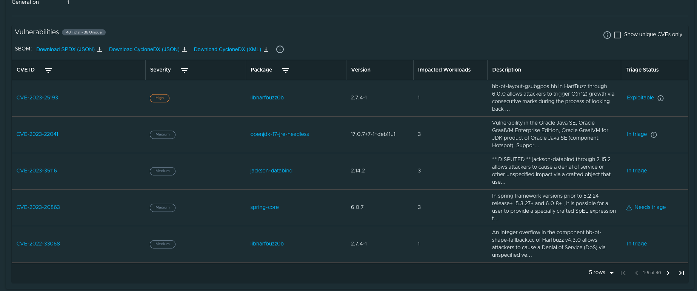
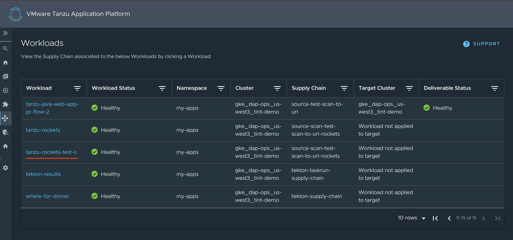
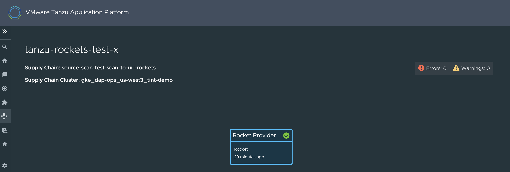
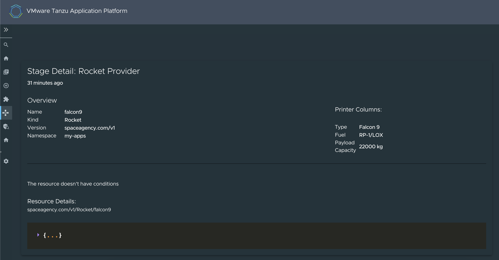
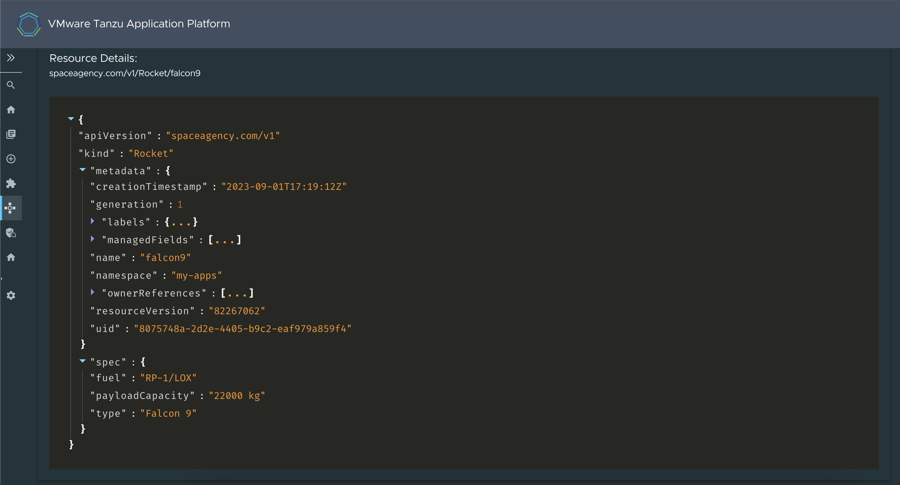

# Supply Chain Choreographer in Tanzu Developer Portal

This topic tells you about Supply Chain Choreographer in Tanzu Developer Portal.

## <a id="overview"></a> Overview

The Supply Chain Choreographer (SCC) plug-in enables you to visualize the execution of a workload by
using any of the installed Out-of-the-Box supply chains.
For more information about the Out-of-the-Box (OOTB) supply chains that are available in
Tanzu Application Platform, see [Supply Chain Choreographer for Tanzu](../../scc/about.hbs.md).

## <a id="prerequisites"></a> Prerequisites

To use Supply Chain Choreographer in Tanzu Developer Portal you must have:

- One of the following installed on your cluster:
  - [Tanzu Application Platform Full profile](../../install-online/profile.hbs.md#install-profile)
  - [Tanzu Application Platform View profile](../../install-online/profile.hbs.md#install-profile)
  - [Tanzu Developer Portal package](../install-tap-gui.hbs.md) and a metadata store package
- One of the following installed on the target cluster where you want to deploy your workload:
  - [Tanzu Application Platform Run profile](../../install-online/profile.hbs.md#install-profile)
  - [Tanzu Application Platform Full profile](../../install-online/profile.hbs.md#install-profile)

For more information, see [Overview of multicluster Tanzu Application Platform](../../multicluster/about.hbs.md)

## <a id="scan"></a> Enable CVE scan results

To see CVE scan results within Tanzu Developer Portal, connect Tanzu Developer Portal to the
Tanzu Application Platform component Supply Chain Security Tools - Store (SCST - Store).

### <a id="scan-auto"></a> Automatically connect Tanzu Developer Portal to SCST - Store

Tanzu Developer Portal has automation for enabling connection between Tanzu Developer Portal and
[SCST - Store](../../scst-store/overview.hbs.md). This automation is active by default and requires
no configuration.

> **Important** There is a known issue with the automatic configuration breaking the SBOM download
> feature introduced in Tanzu Application Platform v1.6. To fix this issue, edit `tap-values.yaml` as
> described in [Troubleshooting](../../tap-gui/troubleshooting.hbs.md#sbom-not-working).

To deactivate this automation, add the following block to the Tanzu Developer Portal section within
`tap-values.yaml`:

```yaml
# ...
tap_gui:
  # ...
  metadataStoreAutoconfiguration: false
```

This file change creates a service account for the connection with privileges scoped only to
Metadata Store.
In addition, it mounts the token of the service account into the Tanzu Developer Portal
pod and produces for you the `app_config` section necessary for Tanzu Developer Portal to
communicate with SCST - Store.

#### <a id="troubleshooting"></a> Troubleshooting

For debugging the automation, or for verifying that the automation is active, you must know
which resources are created. The following commands display the different Kubernetes resources that
are created when `tap_gui.metadataStoreAutoconfiguration` is set to `true`:

```console
$ kubectl -n tap-gui get serviceaccount metadata-store
NAME             SECRETS   AGE
metadata-store   1         AGE-VALUE
```

```console
$ kubectl -n tap-gui get secret metadata-store-access-token
NAME                          TYPE                                  DATA   AGE
metadata-store-access-token   kubernetes.io/service-account-token   3      AGE-VALUE
```

```console
$ kubectl -n tap-gui get clusterrole metadata-store-reader
NAME                    CREATED AT
metadata-store-reader   CREATED-AT-TIME
```

```console
$ kubectl -n tap-gui get clusterrolebinding read-metadata-store
NAME                  ROLE                                AGE
read-metadata-store   ClusterRole/metadata-store-reader   AGE-VALUE
```

There is another condition that impacts whether the automation creates the necessary service account.
If your configuration includes a `/metadata-store` block, the automation doesn't create the
Kubernetes resources for use in `autoconfiguration` and the automation doesn't overwrite the proxy
block that you provide. To use the automation, you must delete the block at
`tap_gui.app_config.proxy["/metadata-store"]`.

For example, a `tap-values.yaml` file with the following content does not create additional Kubernetes
resources as described earlier:

```yaml
# ...
tap_gui:
  # ...
  app_config:
    # ...
    proxy:
      '/metadata-store':
        target: SOMETHING
```

### <a id="scan-manual"></a> Manually connect Tanzu Developer Portal to the Metadata Store

To manually enable CVE scan results:

1. [Obtain the read-write token](../../scst-store/retrieve-access-tokens.hbs.md),
   which is created by default when installing Tanzu Application Platform. Alternatively,
   [create an additional read-write service account](../../scst-store/create-service-account.hbs.md#rw-serv-accts).
2. Add this proxy configuration to the `tap-gui:` section of `tap-values.yaml`:

    ```yaml
    tap_gui:
      app_config:
        proxy:
          /metadata-store:
            target: https://metadata-store-app.metadata-store:8443/api/v1
            changeOrigin: true
            secure: false
            allowedHeaders: ['Accept', 'Report-Type-Format']
            headers:
              Authorization: "Bearer ACCESS-TOKEN"
              X-Custom-Source: project-star
    ```

    Where `ACCESS-TOKEN` is the token you obtained after creating a read-write service account.

> **Important** The `Authorization` value must start with the word `Bearer`.

## <a id="view-approvals"></a> Enable GitOps Pull Request Flow

Set up for GitOps and pull requests to enable the supply chain box-and-line diagram to show
**Approve a Request** in the **Config Writer** stage details view when the **Config Writer** stage is
clicked.
For more information, see [GitOps vs. RegistryOps](../../scc/gitops-vs-regops.hbs.md).

## <a id="sc-visibility"></a> Supply Chain Visibility

Before using the Supply Chain Visibility (SCC) plug-in to visualize a workload, you must create a
workload.

The workload must have the `app.kubernetes.io/part-of` label specified, whether you manually create
the workload or use one supplied with the OOTB supply chains.

Use the left sidebar navigation to access your workload and visualize it in the supply chain that is
installed on your cluster.

The example workload described in this topic is named `tanzu-java-web-app`.


Click **tanzu-java-web-app** in the **WORKLOADS** table to navigate to the visualization of the
supply chain.

There are two sections within this view:

- The box-and-line diagram at the top shows all the configured custom resource definitions (CRDs)
  that this supply chain uses, and any artifacts that the supply chain's execution outputs
- The **Stage Detail** section at the bottom shows source data for each part of the supply chain that
  you select in the diagram view


When a workload is deployed to a cluster that has the `deliverable` package installed, a new section
appears in the supply chain that shows **Pull Config** boxes and **Delivery** boxes.

When you have a `Pull Request` configured in your environment, access the merge request from the
supply chain by clicking **APPROVE A REQUEST**. This button is displayed after you click
**Config Writer** in the supply chain diagram.


## <a id="sc-view-scan-results"></a> View Vulnerability Scan Results

Click the **Source Scan** stage or **Image Scan** stage to view vulnerability source scans and
image scans for workload builds. The data is from
[Supply Chain Security Tools - Store](../../scst-store/overview.hbs.md).

CVE issues represent any vulnerabilities associated with a package or version found in the
source code or image, including vulnerabilities from past scans.

> **Note** For example, the `log4shell` package is found in image ABC on 1 January without any CVEs.
> On 15 January, the log4j CVE issue is found while scanning image DEF. If a user returns to the
> **Image Scan** stage for image ABC, the log4j CVE issue appears and is associated with the
> `log4shell` package.

### <a id="triage-vul"></a> Triage vulnerabilities

This feature enables you to store analysis data for each of the vulnerabilities found in the scan.

The feature is turned off by default in Tanzu Developer Portal. To enable the feature, add the
following YAML to your configuration section within the `tap-values.yaml` file:

```yaml
# tap-values.yaml

tap_gui:
  app_config:
    customize:
      features:
        supplyChain:
          enableTriageUI: true
```

When you select a scan stage, the system shows a table with vulnerabilities and a **Triage Status**
column where you can see the latest status stored for each vulnerability.



The triage panel enables you to select a status, justification, and resolutions from a set of
options, and has a text box to add extra details for the analysis. After you submit this information,
the status is updated on the table and the latest analysis is visible the next time you open the
panel.

**Needs triage** is the default status for all vulnerabilities. After you submit an analysis, the
status changes and the information button next to the status shows you the stored vulnerability
analysis.

## <a id="sc-crds"></a> Support for CRDs

Tanzu Developer Portal v1.7.0 introduced support for CRDs. The following example illustrates the
creation of a basic custom resource definition (CRD), which is used as part of a supply chain and
its visualization in the workload:

To define and use a CRD in a supply chain:

1. Define the CRD.
2. Set CRD permissions.
3. Define the supply chain.
4. Define the `ClusterTemplate`.
5. Create the workload.
6. Visualize the workload.

### <a id="sc-crd-definition"></a> Define the CRD

To define a CRD:

1. Create a new YAML file with the name `NAME-crd.yaml`. For example, `rockets-crd.yaml`.
2. Add the following basic structure to the YAML file:

    ```yaml
    apiVersion: apiextensions.k8s.io/v1
    kind: CustomResourceDefinition
    metadata:
     name: ...
    spec: ...
    ```

   At its most basic, a CRD must have `apiVersion`, `kind`, `metadata`, and `spec`.

   The `apiVersion` for a CRD must always be `apiextensions.k8s.io/v1` and the `kind` must be
   `CustomResourceDefinition`.

3. Add values for `group` and `name`. The value for `group` is usually expressed in a domain URL
   format, such as `company.com`, and the `name` value can be anything.

   The following example uses `spaceagency.com` for the `group` and `rockets` for the `name`.

    ```yaml
    apiVersion: apiextensions.k8s.io/v1
    kind: CustomResourceDefinition
    metadata:
      name: rockets.spaceagency.com
    spec:
      group: spaceagency.com
      scope: Namespaced
      names:
        plural: rockets
        singular: rocket
        kind: Rocket
        shortNames:
          - roc
    ```

   Ensure that the name used in `metadata.name` follows the format `PLURAL-NAME.GROUP`. In this
   example it is `rockets.spaceagency.com`.

4. Add properties in the `spec` section under a list called `versions`. Make each version an object
   with a `name` and a `schema` for the version, so that the CRD looks like the following example:

    ```yaml
    apiVersion: apiextensions.k8s.io/v1
    kind: CustomResourceDefinition
    metadata: ...
    spec:
      ...
      versions:
      - name: v1
        served: true
        storage: true
        schema:
          openAPIV3Schema:
            type: object
            properties:
              spec:
                type: object
                properties:
                  type:
                    type: string
                  fuel:
                    type: string
                  payloadCapacity:
                    type: string
    ```

   The `versions` property also has mandatory `served` and `storage` properties. For more information
   about `served` and `storage`, and CRDs in general, see the
   [Kubernetes documentation](https://kubernetes.io/docs/tasks/extend-kubernetes/custom-resources/custom-resource-definitions/).

   For this example the `schema` is an `openAPIV3Schema` object. For more information, see the
   [OpenAPI Specification](https://github.com/OAI/OpenAPI-Specification/blob/main/versions/3.0.0.md#schema)
   in GitHub.

   The `openAPIV3Schema` object lists the attributes that
   the instances will have and their types. In this example there are 3 attributes (`type`, `fuel`,
   and `payloadCapacity`), and all of them are strings.

5. Verify that your CRD looks like this finished example:

    ```yaml
    apiVersion: apiextensions.k8s.io/v1
    kind: CustomResourceDefinition
    metadata:
      name: rockets.spaceagency.com
    spec:
      group: spaceagency.com
      scope: Namespaced
      names:
        plural: rockets
        singular: rocket
        kind: Rocket
        shortNames:
          - roc
      versions:
      - name: v1
        served: true
        storage: true
        schema:
          openAPIV3Schema:
            type: object
            properties:
              spec:
                type: object
                properties:
                  type:
                    type: string
                  fuel:
                    type: string
                  payloadCapacity:
                    type: string
    ```

#### <a id="sc-crd-printer-columns"></a> (Optional) Add custom data to display in the SCC UI

You can display custom data in the SCC plug-in UI by using the Printer Column feature.
For more information, see the
[Kubernetes documentation](https://kubernetes.io/docs/tasks/extend-kubernetes/custom-resources/custom-resource-definitions/#additional-printer-columns).

> **Note** You must have a service account with permissions to view the CRD, which is where printer
> column data is maintained. When using a service account without this permission, you don't see any
> printer column data and you don't see any warning that the data is missing.

A printer column is a list that is specified as part of a `version` object. Each list item specifies
the following for printing:

- A column name
- The type of the value
- A JSON path, relative to the CRD itself, that shows where to get the value

The following example has 3 printer columns for displaying the `.spec.type`, `.spec.fuel`, and
`.spec.payloadCapacity` attributes:

```yaml
apiVersion: apiextensions.k8s.io/v1
kind: CustomResourceDefinition
metadata:
  name: rockets.spaceagency.com
spec:
  group: spaceagency.com
  scope: Namespaced
  names:
    plural: rockets
    singular: rocket
    kind: Rocket
    shortNames:
      - roc
  versions:
  - name: v1
    served: true
    storage: true
    schema:
      openAPIV3Schema:
        type: object
        properties:
          spec:
            type: object
            properties:
              type:
                type: string
              fuel:
                type: string
              payloadCapacity:
                type: string
    additionalPrinterColumns:
    - name: Type
      type: string
      jsonPath: .spec.type
    - name: Fuel
      type: string
      jsonPath: .spec.fuel
    - name: Payload Capacity
      type: string
      jsonPath: .spec.payloadCapacity
```

### <a id="sc-crd-permissions"></a> Set resource permissions

To use resources in a supply chain, set resource permissions:

1. Create a new YAML file named `permissions.yaml`.

1. Add a `Role` to define which actions (`verbs`) are allowed on this resource:

    ```yaml
    apiVersion: rbac.authorization.k8s.io/v1
    kind: Role
    metadata:
      namespace: NAMESPACE
      name: NAME
    rules:
    - apiGroups: ["API-GROUPS"]
      resources: ["RESOURCES-NAME"]
      verbs:
      - get
      - list
      - watch
      - create
      - patch
      - update
      - delete
      - deletecollection
    ```

    Where:

    - `NAMESPACE` is the namespace in which the rules apply. For example, `my-apps`.
    - `NAME` is the name for the role. For example, `rocket-reader`.
    - `API-GROUPS` is the name of the groups. For example, `spaceagency.com` or `apiextensions.k8s.io/v1`.
    - `RESOURCES-NAME` is the name of the resources. For example, `rockets` or `customresourcedefinitions`.

1. Add a `RoleBinding` to bind this new `Role` to the `serviceAccount` that you typically use:

    ```yaml
    apiVersion: rbac.authorization.k8s.io/v1
    kind: RoleBinding
    metadata:
      name: BINDING-NAME
      namespace: NAMESPACE
    subjects:
    - kind: ServiceAccount
      name: default
      namespace: my-apps
    roleRef:
      kind: Role
      name: ROLE-REFERENCE-NAME
      apiGroup: rbac.authorization.k8s.io
    ```

    Where:

    - `BINDING-NAME` is the binding name. For example, `rocket-reader-binding`.
    - `NAMESPACE` is the namespace. For example, `my-apps`.
    - `ROLE-REFERENCE-NAME` is the role reference name. For example, `rocket-reader`.

   In this binding you associate the `default` service account that you use with the new role you
   created. The two definitions together look like this example:

    ```yaml
    apiVersion: rbac.authorization.k8s.io/v1
    kind: Role
    metadata:
      namespace: my-apps
      name: rocket-reader
    rules:
    - apiGroups: ["spaceagency.com"]
      resources: ["rockets"]
      verbs:
      - get
      - list
      - watch
      - create
      - patch
      - update
      - delete
      - deletecollection
    ---
    apiVersion: rbac.authorization.k8s.io/v1
    kind: RoleBinding
    metadata:
      name: rocket-reader-binding
      namespace: my-apps
    subjects:
    - kind: ServiceAccount
      name: default
      namespace: my-apps
    roleRef:
      kind: Role
      name: rocket-reader
      apiGroup: rbac.authorization.k8s.io
    ```

   > **Important** If you defined `additionalPrinterColumns` in your CRD, you must grant
   > permissions for both the group you defined in the CRD and to the `apiextensions.k8s.io/v1`
   > group that contains the definition of your resource.

   The finished definitions look like the following example:

    ```yaml
    apiVersion: rbac.authorization.k8s.io/v1
    kind: Role
    metadata:
      namespace: my-apps
      name: rocket-reader
    rules:
    - apiGroups: ["spaceagency.com", "apiextensions.k8s.io/v1"]
      resources: ["rockets", "customresourcedefinitions"]
      verbs:
      - get
      - list
      - watch
      - create
      - patch
      - update
      - delete
      - deletecollection
    ---
    apiVersion: rbac.authorization.k8s.io/v1
    kind: RoleBinding
    metadata:
      name: rocket-reader-binding
      namespace: my-apps
    subjects:
    - kind: ServiceAccount
      name: default
      namespace: my-apps
    roleRef:
      kind: Role
      name: rocket-reader
      apiGroup: rbac.authorization.k8s.io
    ```

### <a id="define-the-supply-chain"></a> Define the supply chain

Now that you have a CRD and the permissions for it, you can define a supply chain that uses this CRD
as one of its resources.

The following example is a simple supply chain that has only one stage that uses an instance of
the CRD. You can create the supply chain by downloading another supply chain and editing it.

1. List the existing supply chains in your cluster by running:

   ```console
   kubectl get ClusterSupplyChain -n NAMESPACE
   ```

   Where `NAMESPACE` is your namespace. For example, `my-apps`.

2. Download one of them to a file by running:

   ```console
   kubectl get ClusterSupplyChain SUPPLY-CHAIN -n NAMESPACE -oyaml >> ~/supply-chain.yaml
   ```

   Where:

   - `SUPPLY-CHAIN` is the name a supply chain you discovered earlier.
   - `NAMESPACE` is your namespace.

   For example:

   ```console
   $ kubectl get ClusterSupplyChain source-test-scan-to-url -n my-apps -oyaml >> ~/supply-chain.yaml
   ```

3. Edit the downloaded supply-chain definition as follows:

    ```yaml
    apiVersion: carto.run/v1alpha1
    kind: ClusterSupplyChain
    metadata:
      name: SUPPLY-CHAIN-NAME
    spec:
      resources:
      - name: RESOURCES-NAME
        templateRef:
          kind: ClusterTemplate
          name: TEMPLATE-REFERENCE-NAME
      selector:
        apps.tanzu.vmware.com/LABEL: "true"
      selectorMatchExpressions:
      - key: apps.tanzu.vmware.com/workload-type
        operator: In
        values:
        - web
        - server
        - worker
    ```

    Where:

    - `SUPPLY-CHAIN-NAME` is the supply-chain name. For example, `source-scan-test-scan-to-url-rockets`.
    - `RESOURCES-NAME` is the resources name. For example, `rocket-provider`.
    - `TEMPLATE-REFERENCE-NAME` is the template reference name. For example, `rocket-source-template`.
    - `apps.tanzu.vmware.com/LABEL:` is a label that must be present, when creating the workload, to
      use this supply chain. For example, `apps.tanzu.vmware.com/has-rockets: "true"`.

    `apiVersion` and `kind` stay the same. `metadata.name` is created for this new supply chain.

    The `spec.selector` field states which label selector is used to select this supply chain when
    creating a workload.

4. Save the supply-chain YAML file as `NAME-supply-chain.yaml`. For example, `rocket-supply-chain.yaml`.

### <a id="define-cluster-template"></a> Define the ClusterTemplate

In this procedure you define, for the `resources` field, a single resource that uses an instance of
your CRD.

This example supply chain has just a single resource (stage), which is named `rocket-provider`.
The supply chain uses a `templateRef`, of the kind `ClusterTemplate`, which is named
`rocket-source-template`.

At its most basic, a supply chain’s resource is an object consisting of a `name` and a `templateRef`
pointing to an existing `ClusterTemplate`.

To define a new `ClusterTemplate`:

1. List existing `ClusterTemplate` resources by running:

   ```console
   kubectl get ClusterTemplates -n NAMESPACE
   ```

   Where `NAMESPACE` is your namespace

2. Download a `ClusterTemplate` resource that you found by running:

   ```console
   kubectl get ClusterTemplates TEMPLATE-NAME -n NAMESPACE -oyaml >> ~/cluster-template.yaml
   ```

   Where:

   - `TEMPLATE-NAME` is the name of the `ClusterTemplate` resource you found. For example,
     `config-writer-template`.
   - `NAMESPACE` is your namespace. For example, `my-apps`.

   For example:

   ```console
   $ kubectl get ClusterTemplates config-writer-template -n my-apps -oyaml >> ~/cluster-template.yaml
   ```

3. Verify that the file, when cleaned up, looks similar to the following:

    ```yaml
    apiVersion: carto.run/v1alpha1
    kind: ClusterTemplate
    metadata:
      name: rocket-source-template
    spec:
      lifecycle: mutable
      ytt: |
        #@ load("@ytt:data", "data")

        #@ def merge_labels(fixed_values):
        #@   labels = {}
        #@   if hasattr(data.values.workload.metadata, "labels"):
        #@     exclusions = ["kapp.k14s.io/app", "kapp.k14s.io/association"]
        #@     for k,v in dict(data.values.workload.metadata.labels).items():
        #@       if k not in exclusions:
        #@         labels[k] = v
        #@       end
        #@     end
        #@   end
        #@   labels.update(fixed_values)
        #@   return labels
        #@ end

        ---
        apiVersion: spaceagency.com/v1
        kind: Rocket
        metadata:
          name: falcon9
          labels: #@ merge_labels({ "app.kubernetes.io/component": "rocket" })
        spec:
          type: Falcon 9
          fuel: RP-1/LOX
          payloadCapacity: 22000 kg
    ```

    `metadata.name` matches the name specified in the supply-chain resource.

    An instance of the new CRD is used in the `spec` of this resource through the `ytt` field.
    ytt is a templating language that can output resource instances.

    A function is retained that takes in labels from the workload and propagates them to the
    resource. This function is not essential, but is usually performed to propagate important labels
    from the workload down to the individual resources.

4. Save the file as `NAME-cluster-template.yaml`. For example, `rocket-cluster-template.yaml`.

You have now completed all the necessary definitions to create a workload that uses this new supply
chain and the new CRD.

### <a id="create-the-workload"></a> Create the workload

Now that you have all of the resources, apply them to a cluster and then create a workload:

1. Apply your CRD by running:

   ```console
   kubectl apply -f rockets-crd.yaml
   ```

1. Apply the resource permissions by running:

   ```console
   kubectl apply -f permissions.yaml
   ```

1. Apply the cluster template by running:

   ```console
   kubectl apply -f rocket-cluster-template.yaml
   ```

1. Apply the supply chain by running:

   ```console
   kubectl apply -f rocket-supply-chain.yaml
   ```

   The cluster now has all the necessary resource definitions to create a workload by using the
   new supply chain, which, in turn, uses an instance of the new resource.

1. Create the workload by running:

   ```console
   tanzu apps workload create tanzu-rockets-test-x \
   --type web \
   --label app.kubernetes.io/part-of=tanzu-rockets \
   --label apps.tanzu.vmware.com/has-rockets=true \
   --yes \
   --namespace my-apps
   ```

   The label `apps.tanzu.vmware.com/has-rockets=true` is explicitly set. The `selector` property,
   specified when defining the new supply chain, ties the new supply chain with this particular
   workload.

### <a id="visualize-the-workload"></a> Visualize the workload

To see the workload rendered through the Supply Chain plug-in:

1. Go to the supply chain plug-in section in Tanzu Developer Portal and locate the workload among
   the listed ones:

   

   The workload `tanzu-rockets-x` is **Healthy**. The **Supply Chain** column shows that it is using
   the `source-scan-test-scan-to-url-rockets` supply chain.

2. Click on it to see its details. The **Workload** graph appears. Given that the supply chain
   `source-scan-test-scan-to-url-rockets` only specified one `resource`, you see a simple
   single-stage graph.

   

3. Scroll down the screen to see the details associated with the stage.

   

   The printer columns that you defined in the CRD are now rendered in the **Overview** section.
   This happens with any CRD that you define and that includes the `additionalPrinterColumns`
   definition.

4. Go to the end of the section to see the full resource in JSON format.

   